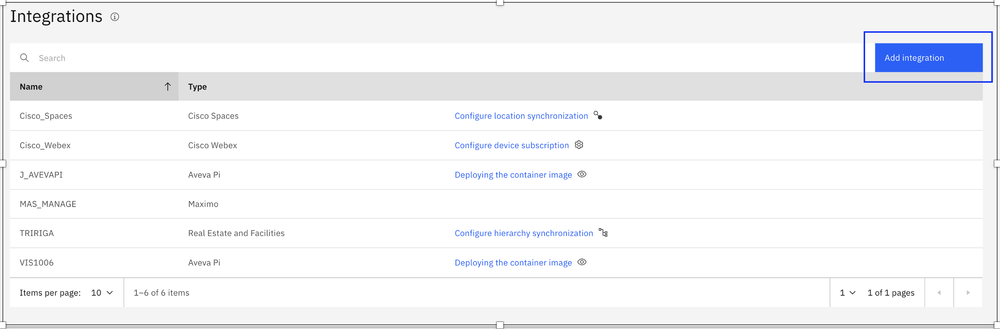
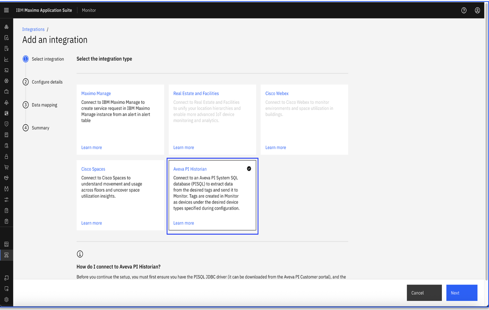
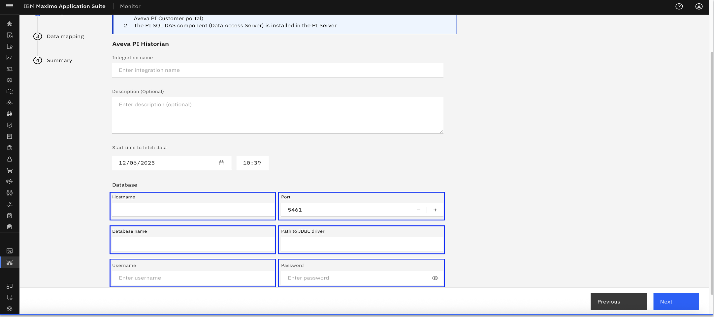
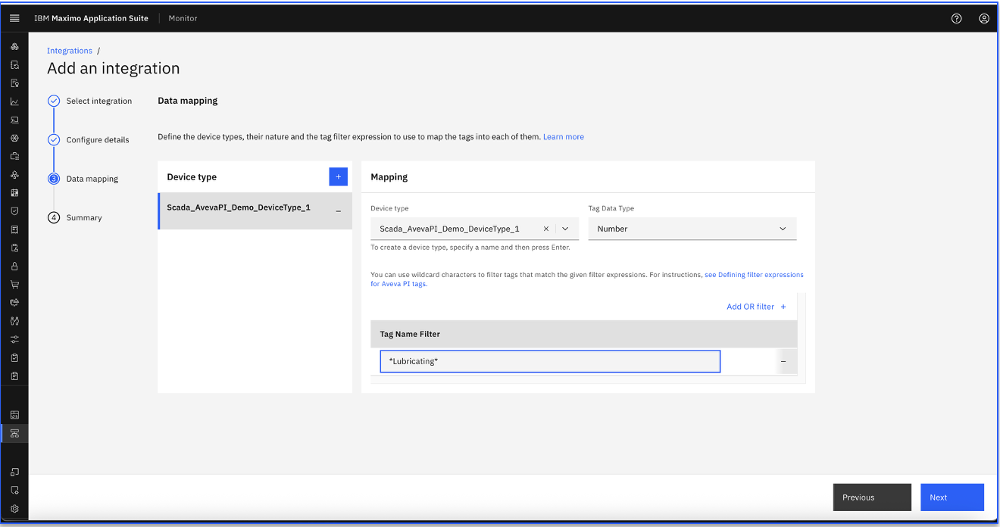
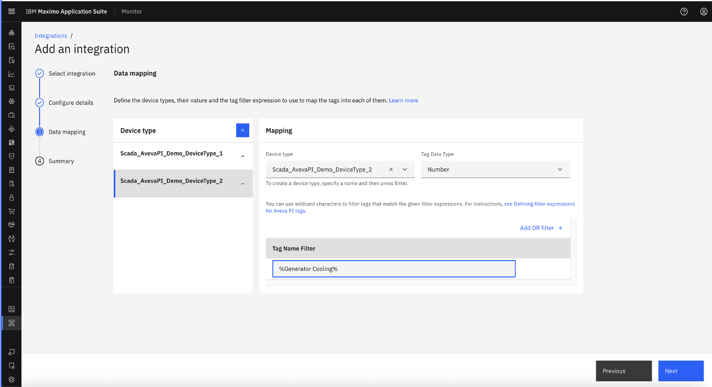
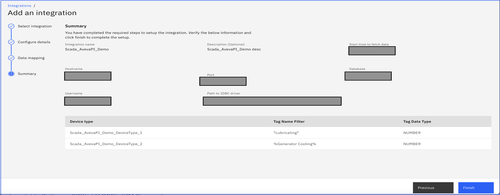
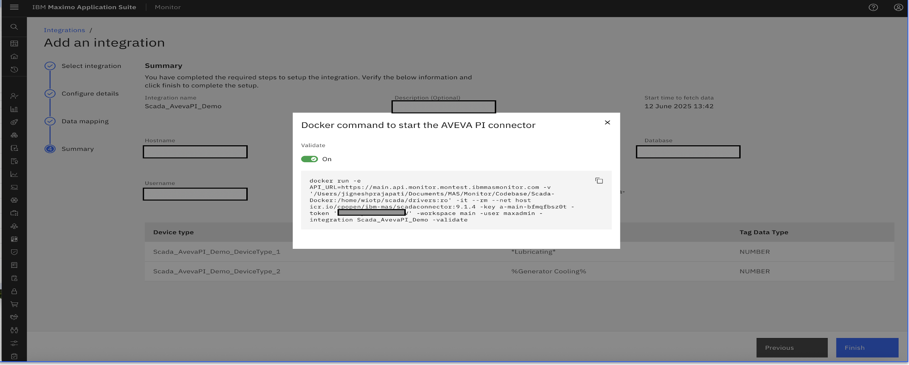

# Configure Aveva PI Scada Historian Integration

In this Exercise you will learn how to configure Aveva PI Scada Historian configuration to IBM MAS Monitor

As a user who needs to monitor devices across multiple sites, IBM MAS Monitor provides a single scalable place of ingest device data, calculate key performance metrics so that it can monitor all mission critical devices and populate dashboards for further analysis.

!!! info
    You can create maximum of five device type while adding configuration. If needed to add more, then this configuration has to be saved and edited.
    
## Aveva PI Scada Historian Configuration

1. Open `Maximo Application Suite` and select `Monitor Application`. 
{:style="height:500px;width:900px"}
2. Open `Monitor` tab
{:style="height:500px;width:900px"}
3. Navigate to the `Integrations` menu tab
{:style="height:350px;width:140px"}
4. List of existing integrations
{:style="height:300px;width:900px"}
5. Click on new `Add Integration` from Integration list and select `Aveva PI Historian`
{:style="height:500px;width:900px"}
6. Configure Aveva PI historian integration configurations details in section `Configuration details`.
{:style="height:500px;width:900px"}
7. Configure section `Data Mapping` and select existing `Device type` or create new `Device type` and enter `Tag name filter`.
{:style="height:4500px00px;width:900px"}
{:style="height:500px;width:900px"}
8. Verify Aveva PI historian integration configurations in section `Summary`
{:style="height:500px;width:900px"}
9. Submit Aveva PI historian integration details. This will show docker command.
{:style="height:500px;width:900px"}

## Summary

Docker command will be generated once Aveva PI Historian configuration are saved. 

Lets next see how to run docker command and create devices and device data from Aveva PI system.