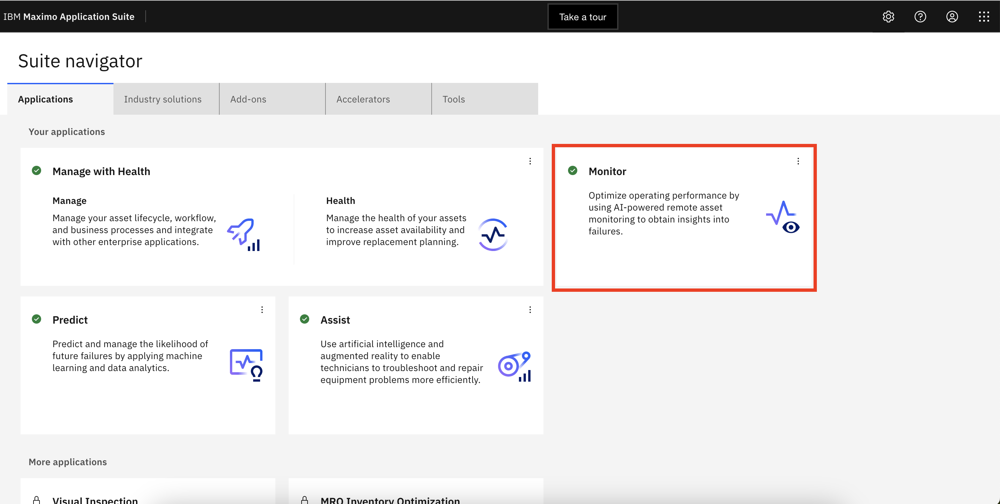
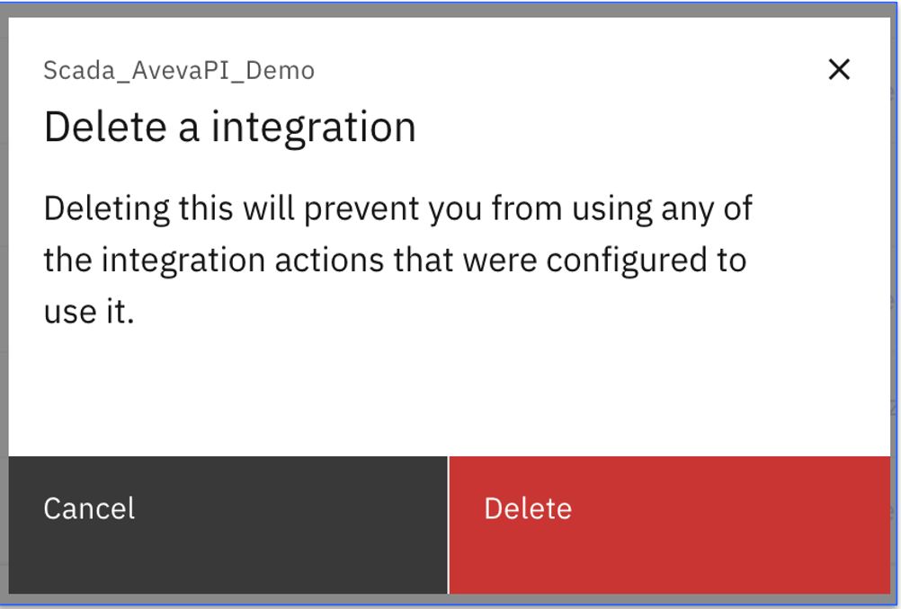

# Delete Aveva PI Scada Historian Integration

In this Exercise you will learn how to delete existing Aveva PI Scada Historian integration.

## Delete Aveva PI Scada Historian integration

1. Open `Maximo Application Suite` and select `Monitor Application`. 
{:style="height:500px;width:900px"}
2. Open `Monitor` tab
{:style="height:500px;width:900px"}
3. Navigate to the `Integrations` menu tab
{:style="height:350px;width:140px"}
4. Select the integration that needs to be deleted from the list.
5. Click on `Delete`
{:style="height:400px;width:900px"}
{:style="height:300px;width:500px"}

!!! note
    Deleting the Aveva PI Scada Historian integration, only deletes the integration but Device Types and Devices will remains in Monitor.

## Summary

Lets next see how to use Reset API Key.