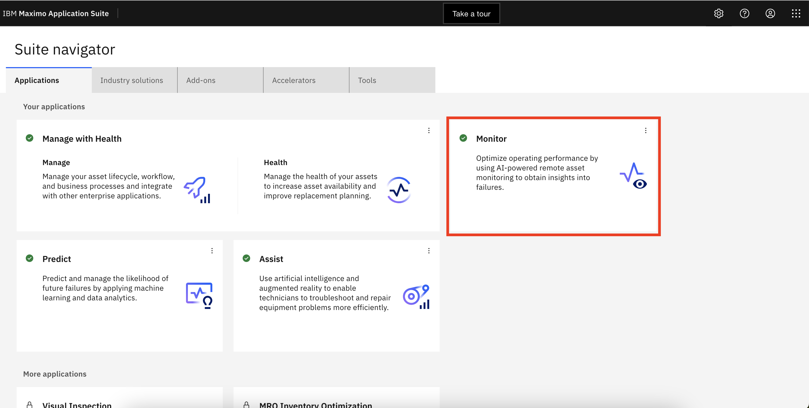
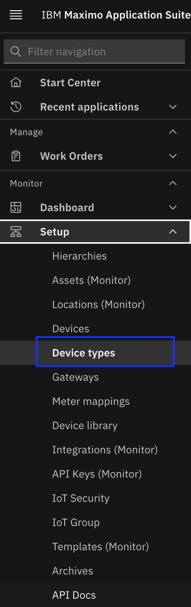
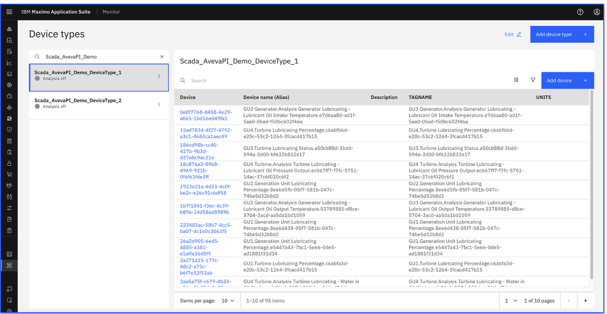
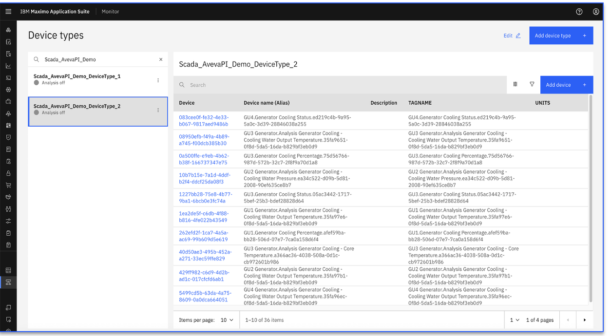
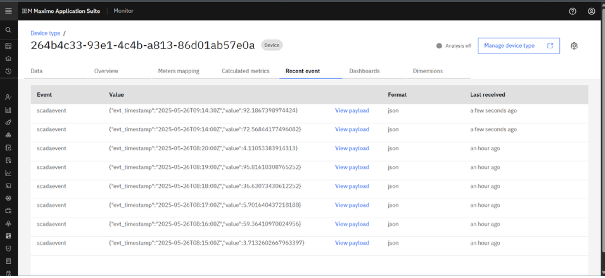
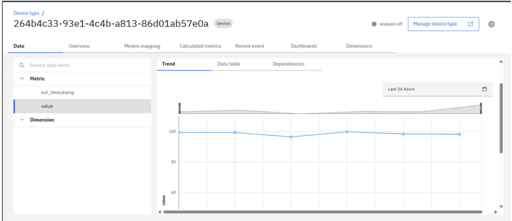
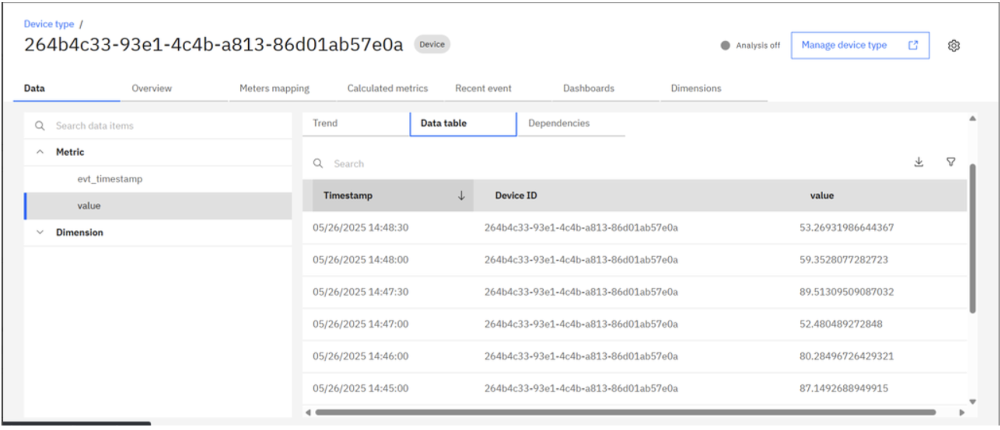

# Device Type, devices and devices data

In this Exercise you will learn how device type, devices and device data are populated in IBM MAS Monitor UI

Upon execution of docker command, it starts pulling device data based on `tag name filter` expression and device raw data from Aveva PI Scada historian and can be seen in the recent events of IBM MAS Monitor. 

## Device Types and Devices Creation

1. Open `Maximo Application Suite` and select `Monitor Application`. 
{:style="height:500px;width:900px"}
2. Open `Monitor` tab
{:style="height:500px;width:900px"}
3. Navigate to the `Device types` menu tab 
{:style="height:350px;width:140px"}
4. Search device type name. This will shows the device list as below.
{:style="height:500px;width:900px"}
{:style="height:500px;width:900px"}

## Device Data - Recent Events
Click on any device Id from device list and navigate to `Recent event` tab to view incoming device data
{:style="height:400px;width:900px"}

## Device Data - Trend Chart
Navigate to `Data` tab, Select Metric Name `value` then click on `Trend` tab
{:style="height:400px;width:900px"}

## Device Data - Data Table
Navigate to `Data` tab, Select Metric Name `value` then click on `Data table` tab
{:style="height:400px;width:900px"}

## Summary

You can view the recent events generated for each device, trend chart and data table from Aveva PI Scada historian.

Lets next see how to update existing Aveva PI Scada Historian integration configuration.