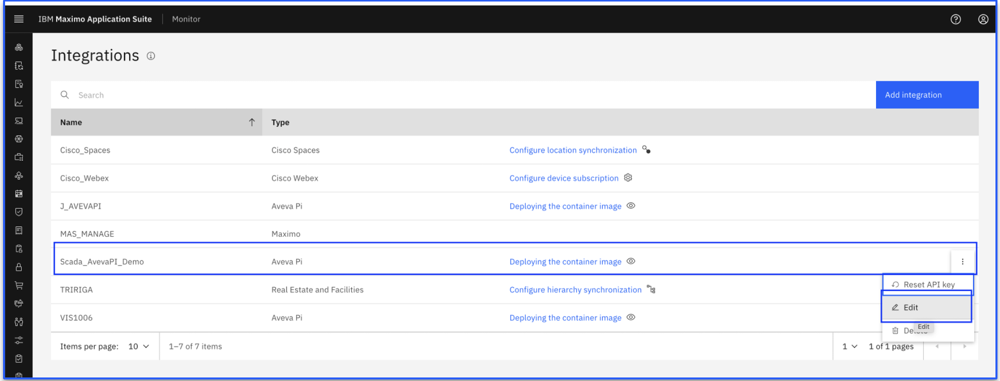
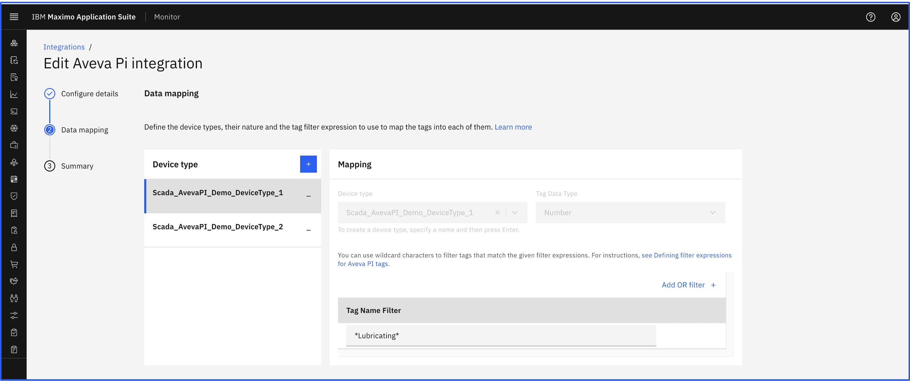

# Update Aveva PI Scada Historian Integration

In this Exercise you will learn how to update existing Aveva PI Scada Historian integration in IBM MAS Monitor

You can edit Aveva PI Scada Historian integration from the Edit button

!!! note
    You can update the Database (DB) Host, DB Port, DB Name, Driver Path, User Name, Password & Data mapping such as Tag Filter, Tag Data Type

    Fields like Integration name, Device Type cannot be edited.

!!! info
    You can create maximum of five device type while editing configuration. If needed to add more, then this configuration has to be saved and edited.

## Update Aveva PI Scada Historian Configuration 

1. Open `Maximo Application Suite` and select `Monitor Application`. 
{:style="height:500px;width:900px"}
2. Open `Monitor` tab
{:style="height:500px;width:900px"}
3. Navigate to the `Integrations` menu tab
{:style="height:350px;width:140px"}
4. Select the integration that needs to be edited from the list.
5. Click on `Edit`
{:style="height:400px;width:900px"}
6. Update configurations details in section `Configuration details` (If any update required)
7. Update details in `Data Mapping` section (If any update required). 
You can update `Tag name filter` and  `Tag data type`.
{:style="height:400px;width:900px"}
8. Verify and Submit updated Aveva PI Scada historian integration details. This will show docker command.

## Summary

Once Aveva PI Scada Historian integration is updated then re-run the docker command for the updated data based on changes.

Lets next see how to delete Aveva PI Scada Historian integration.