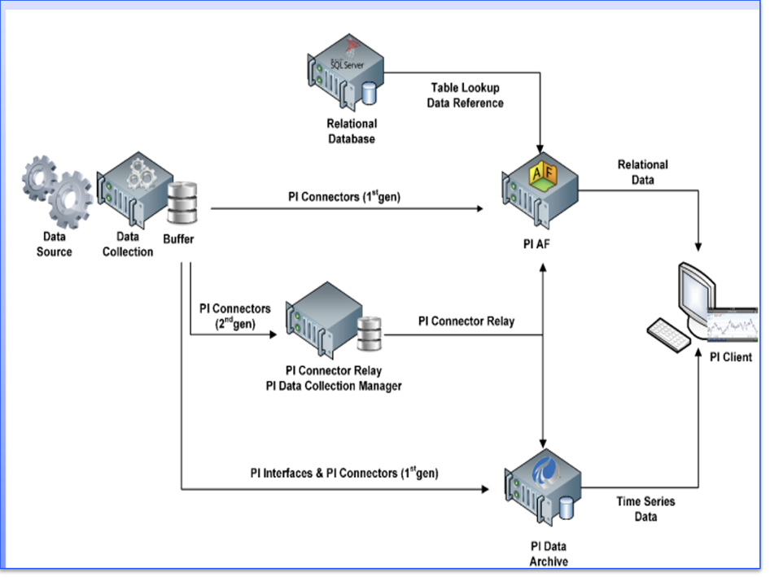
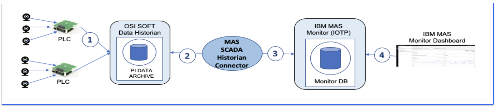

# Welcome to the  IBM Maximo Monitor Aveva PI Scada Historian Integration Lab

!!! info
    This lab demonstrates the integration of Aveva PI Scada Historian to IBM Maximo Monitor.

In this lab you will learn the steps needed to integrate Aveva PI Scada historian.   
it describes how to configure, execute and verify Aveva PI Scada Historian data.

## Overview

The OSI PI Data Historian, developed by OSIsoft (now AVEVA PI), is a real-time data historian that collects, stores, and analyzes time-series data from various industrial processes and sensors. 
It's widely used across industries like energy, manufacturing, and utilities, enabling organizations to gain insights, optimize processes, and make better decisions.

## High Level Architecture

{:style="height:400px;width:500px"}  

## High Level Data Flow

  

OSI Soft data historian (PI Data Archive) stores sensor data collected from PLCs.
MAS Monitor SCADA Historian connector extracts PI Point data from PI Data Archive. Extracts tag data from SCADA historian
MAS Monitor SCADA Historian connector sends PI Point data to IBM MAS Monitor using MQTT protocol.
Transforms tag data into MQTT events and send events to MAS Monitor. The device events can be used by IBM MAS Monitor for visualization and AI-driven analytics.

The exercises will cover:

* Adding a configuration of Aveva PI Scada Historian
* Verify, Deploy and Execute docker to load device data into IBM MAS Monitor based on tag filter expression mapping
* Update configuration of Aveva PI Scada Historian
* Delete configuration of Aveva PI Scada Historian
* Reset API Keys

!!! note
    Expected time needed to run the complete lab: 1 hour

---

**Updated: 2025-07-07**

---