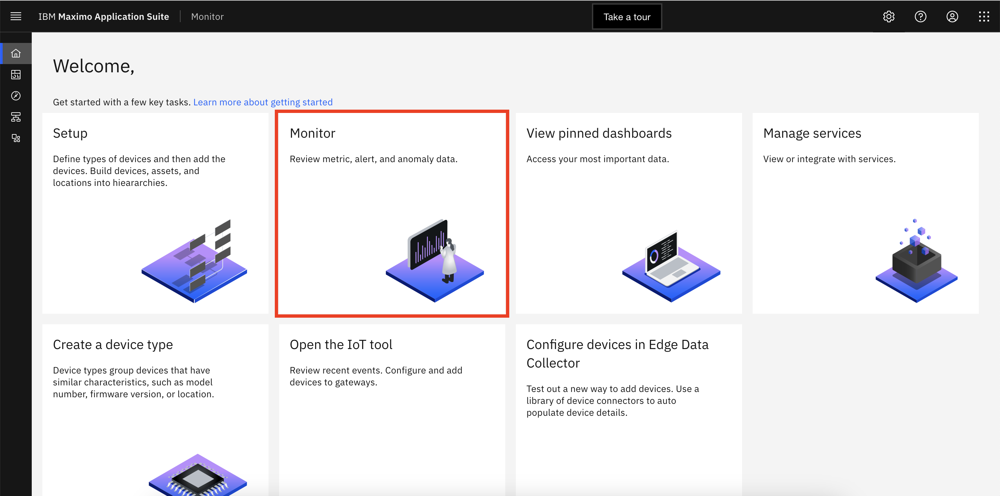

# Reset API Key

In this Exercise you will learn how to reset api key of Aveva PI Scada Historian integration.

## Reset API Key for Aveva PI Scada Historian Integration

1. Open `Maximo Application Suite` and select `Monitor Application`. 
{:style="height:500px;width:900px"}
2. Open `Monitor` tab
{:style="height:500px;width:900px"}
3. Navigate to the `Integrations` menu tab
{:style="height:350px;width:140px"}
4. Select the integration that needs api key reset from the list.
5. Click on `Reset Api Key`
{:style="height:400px;width:900px"}
{:style="height:300px;width:500px"}
{:style="height:300px;width:500px"}

!!! info
    On clicking "Deploying container Image", we can see updated docker command with new API token.

---
Congratulations you have successfully created, updated and deleted Aveva PI Scada Historian integration and thereby completed this Maximo Lab. 