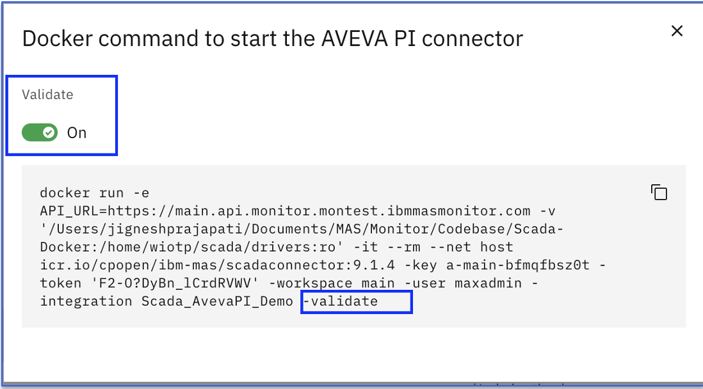
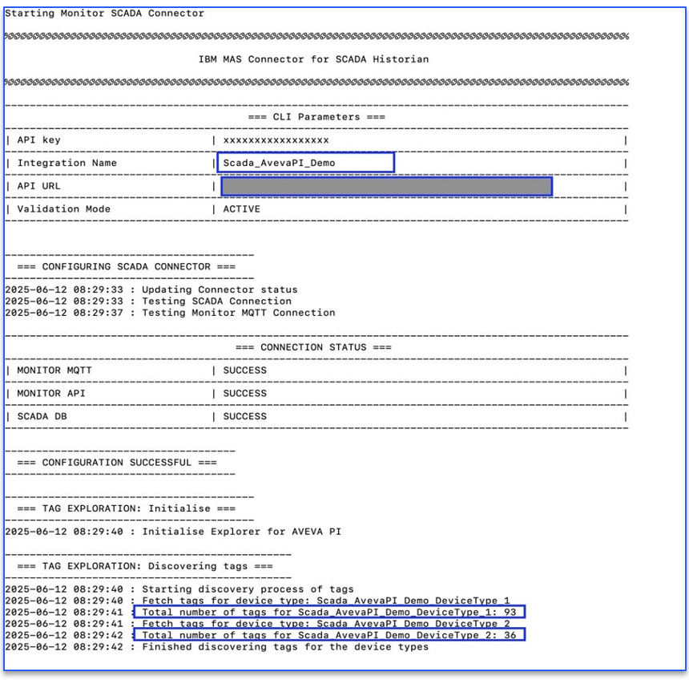
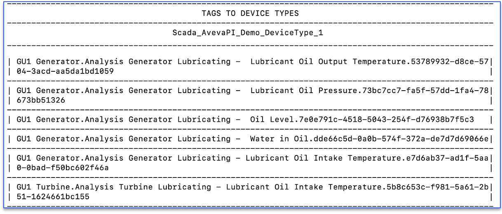
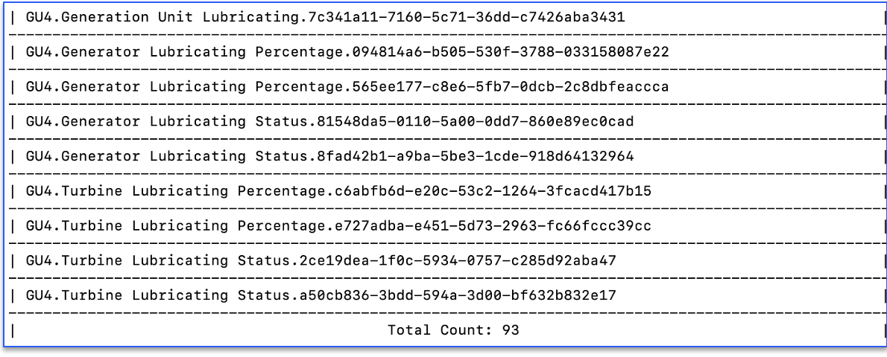
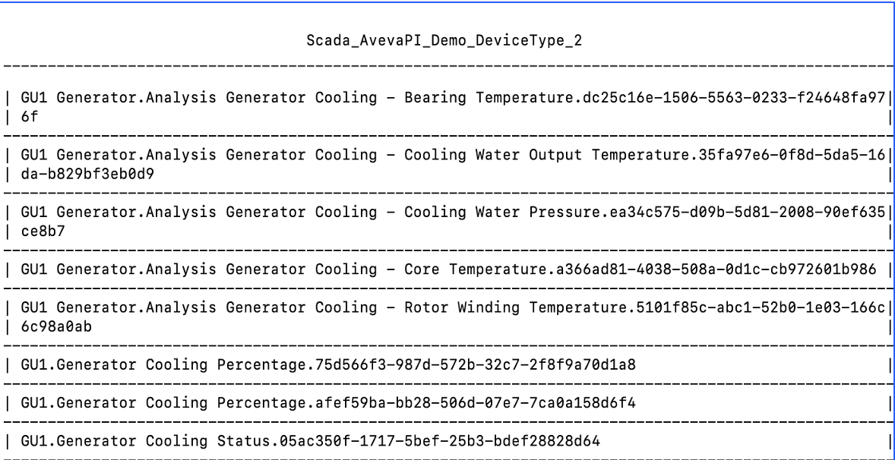
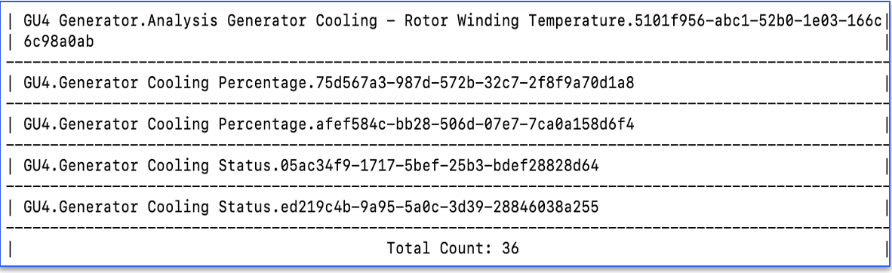

# Verify and Deploy Docker

In this Exercise you will learn how to verify and deploy generated docker command of Aveva PI Scada Historian.

Upon execution of docker command, it starts pulling device data based on tag name filter expression and device raw data from Aveva PI system. This data will be loaded into the devices created in the IBM MAS Monitor. 

## Aveva PI Scada Historian Docker With Validate Flag

By default, docker command has validate flag "on" (`-validate`).

{:style="height:350px;width:600px"}

When the docker command is initiated with validate flag "on" then it connects to Aveva PI system and retrieve tag details and show devices list based on Tag Name filter configured.

Once the user is satisfied with the validate results, then remove "-validate" flag and run the same docker command. 

## Aveva PI Scada Historian Docker Without Validate Flag

When we run docker command without `-validate` then this will retrieve the device data from Aveva PI Scada system and load into IBM MAS Monitor.

{:style="height:600px;width:700px"}

It also shows device type name which is similar to tag name filter from Aveva. It displays the device name and number of devices will be created in IBM MAS Monitor (Example screenshot of device type `Scada_AvevaPI_Demo_DeviceType_1` )

{:style="height:300px;width:700px"}
{:style="height:300px;width:700px"}

In case multiple device types are mapped during Aveva PI Historian integration configuration then it shows those device types (Example screenshot of device type `Scada_AvevaPI_Demo_DeviceType_2` )

{:style="height:300px;width:700px"}
{:style="height:200px;width:700px"}

## Summary

Once docker command is executed successfully without `--validate` flag then it creates device(s) and start loading device data in IBM MAS Monitor in the regular intervals

Lets next see how to view the devices created in IBM MAS Monitor and device data populated in recent events, trend chart and view data in data table.