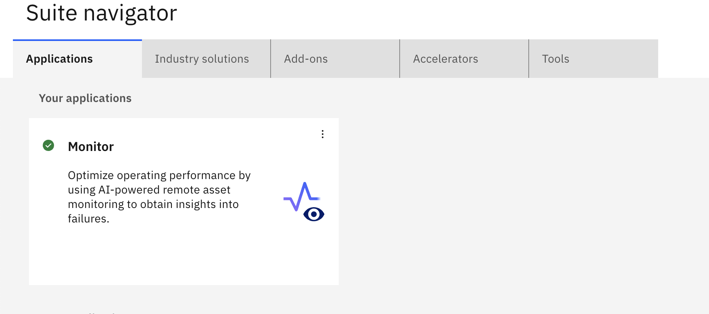
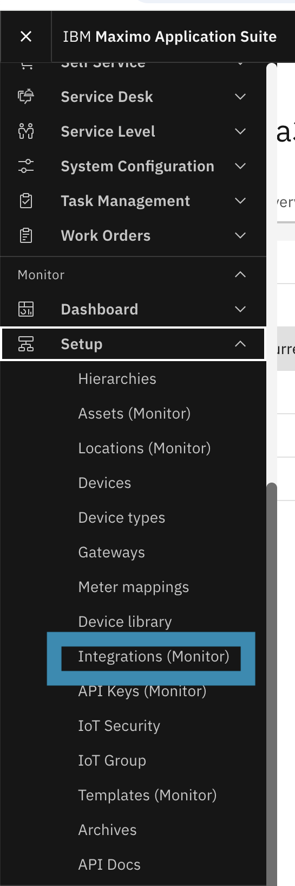
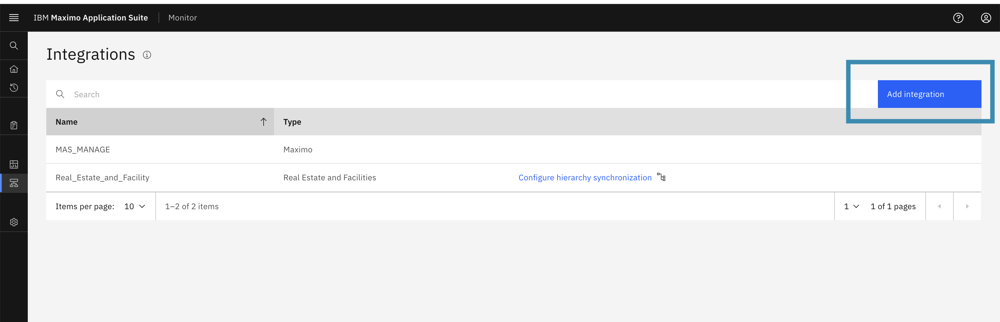
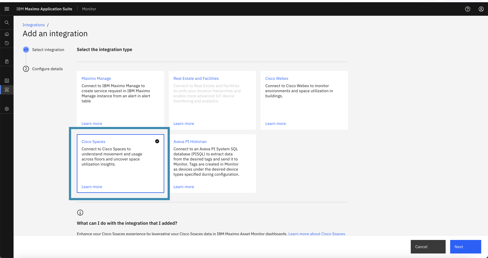
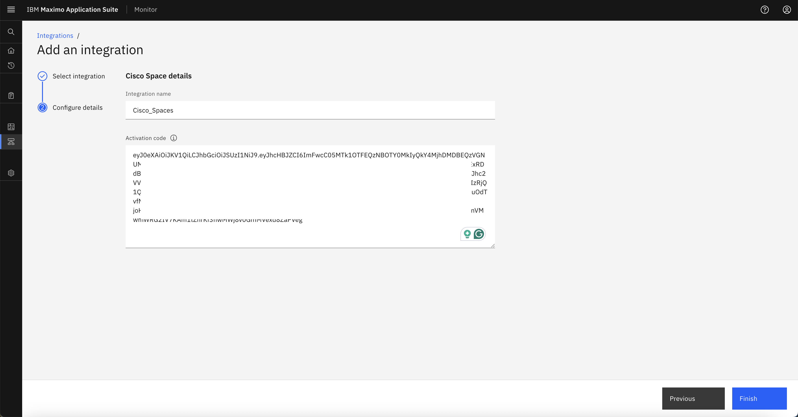
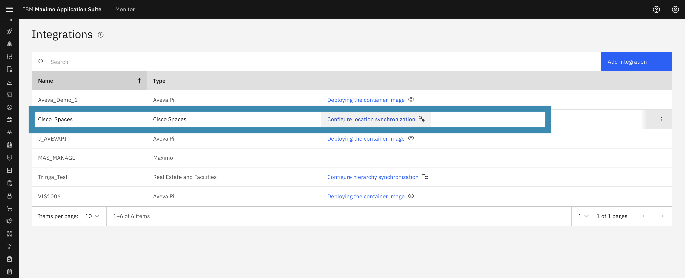

# Configure Cisco Spaces Integration

This guide explains how to configure Cisco Spaces integration in IBM MAS Monitor using the Activation Token generated earlier.

## Steps to Configure the Integration

1. **Log in to IBM MAS Monitor**  
   Access your MAS Monitor environment by logging in with your credentials in Maximo Application Suite.

    { width=70% height=50% }

2. **Navigate to Integrations**  
   Open the left-side navigation menu. Scroll to the **Monitor applications list** and select **Setup → Integrations** from the menu options.

    { width=20% height=10% }

3. **Add a New Integration**  
   On the Integrations screen, click the **Add Integration** button to start configuring a new integration.

    { width=70% height=30% }

4. **Select Cisco Spaces as the Integration Type**  
   In the integration configuration dialog, choose **Cisco Spaces** as the integration type.

    { width=70% height=30% }

5. **Provide Integration Details**  
    - Enter a meaningful **Integration Name**.  
    - Paste the **Activation Token** you copied from the previous exercise.  
    - Click **Finish** to complete the integration setup. 

    !!! warning
        - Ensure the Activation Token is correct. 
        - Make sure the token has not expired.
        - Verify the token has not been used previously for activation. Once a token is activated, an activation key is stored in the database, making that token unusable for any other integration. One token can only be used for a single configuration.
        - Only a correct and valid token will be saved successfully; otherwise, the integration setup will fail with an error.

    { width=70% height=30% }

6. **Verify Integration**  
   Once the integration is added successfully, its details will appear on the **Integrations list** page. This confirms that the configuration has been saved.

    { width=70% height=30% }

7. **View locations **  
   Within a few minutes, the list of locations associated with the Activation Token will be fetched automatically from Cisco Spaces and displayed in MAS Monitor.

---
