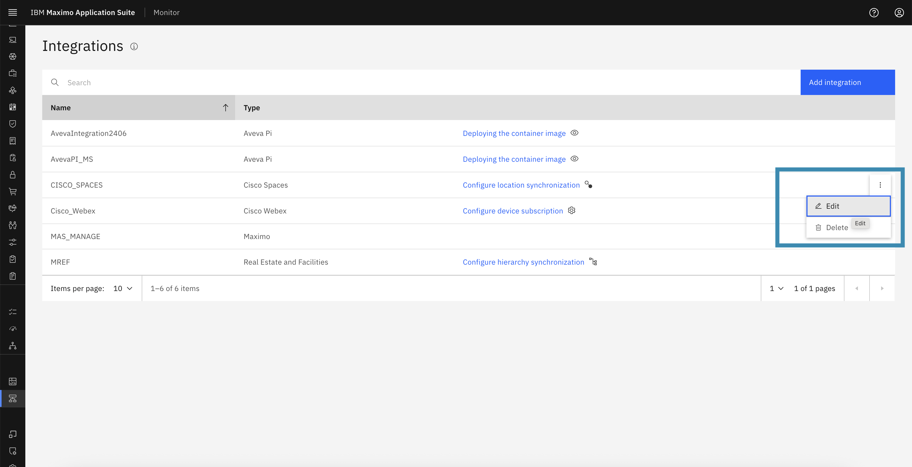
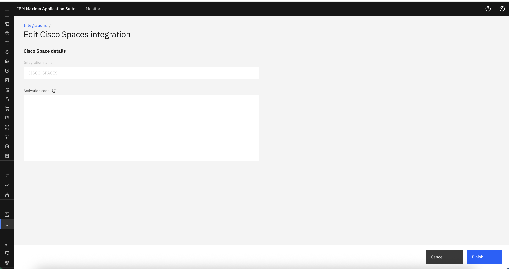
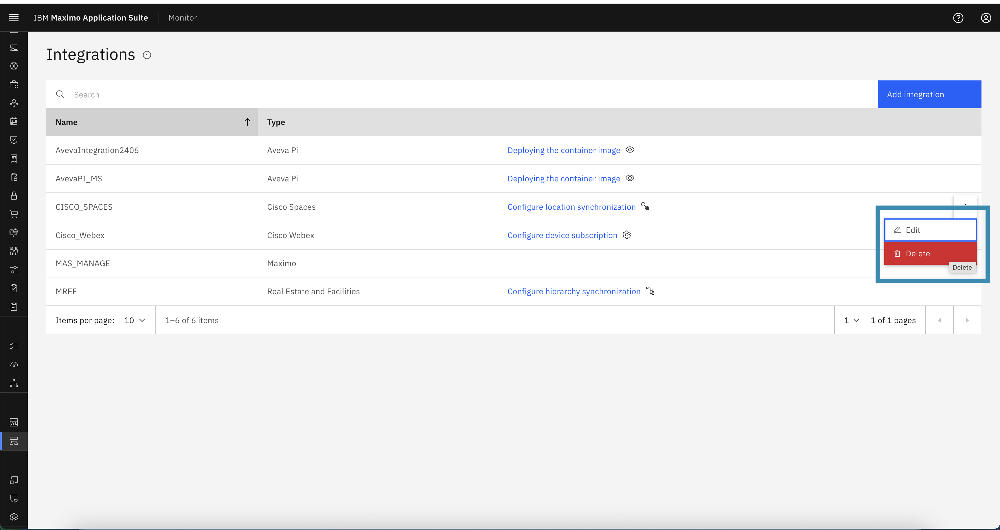
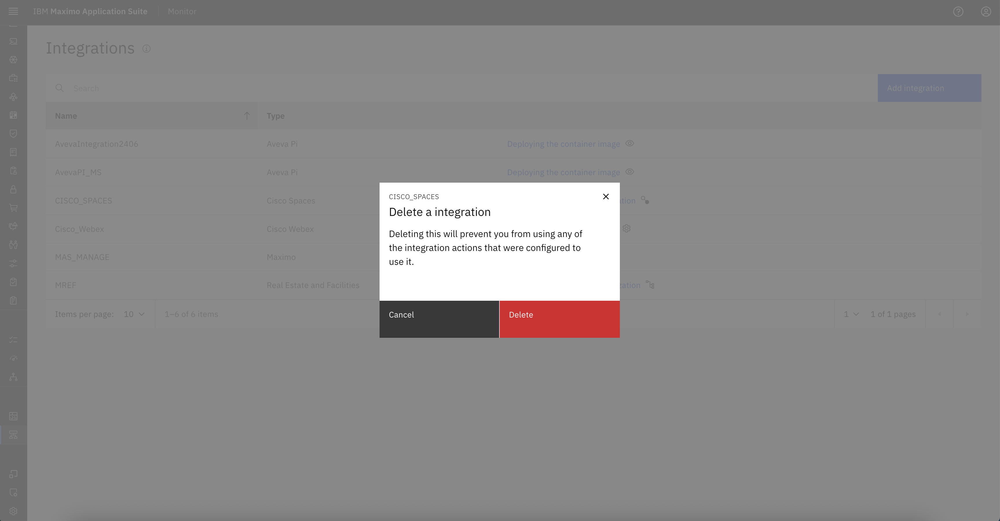
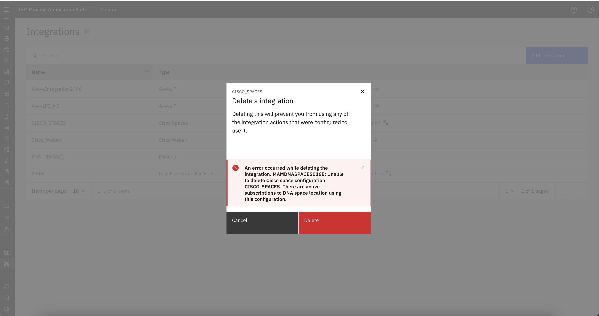

# Edit or Delete Cisco Spaces Integration Configuration

This guide explains how to **edit** or **delete** an existing Cisco Spaces integration configuration. These options are useful when you need to:

- Update the Activation Token.
- Remove an outdated or no longer needed integration.

---

## Edit Cisco Spaces Configuration

You can edit the Cisco Spaces configuration if the activation key (JWT token) needs to be **renewed, updated, or replaced**.

### Steps to Edit:

1. Navigate to **Setup → Integrations** in the MAS Monitor application.
2. Locate the **Cisco Spaces integration** from the integrations list.
3. Click on the **ellipsis (⋮)** button next to the integration name.
4. Select **Edit** from the action menu.

    

5. You will be redirected to Edit Cisco Spaces integration :
    - Update the **Activation Token** if it has **expired** or needs to be **renewed**.
    - Click on **Finish** to save the changes to apply the new configuration.

    

> ⚠️ Only the activation key can be edited. Integration name cannot be changed, if required, then consider deleting and recreating the configuration.

---

## Delete Cisco Spaces Configuration

You can delete the Cisco Spaces configuration if it is no longer required. However, this action has a strict conditions.

### Steps to Delete:

1. Navigate to **Setup → Integrations**.
2. Find the **Cisco Spaces** integration entry.
3. Click the **ellipsis (⋮)** menu next to the integration.
4. Select **Delete**.

    

5. A confirmation popup will appear with the message:

    > **Deleting this will prevent you from using any of the integration actions that were configured to use it.**

    

6. Click **Confirm** to proceed with deletion.

---

## ⚠️ Important Note

> **Deleting the Cisco Spaces integration is only allowed if all associated locations are unsubscribed.**

- If **any location is still subscribed**, deletion will be **blocked**.
- You must first go to each subscribed location and perform an **Unsubscribe** action.
- Once all locations are unsubscribed, the Delete action will be permitted.

   

---

## Summary

- Use **Edit** to update the activation key.
- Use **Delete** to completely remove the configuration — **only after unsubscribing all locations**.
- Always verify whether the integration is still in use before performing actions like deletion.

---
