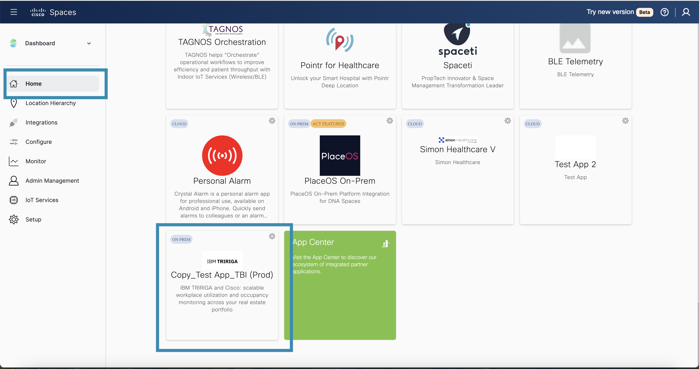
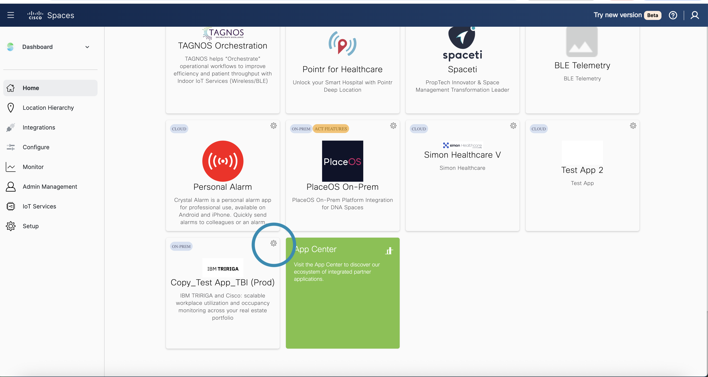
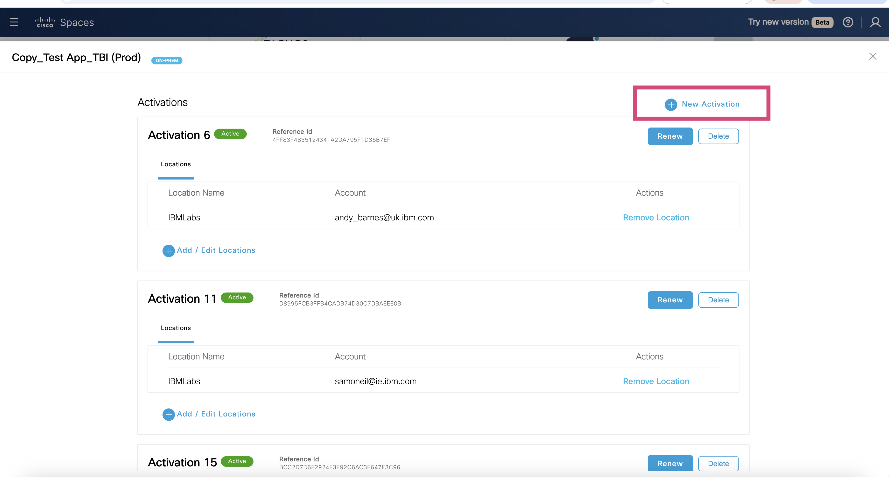
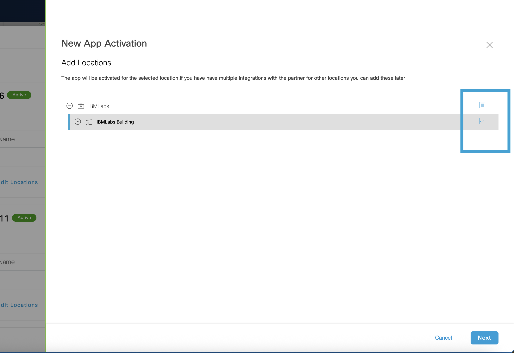
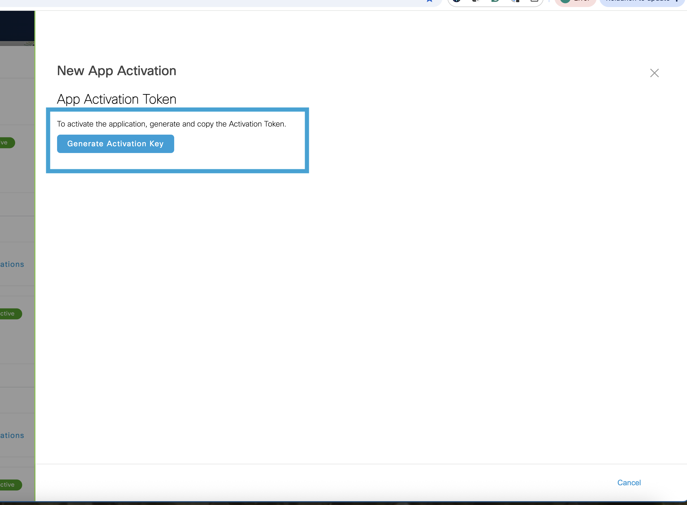
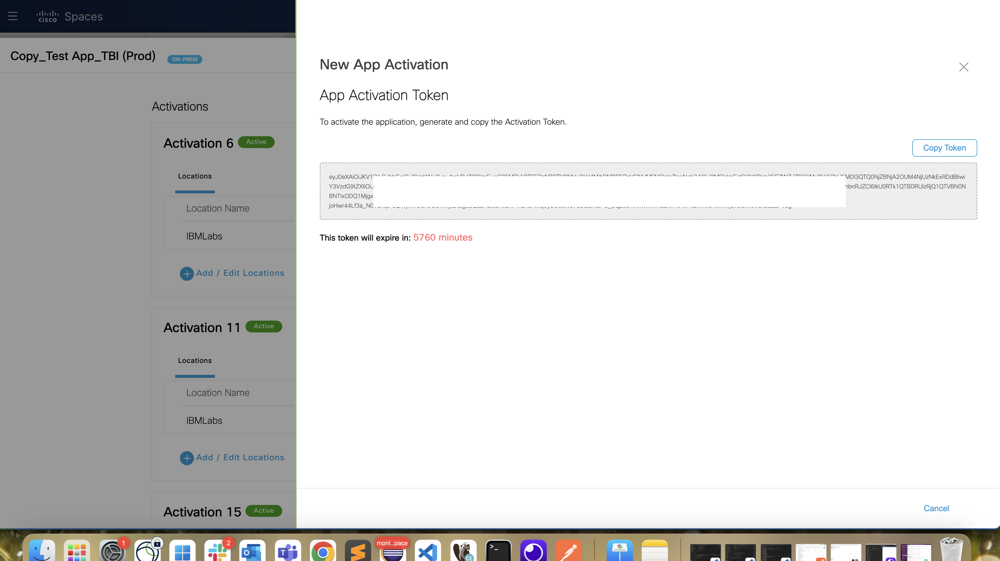

# Generating an Activation Token in Cisco Spaces for MAS Monitor Integration

This guide details the step-by-step process for generating an **Activation Token** in Cisco Spaces, which is required to integrate Cisco Spaces with Maximo Application Suite (MAS) Monitor.

The Activation Token allows MAS Monitor to fetch building and location data from Cisco Spaces, enabling location-aware monitoring and insights.

## Steps to add the Integration to MAS Monitor

1. **Log in to Cisco Spaces**  
   Open [dnaspaces.io/login](https://dnaspaces.io/login) in your browser and sign in using your Cisco Spaces credentials.

2. **Search for the Application**  
   After logging in, navigate to the **Home** page. Use the search bar to find the application. For this exercise, we will use the app named **Copy_Test App_TBI (Prod)**.

    !!! note "Search for the Application"
        Ensure you search for the application that contains the list of buildings or locations relevant to your integration. The application should include the physical spaces / locations you intend to monitor with MAS Monitor.

3. **Open the Application Settings**  
   Once you locate the app tile for **Copy_Test App_TBI (Prod)**, click on the **gear icon** located on the tile to open the application’s settings.

      

4. **Generate a New Activation Key**  
   In the new window that opens, click on the **New Activation** button to start the process of generating a new activation key.

    

5. **Select Locations**  
   In the **New App Activation** window, select the locations (buildings or areas) you want MAS Monitor to access. This selection determines which physical spaces will be integrated into MAS Monitor.

    

    After selecting the desired locations, click **Next** to proceed.

6. **Generate the Activation Token**  
   Review your selection. Then, click on the **Generate Activation Key** button. This action will create your Activation Token (JWT token), which you can use in MAS Monitor to complete the integration.

    

7. **Copy and Store the Activation Token**  
   Once the activation key is generated, **Copy Token** and keep it stored securely. You will need this token when configuring the Cisco Spaces integration within the MAS Monitor application.

    
