# Heat Maps on MREF Floor Plan

In this guide, we will learn how to **generate heat maps** on the MREF Floor Plan using events received from **Cisco Spaces**. These heat maps help visualize **user movement patterns** on a floor using coordinate-based data (`x_pos` and `y_pos`).

We’ll walk through the full process including verifying floor plans, creating calculated metrics, and rendering heat maps on a custom dashboard.

---

## Overview

Cisco Spaces sends real-time user location events which include X and Y positions. Using this data, we can:

- Plot heat maps on SVG-based floor plans.
- Observe occupancy trends.
- Analyze behavior across time (hourly, daily, etc.).

---

## Step-by-Step Guide to Generate Heat Maps

### Step 1: Verify Floor Plan for the MREF Floor

1. Go to **Dashboard → Location View**.
    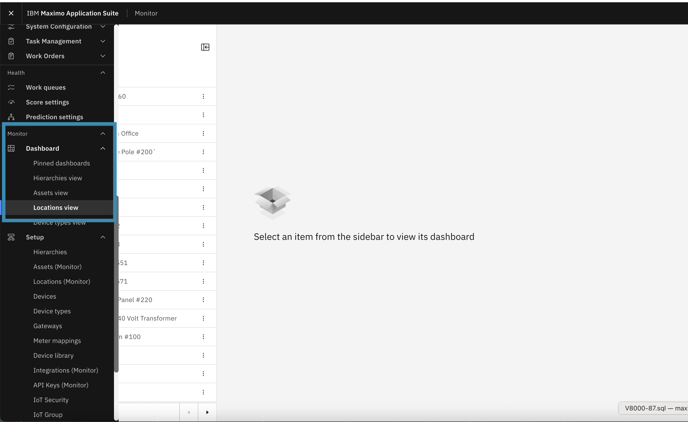
     
2. Use the **search bar** to find the desired **Floor Name**.
     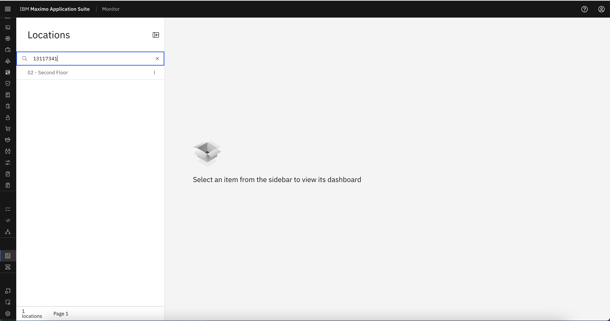
     
3. Click on the **floor** to open dashboards.
4. On the right-side pane, select the **Workplace Analytics** tab.
5. Ensure that a **floor plan (.svg)** has been generated from MREF.
    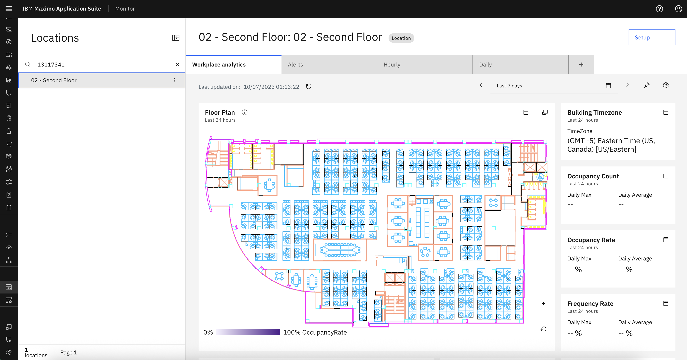

---

### Step 2: Create Occupancy Location Calculated Metric

We now create a calculated metric to capture occupancy data over time.

1. Navigate back to the **Locations** tab.
2. Open the **Calculated Metrics** tab.
3. Click **Add Calculated Metric**.
    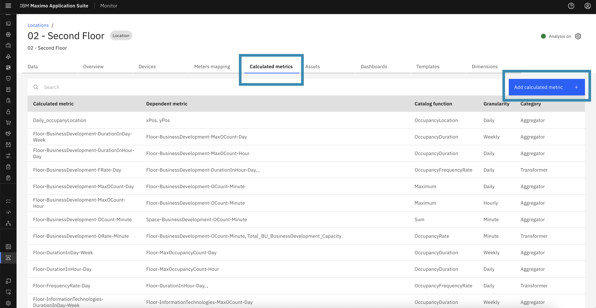

#### Configure the Metric:

- This will open a pop-up with the list of function to calculate the batch data metrics
    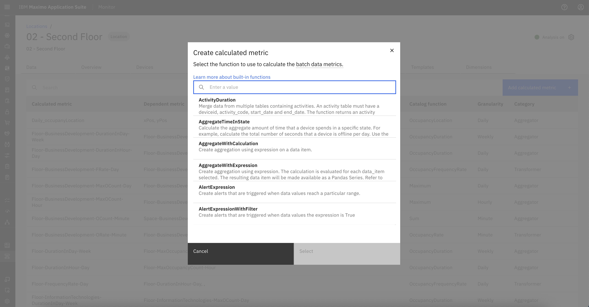
- From this popup, **search and select**: `OccupancyLocation` aggregate function.
    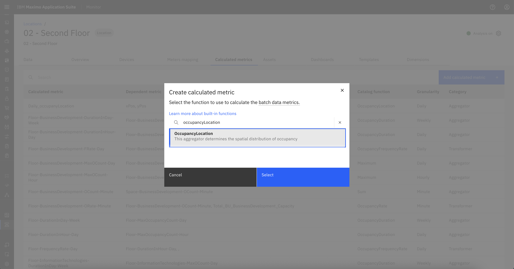

#### Fill in the configuration fields:

1. **Scope**: Define the nodes to include.
    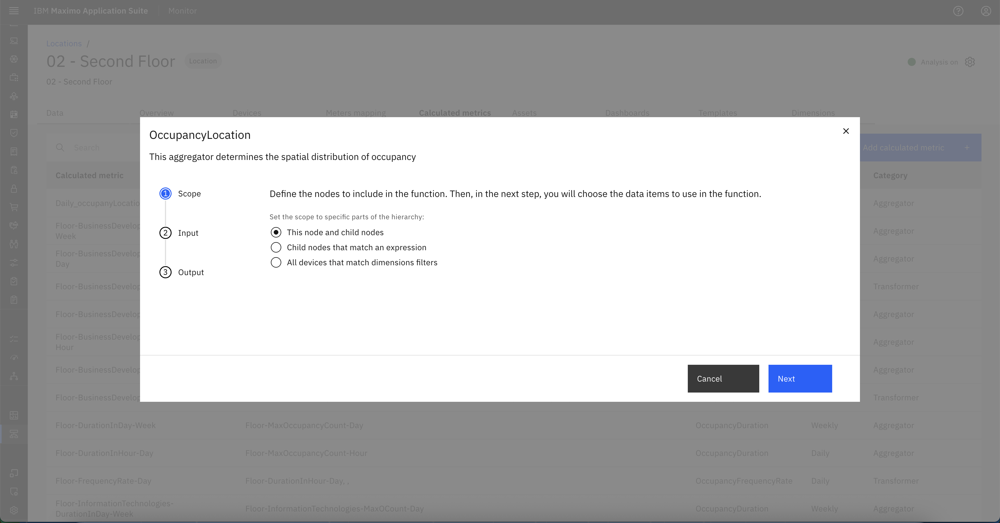
2. **Input**: Select `x_pos` and `y_pos` metrics from the dropdown.
    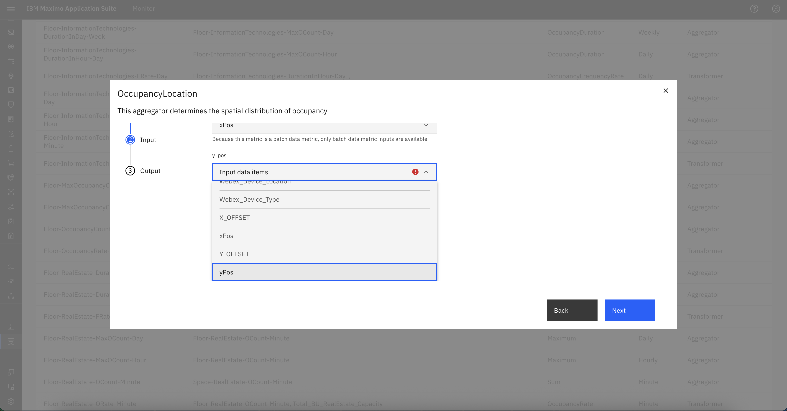
    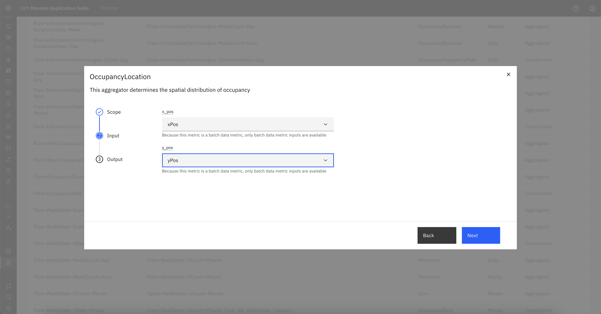
3. **Output**:  
    - Granularity: **Hourly**  (For this lab, we will use **hourly granularity**)
    - Auto Schedule: Enabled (or turn off and select custom time range)  
    - Output Data Item Name: Provide any name for the data item , eg. `Hourly_OccupancyLocation`  

    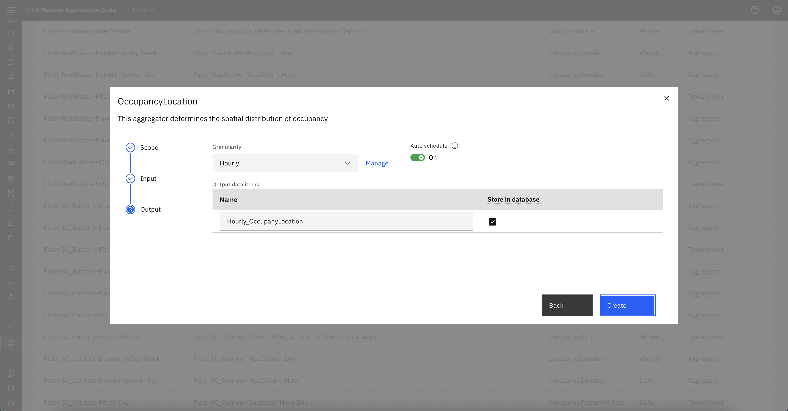
     

4. Click **Create**.
    
    - The metric `Hourly_OccupancyLocation` will now appear in the list of Calculated Metrics.
    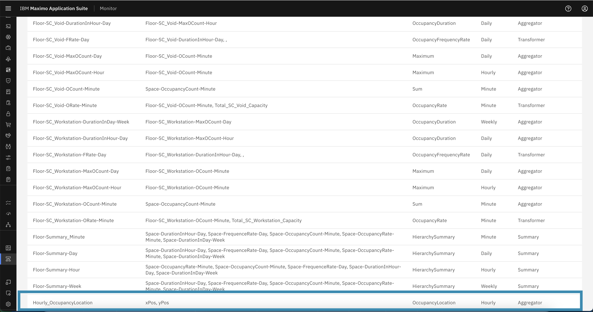
---

### Step 3: Create or Update Dashboard to Visualize Heat Map

You can either create a new dashboard or add a card to an existing one.

1. Go to the **Dashboards** tab.
2. Click **Add Dashboard**, provide a **title**, and click **Configure Dashboard**.

     

     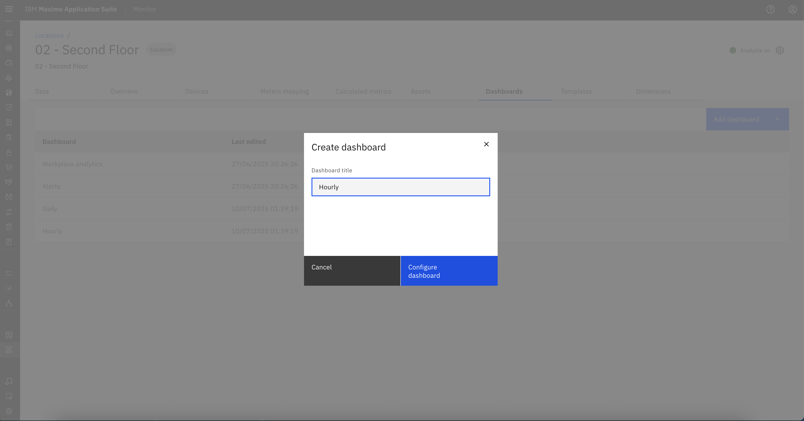
#### Add Heat Map Card:

- From the right-side **Gallery**, select: `Floorplan with overlay`.
    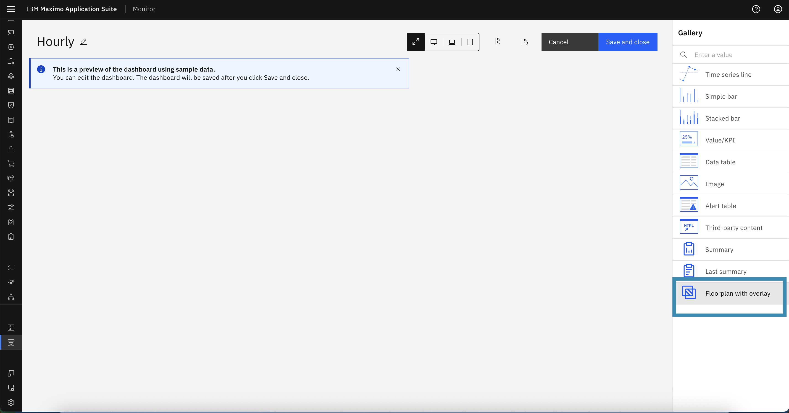

    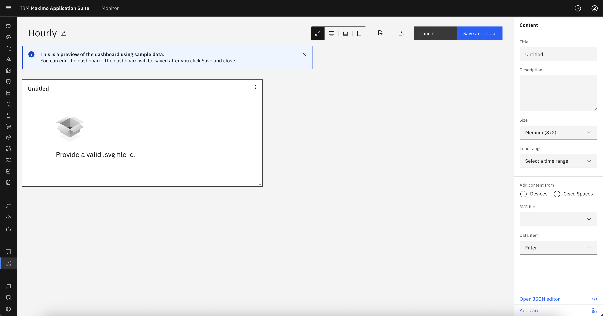

- Fill in the **card configuration details**:
    - **Title**: Heat Map or any relevant title
    - **Description**: Describe what the card visualizes
    - **Card Size**: Choose based on layout
    - **Time Range**: Select desired time range
    - **Data Source**: Choose **Cisco Spaces**
    - **SVG File**: Select the appropriate floor plan.
    - **Data Item**: Select `Hourly_OccupancyLocation`

    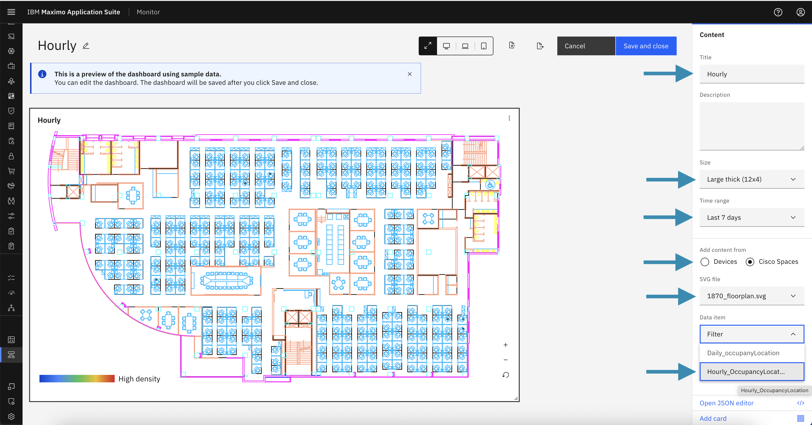

3. Click **Save and Close**.

---

### Step 4: Wait for Pipeline Execution and View the Heat Map

- The system will automatically schedule the pipeline to process the calculated metric.
- Once processed, go back to:

  **Dashboard → Location View → Search Floor Name**

1. Open the newly created dashboard (e.g., `"Hourly"`).
2. You should now see the **heat map overlayed** on the SVG floor plan.
3. The heat map visualizes **user density and movement** across the floor.

    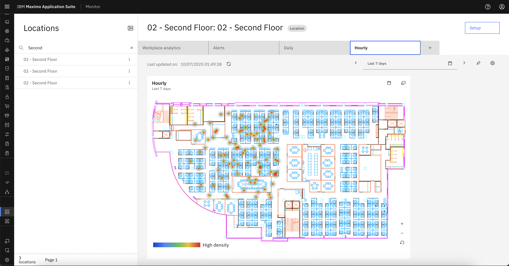

    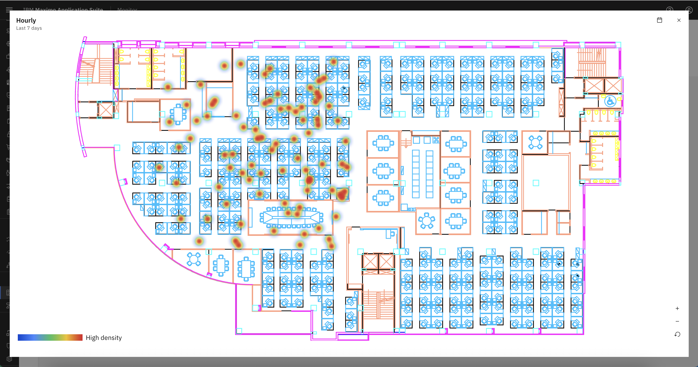
---

## Summary

You have now successfully:

- Created a calculated metric for occupancy data.
- Configured a dashboard with a heat map overlay.
- Visualized Cisco Spaces event data on MREF floor maps.

This process enables facilities teams to gain actionable insights into user flow and space utilization using real-time data from Cisco Spaces.

---
