# Cisco Spaces Location Metrics 

Once the Cisco Spaces integration is set up and events are being processed successfully, IBM MAS Monitor begins to display real-time and historical **location-based metrics** fetched directly from Cisco Spaces.

These metrics provide deep insights into user presence, movement, and positioning within a mapped floor or space.

---

## Accessing Location Metrics

You can view metrics associated with a Cisco Spaces location using either of the following methods:

1. **Navigate via Floor Name Link**  
    - Go to the **Cisco Spaces Locations** table.  
    - Click on the **Floor Name** (which is a clickable link) for the subscribed location.

    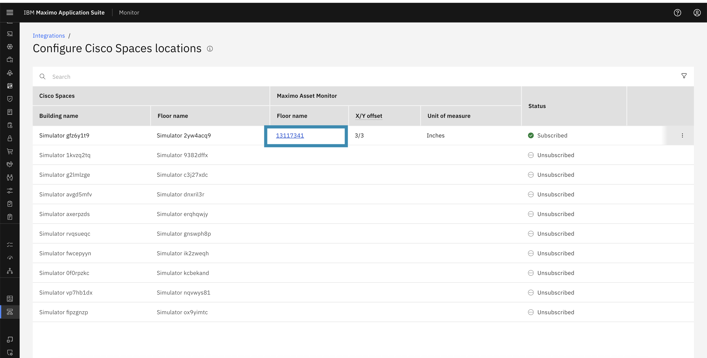 

2. **Search from Locations Tab**  
    - Go to the **Monitor → Locations** tab.  
    - Search for the location by its mapped **Floor Name**.
    - Select the matching location from the results to open the detailed location view.

     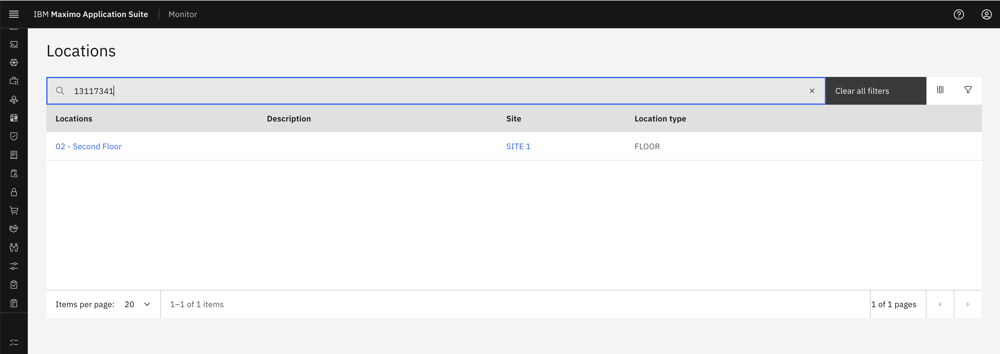

Once inside the location page, view the **Metrics** section to see Cisco Spaces data.
     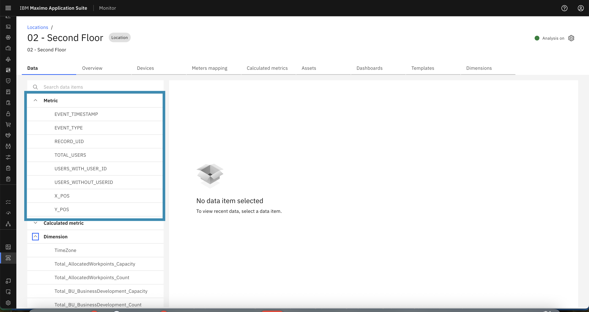
---

## Metrics Fetched from Cisco Spaces

Below is the list of key metrics received from Cisco Spaces.

### 1. `EVENT_TIMESTAMP`  
Represents the timestamp when the event is received.

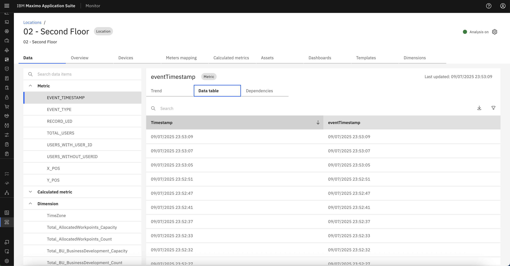 

---

### 2. `EVENT_TYPE`  
Represents the type of event that occurred (e.g., entry, exit).

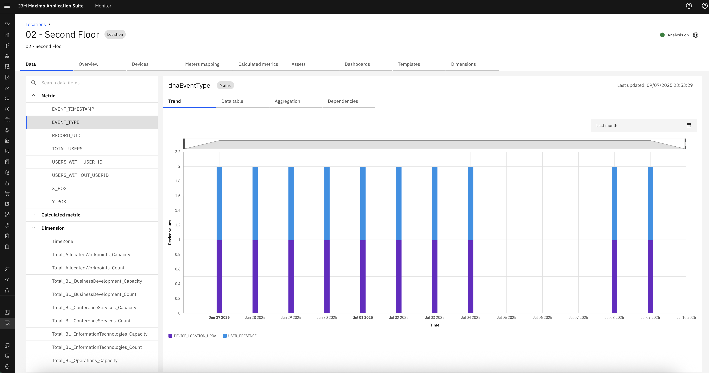  
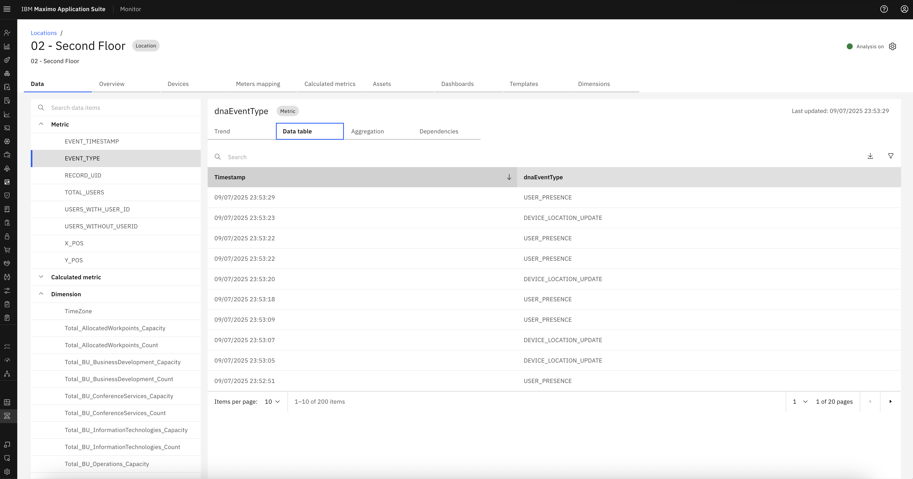

---

### 3. `RECORD_UID`  
Unique identifier for the event record received from Cisco Spaces.

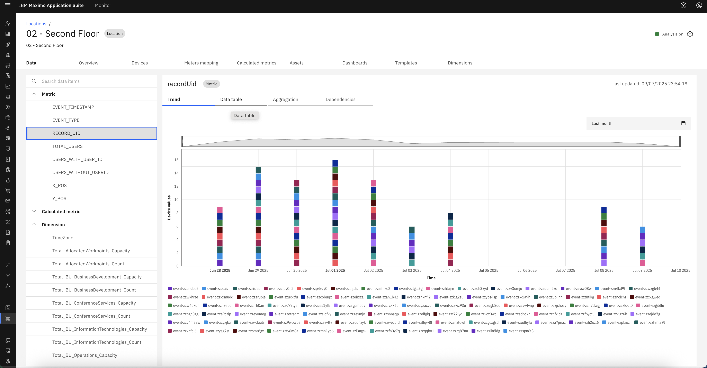  
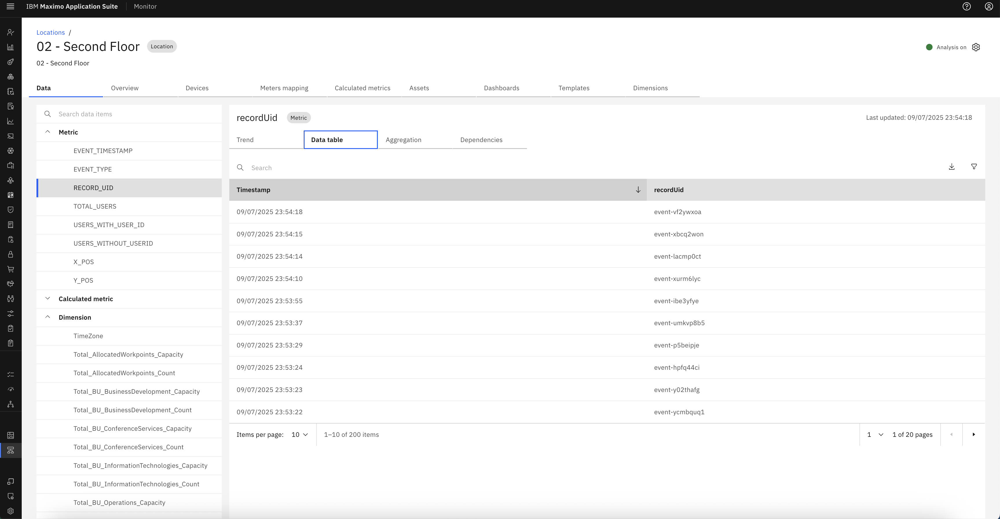

---

### 4. `TOTAL_USERS`  
Indicates the total number of users detected in the location at that timestamp.

  
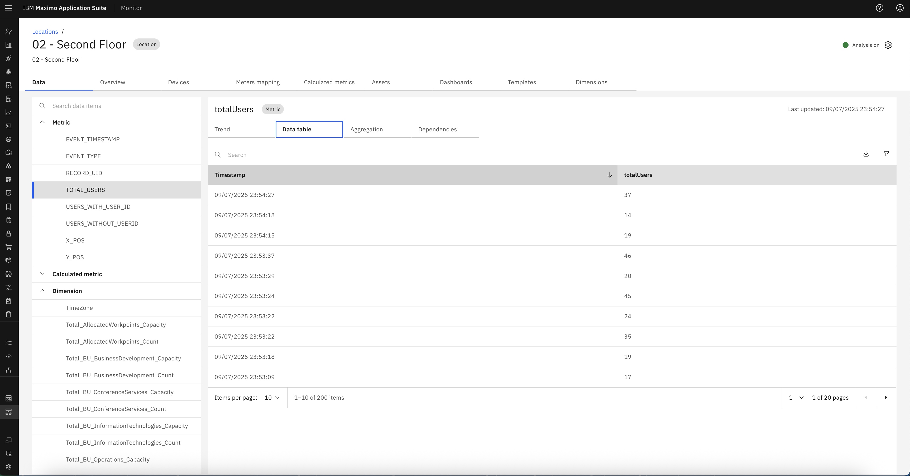

---

### 5. `USERS_WITH_USER_ID`  
Number of users identified with a valid user ID.

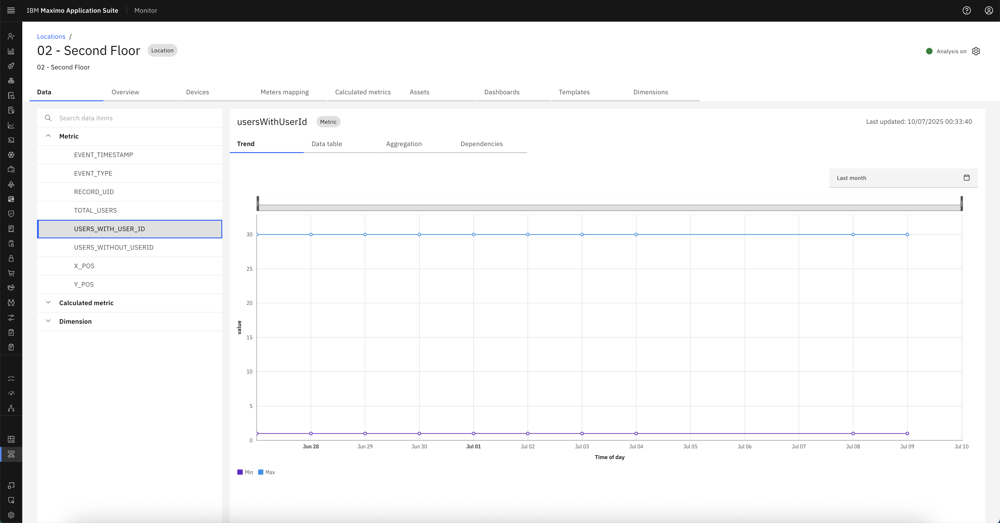  
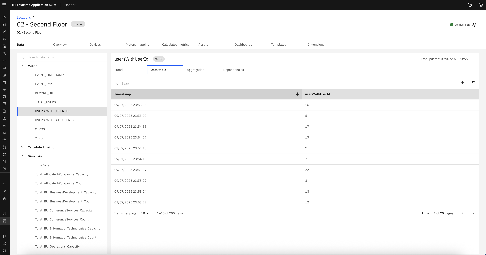

---

### 6. `USER_WITHOUT_USERID`  
Number of anonymous users or users without an ID.

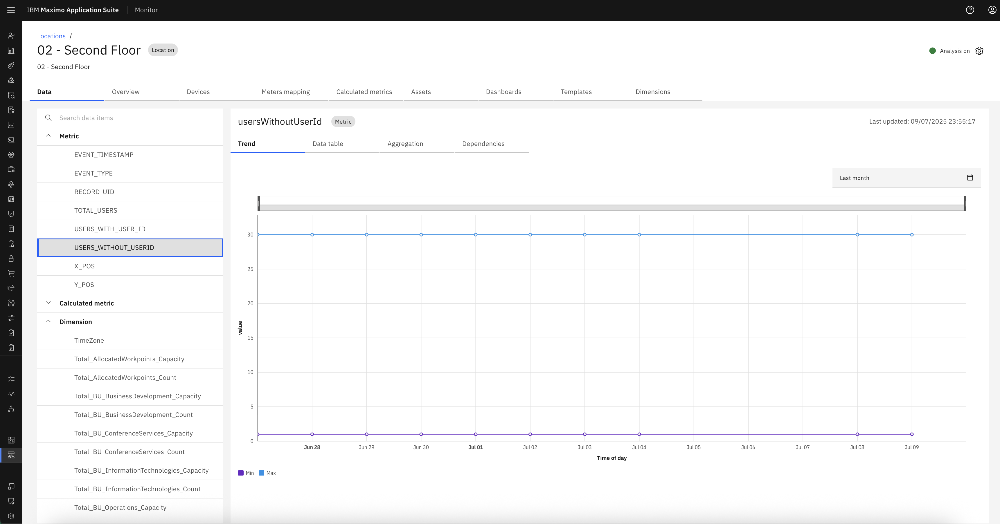  
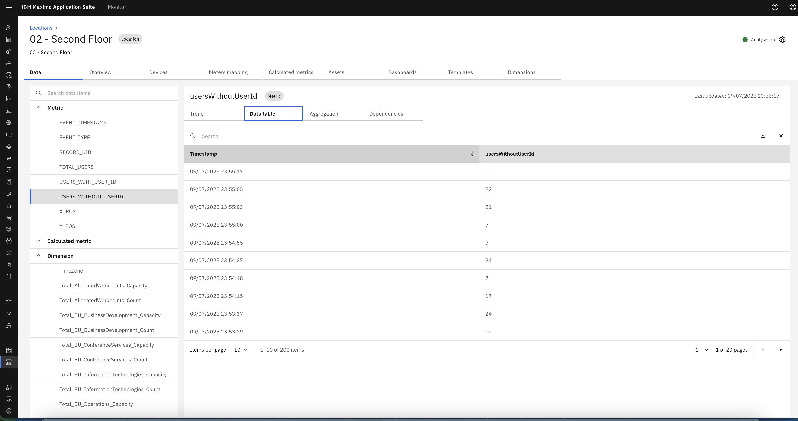

---

### 7. `X_POS`  
X-coordinate of user position within the mapped space.

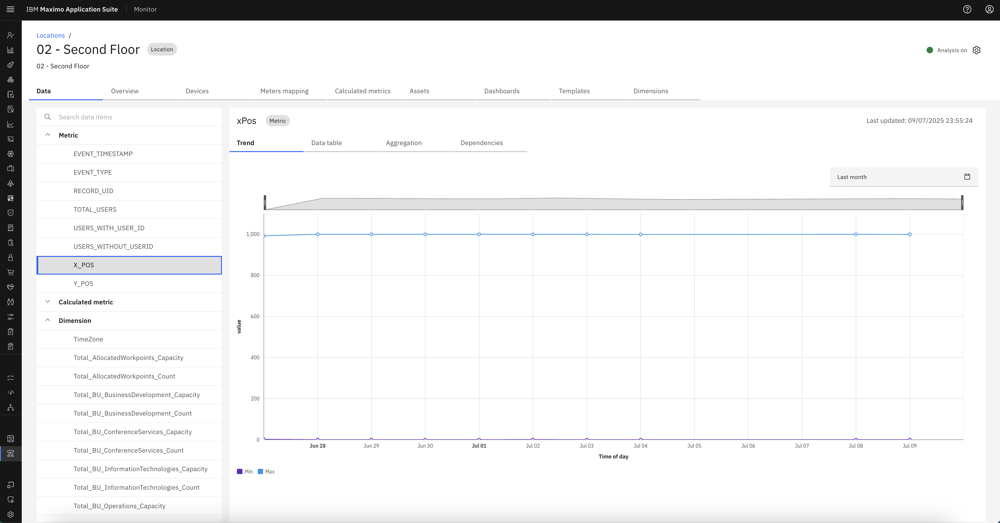  
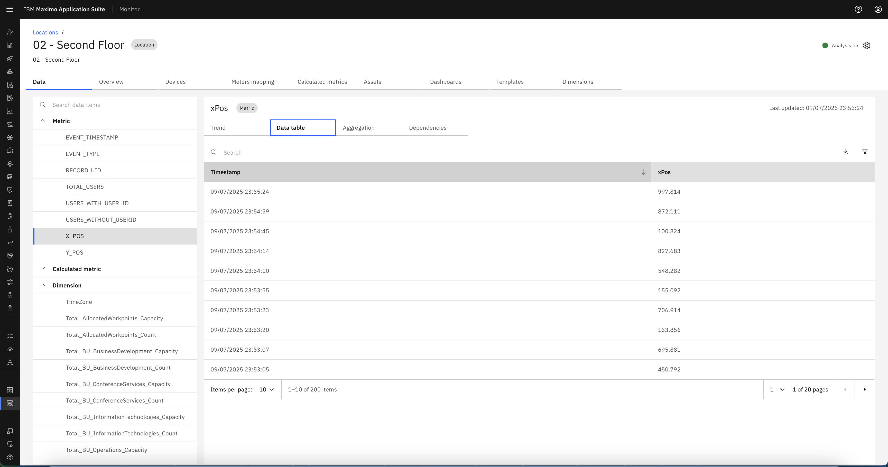

---

### 8. `Y_POS`  
Y-coordinate of user position within the mapped space.

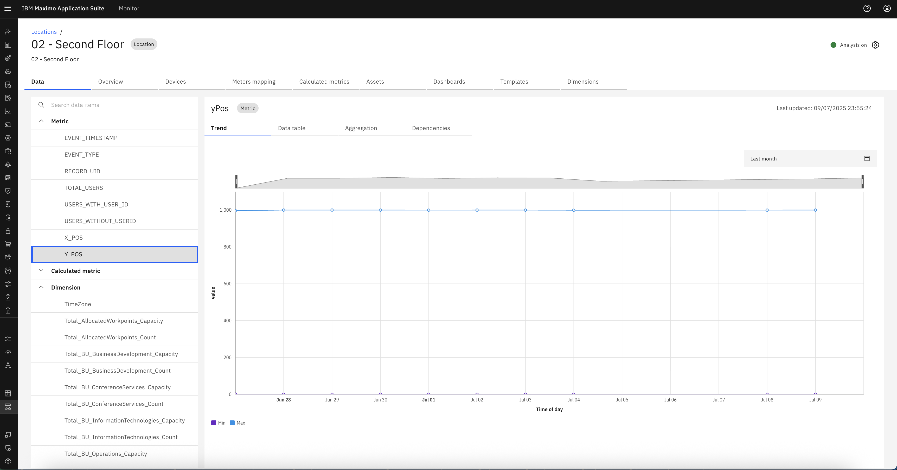  
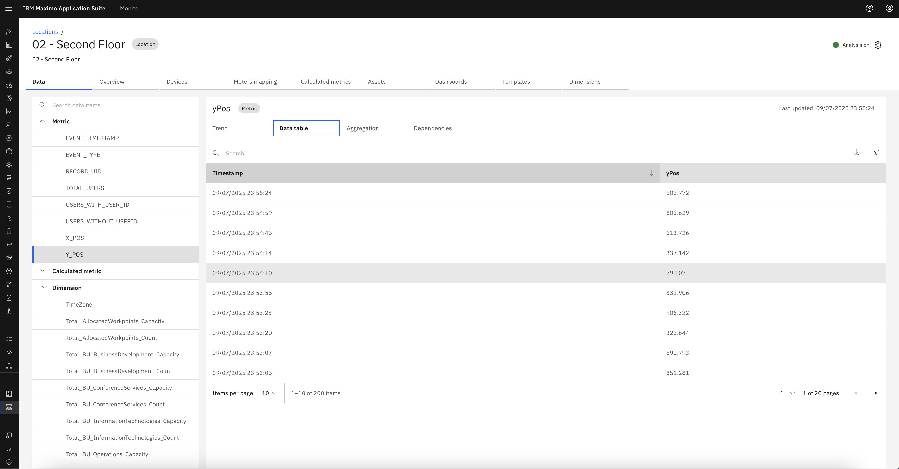

---

## Dimensions Fetched from Cisco Spaces

In addition to event metrics, Cisco Spaces also provides **dimension details** configured during the subscription phase. These include:

### 1. `X-OFFSET`  
The horizontal offset configured in **Edit Offset and Measurement**.

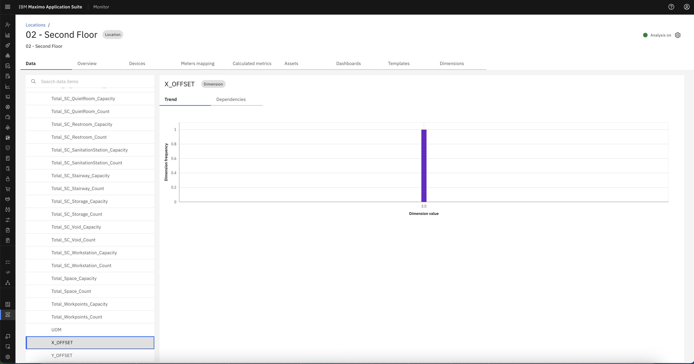 

---

### 2. `Y-OFFSET`  
The vertical offset configured in **Edit Offset and Measurement**.

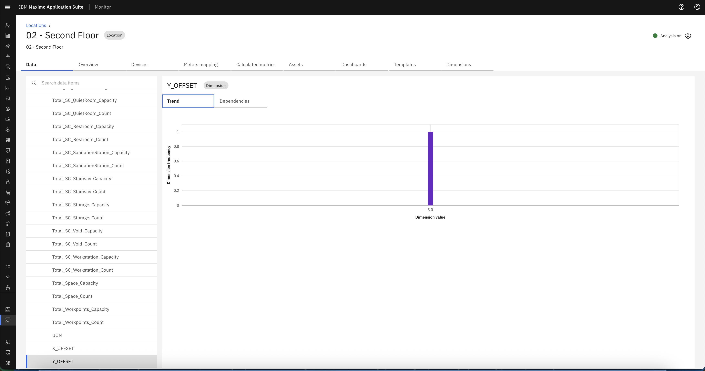  

---

