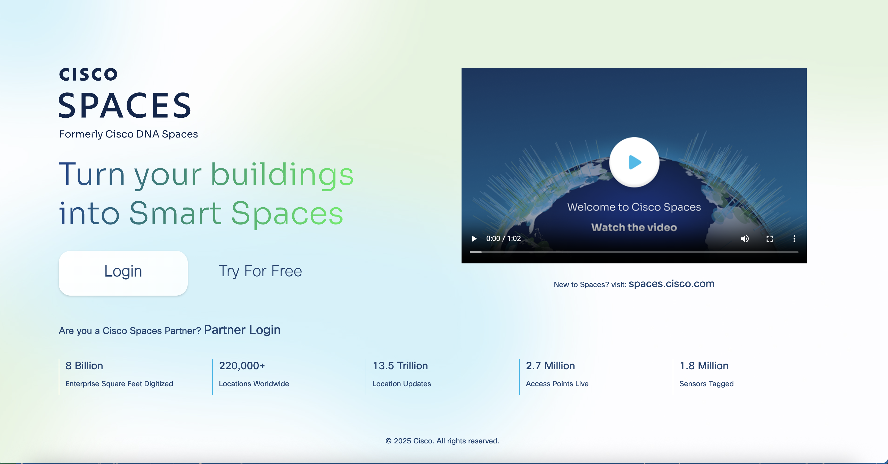

# Pre-Requisite Instructions

Here are the pre-requisites for this Maximo hands-on lab.  

!!! attention
    This lab requires Maximo Monitor 9.0 or later. 
    MAS application entitlement must be `Limited` or higher.

# All Exercises

All Exercises require that you have:

1.  A computer with a Chrome or Firefox browser and internet connectivity.

2.  User access to a Maximo Application Suite environment that can configure Cisco Spaces integration. This require: 
o Your user must have access to Maximo Monitor 

3.  An IBM ID.  If you don't have an IBM ID you can get one [here](https://www.ibm.com/account/reg/signup?){target=_blank}: 
o Click `Login to MY IBM` button 
o Click `Create an IBM ID` link

4.  Test your access to the Maximo Application Suite environment.

# Exercise 

> - You must have access to the [dnaspaces.io login page](https://dnaspaces.io/login) to continue with this exercise.
>
> - We need access to dnaspaces.io to get an activation token (JWT token). This token will generate the activation key that will fetch Cisco Spaces locations.
>
> 
