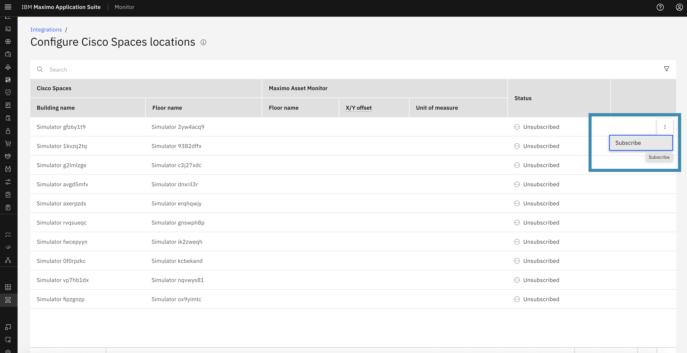
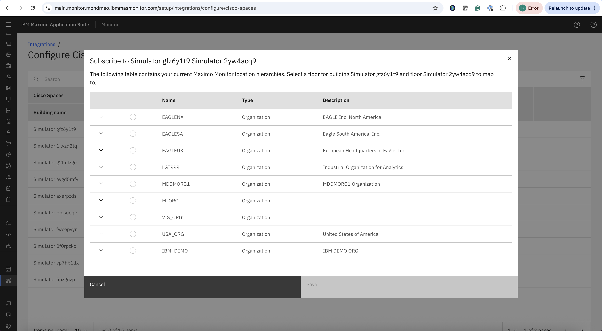
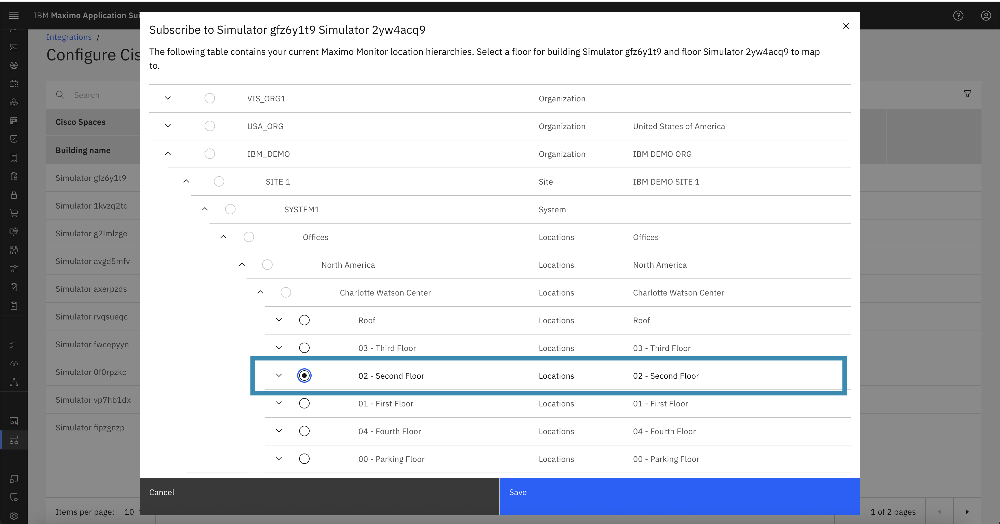
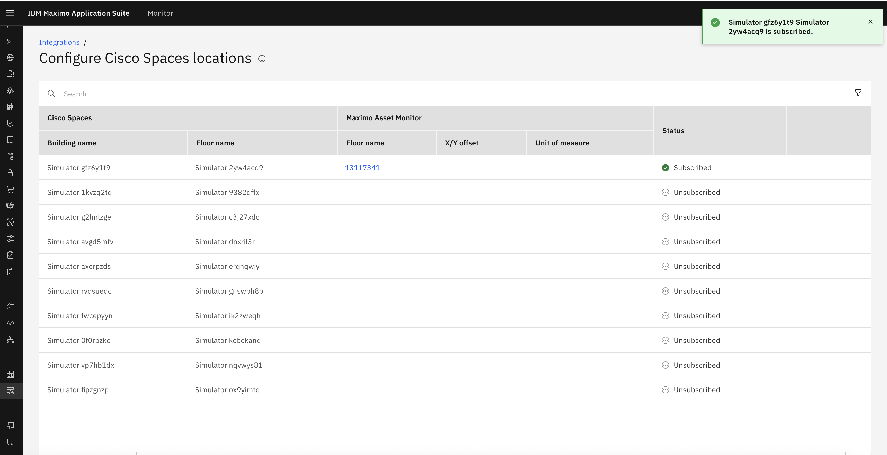
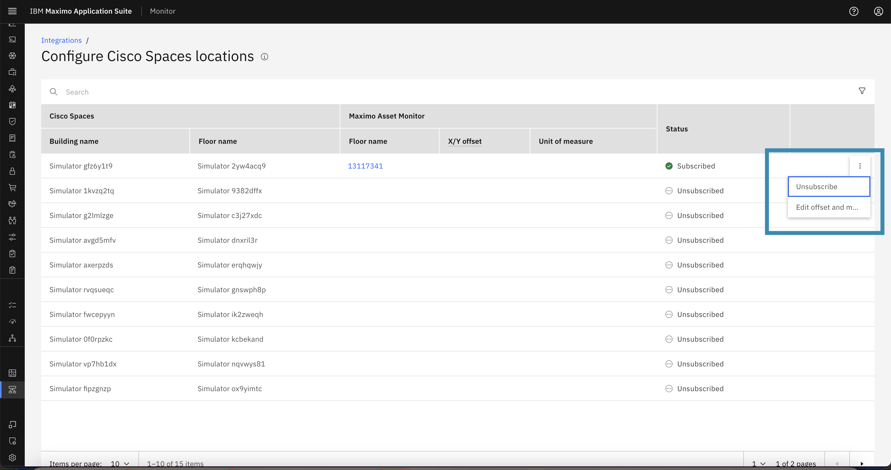
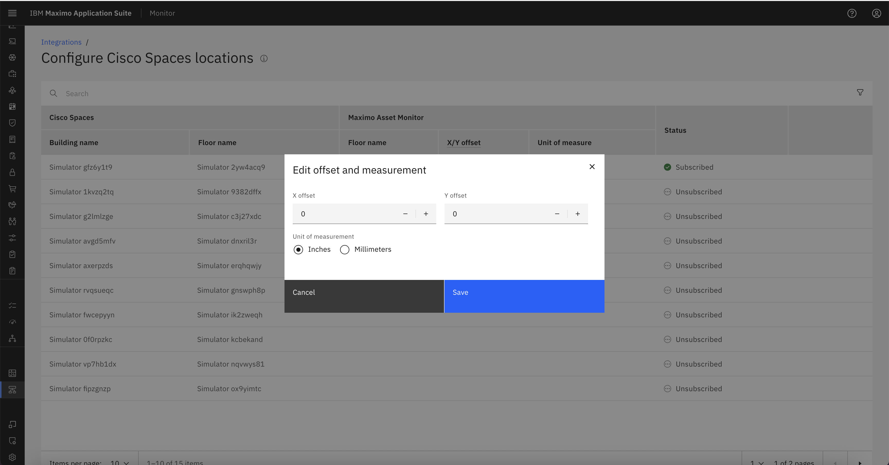
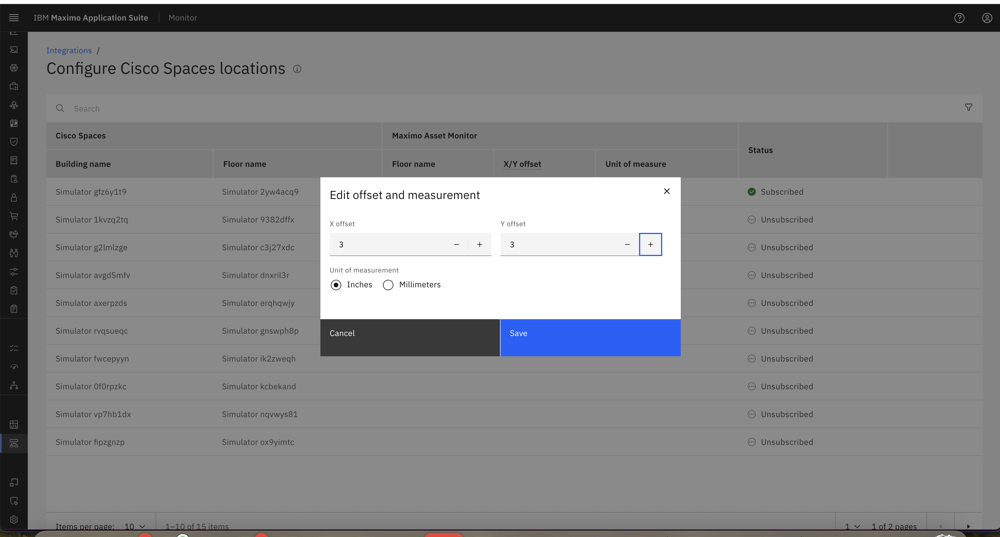
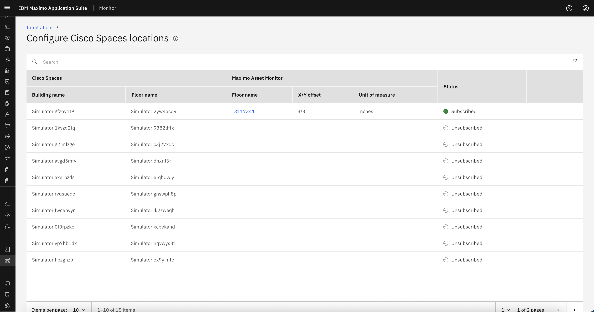

# Subscribe to Cisco Spaces Location

In this guide, we will walk through the process of subscribing a Cisco Spaces location in IBM MAS Monitor. Subscribing a location links the Cisco Spaces location with an MREF floor, allowing MAS Monitor to begin tracking and visualizing user presence , user movement and other metrics for that area.

---

## Step 1: Open the Actions Menu

Navigate to the list of Cisco Spaces locations in MAS Monitor.

- On the rightmost side of the location entry, click the **ellipsis (⋮)** button to open the actions menu.
- You will see an option labeled **Subscribe**.

---

## Step 2: Click on Subscribe

- Click the **Subscribe** button from the menu.
- A popup will appear asking you to associate the Cisco Spaces location with a corresponding **MREF building floor**.

!!! note
    Cisco Spaces locations **must always** be subscribed with an **MREF Building Floor**.  

---

## Step 3: Confirm Subscription

Once the location is successfully subscribed:

- The **Status** column will change from `Unsubscribed` to `Subscribed`.
- The **Floor Name** column will be populated with the name of the floor the location is mapped to.
- The floor name is a **clickable link** that navigates directly to the **Locations** page within MAS Monitor.

---

## Step 4: View Updated Actions

Now that the location is subscribed, clicking the **ellipsis (⋮)** menu will show two new options:

- **Unsubscribe**
- **Edit Offset and Measurement**

These actions allow further control over the location mapping and coordinate adjustment.

---

## Step 5: Edit Offset and Measurement

Selecting **Edit Offset and Measurement** opens a dialog box where you can:

- Set **X-Offset** and **Y-Offset** values to coordinate the alignment of the location on the floor map.
- Choose the **Unit of Measurement**, which can be either:
  - **Inches**
  - **Millimeters**

These offsets will be reflected as **dimensions** in the location data.

---

## Step 6: Verify

- Once your edits are saved, the **X/Y Offset** values will be displayed in the corresponding columns of the location table.
- The **Unit of Measurement** will also be updated accordingly.

---
