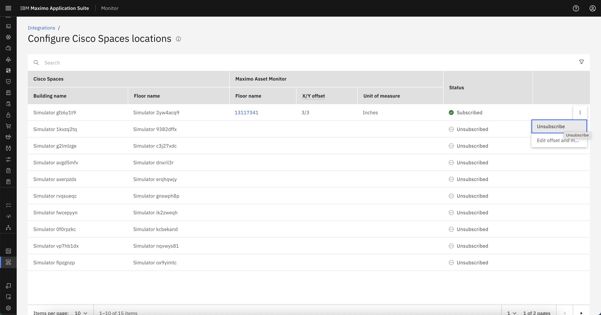
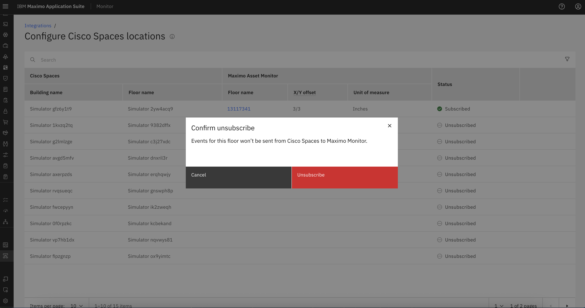
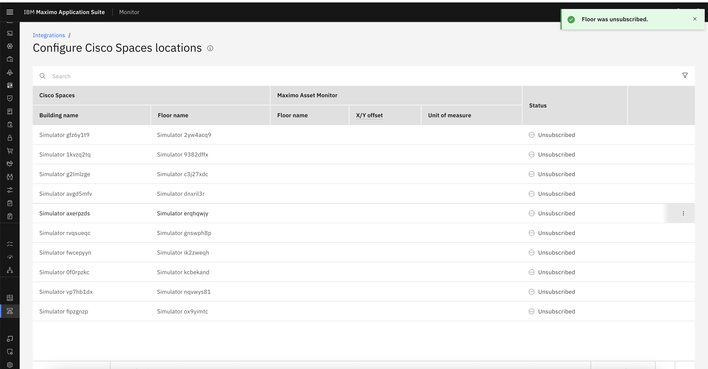

# Unsubscribe Cisco Spaces Location

In some cases, you may want to **stop receiving events from a Cisco Spaces location** . This can be useful if a floor is being decommissioned, reconfigured, or no longer needs to be monitored.

This guide explains how to unsubscribe a specific Cisco Spaces location.

---

## Unsubscribe a location

- Stop incoming events from Cisco Spaces for that floor.
- Disable any further updates or visualizations related to that location in MAS Monitor.

---

## Steps to Unsubscribe a Cisco Spaces Location

1. **Navigate to the Integration Configuration**

    - Go to **Setup → Integrations** from the MAS Monitor left navigation menu.
    - Select the **Cisco Spaces** integration from the list.

2. **Locate the Subscribed Location**

    - Find the specific **floor/location** that you want to unsubscribe from the integration list.
   
3. **Open the Actions Menu**

    - Click on the **ellipsis (⋮)** button at the right corner of the location row.
    - This will open the actions dropdown menu.

    

4. **Select "Unsubscribe"**

    - Choose the **Unsubscribe** option from the list.
    - A confirmation popup will appear with the message:

        > **Events for this floor won’t be sent from Cisco Spaces to Maximo Monitor.**

        

5. **Confirm Unsubscribe**

    - Click the **Unsubscribe** button in the popup.
    - The floor will now be marked as unsubscribed, and Cisco Spaces will stop sending any new data for it.

    

---

## Summary

After unsubscribing:

- The floor’s **subscription status** will be updated to `Unsubscribed`.
- No new **user movement**, **occupancy**, or **location metrics** will be fetched from Cisco Spaces.
- You can re-subscribe the location again later if needed using the same process.

---
