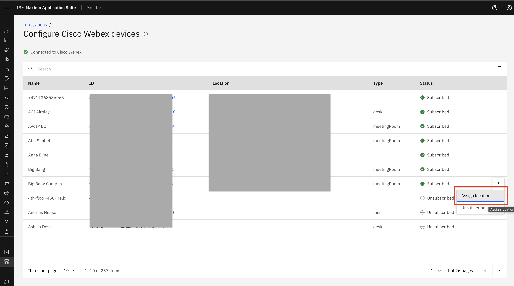
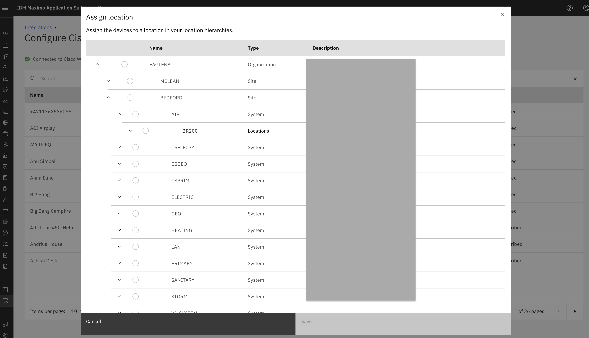
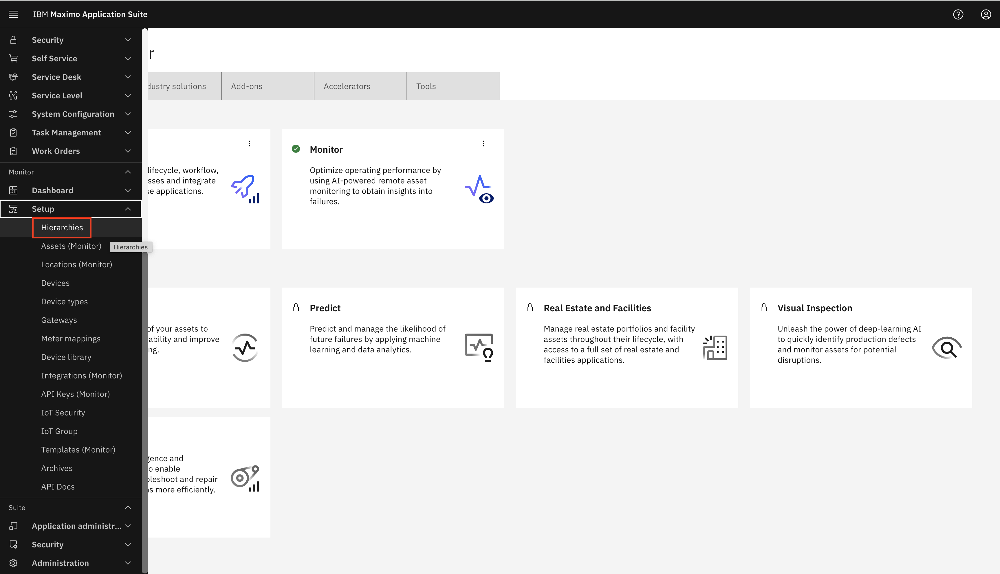

# Objectives
In this Exercise you will learn how to add and remove locations in Cisco Webex devices. 

---
*Before you begin:*  
This Exercise requires that you have:

1. completed the pre-requisites required for [all labs](prereqs.md)
2. completed the previous exercises

---
 
# Assign Location to Cisco Webex device

Please again go to Cisco Webex integration page. Click on `Configure device subscription`. 
  

It will show all available devices and subscribed devices. From there, we get an option `Assign location` in the ellipses icon to assign the Cisco Webex device to a location. 
  

On click `Assign location`, we get a pop-up to assign device to a location in the Real Estate and Facilities location hierarchies: 
  

After we assign a Webex device to a location. We can view that in Monitor Hierarchies as well as in the `Devices` section of that particular location. 

Expand Setup under the Monitor setup section in the left menu and select `Hierarchies`: 
  

In `Hierarchies`, we can check `Location` in below manner. 

`Organisation` -> `Site` -> `System` -> `Location`. 

Under `Location` where we have assigned Cisco Webex device, that specific device will be incorporated. 
  

# View Location in Cisco Webex device

To check `Location` under `Device`, we need to click that device under `Hierarchies`. It will redirct to device page in Monitor. Select `Cisco_Webex: BigBang` device which we check above steps. It will open device page. 
  

Here go to `Overview` tab, under `Relationship` section we can see all assign location. 
  

# View Cisco Webex device in Location

We can even see `Device` under `Location` also. For it again we need to go to `Hierarchies` select location `Charlotte Watson Center`: 
  

It will redirct to `Location` page in Monitor. 
  

Now we need to go `Devices` tab under it. It will show all assigned devices. 
  

---

# Unassign Location to Cisco Webex device

We can `remove` device from location. For it we need to select checkbox of assign device in Location `Device` tab. Click on `remove` button. It will unassign device from that location and vice versa: 
  

Same way we can remove `Location` from `Device` also. In `Device` there is one `Overview` tab. Under overview there is one `Relationship` section which contains `Asset` and `Location` details for that device. We can unassign location by clicking `remove` from there. 
  

---
Congratulations you have successfully add and remove location in Cisco Webex device to your Cisco Webex integration. 
