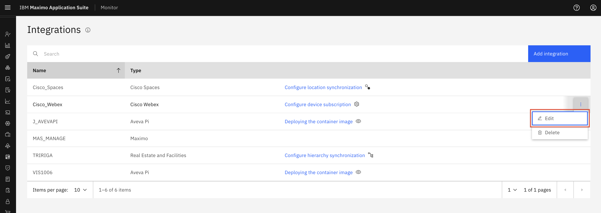
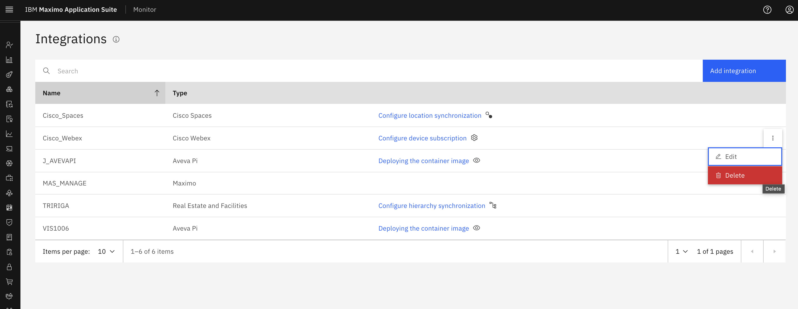

# Objectives
In this Exercise you will learn how to edit and delete Cisco Webex integration:

---
*Before you begin:*  
This Exercise requires that you have:

1. completed the pre-requisites required for [All Exercises](prereqs.md) and for Exercise 4
2. completed the previous exercises

---

# Edit Cisco Webex Configuration

Please again go to integration page in Monitor. We get an option in the ellipses icon to `Edit` the Cisco Webex integratiion. 
  

After click `Edit`, it will show `edit integration` page where we can update the `Activation Key` (JWT Token) , `Device client ID` (Client Id) and `Device client secret` (Client secret). 
  

After mentioned updated configuration click `Finish`. It will update these details in System. 

!!! note
    We cannot edit the Integration Name, as it is already in use for a Webex Device Type in Monitor.

---

# Delete Cisco Webex Integration

Navigate to the `Cisco Webex` in the Monitor Integration section: 
  

To delete Cisco Webex Configuration we need to make sure below points. 

* All the devices are unassigned from locations.
* All the devices are unsubscribe(i.e remove all devices from Monitor).

!!! note
    There can be devices that have been subscribed but they might have been removed from Webex control hub, in that case the status of that devices will be `SUBSCRIBED_NOT_AVAILABLE`.
    When a device has `SUBSCRIBED_NOT_AVAILABLE` status that means there will not be any data flowing for that device from Webex.
    

Now go to `Cisco Webex integration` in Integration section in Monitor and click ellipses icon to `Delete` the Cisco Webex integratiion. 
  

On click `Delete` button, it will show pop-up for confirmation with `Delete` and `Cancel` option. On click `Delete` it will remove Cisco Webex configuration from Monitor. 
  

!!! note
    Upon confirming the deletion, the corresponding Cisco Webex device type in Monitor will also be removed.

---
Congratulations you have successfully edit and delete Cisco Webex integration in Monitor. This concludes this lab.  
