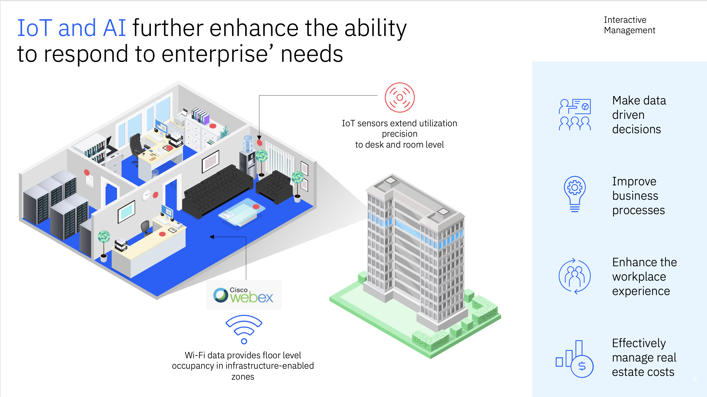

# Welcome to the Maximo Monitor 9.1  Cisco Webex Integration Lab

!!! info
    This Maximo Monitor lab demonstrates the use of Cisco Webex Integration in Monitor.

In this lab you will learn how to setup a Cisco Webex Integration within Maximo Monitor 9.1 and adding a couple of cisco webex devices from the Cisco Webex integration.

  

  

The exercises will cover:

* Overview and Purpose of using Cisco Webex device
* Integrate Cisco Webex device in MAS Monitor
* Subscribe to a Cisco Webex device
* Assign Cisco Webex device to a location
* Unsubscribe Cisco Webex device
* Delete Cisco Webex configuration
* Have fun

!!! note
    Expected time needed to run the complete lab: 1 hour

---

**Updated: 2025-07-01**

---