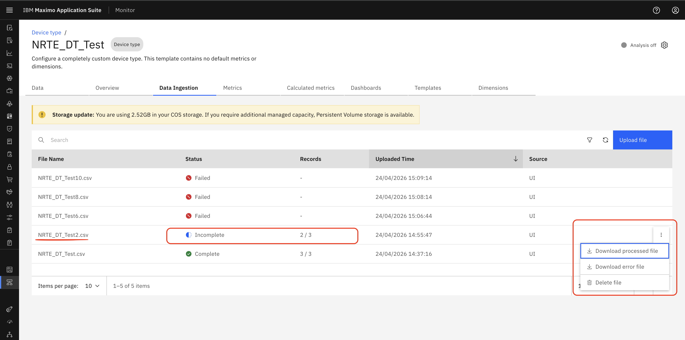
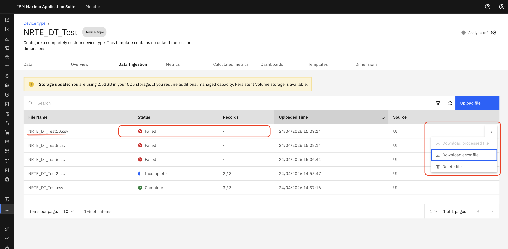

# Download Processed and Error Files

## Objective

In this exercise, you will learn how to download processed CSV files and error files from Monitor. You will review file outcomes based on processing status and understand which downloadable files are available for completed, incomplete, and failed uploads.

---

## Download Options by File Status

### Step 1: Download a Successfully Processed File

If a file is uploaded and all records are valid, the status is marked as **Completed**. The processed file can be downloaded from the UI.

&nbsp;&nbsp;

### Step 2: Download Files for a Partially Processed Upload

If the data is partially processed, where some records are ingested and some fail, the status is marked as **Incomplete**.

Both files are available for download from the UI:

- **Processed file** – Contains successfully processed records
- **Error file** – Contains failed or unprocessed records

&nbsp;&nbsp;

### Step 3: Download the Error File for a Failed Upload

If the file fails due to invalid data, incorrect headers, or record-level errors, no data is processed. The file status is marked as **Failed**.

An error file is available for download from the UI for troubleshooting.

&nbsp;&nbsp;

---

## Summary

You have learned how to:

- Identify downloadable files based on upload status
- Download processed files for completed uploads
- Download both processed and error files for incomplete uploads
- Download error files for failed uploads

---

## Next Steps

Proceed to [Storage Usage & Storage Mode](storage_guide.md) to learn how storage works for CSV files in Data Ingestion.

---

**Congratulations!** You have successfully learned how to download processed and error CSV files.