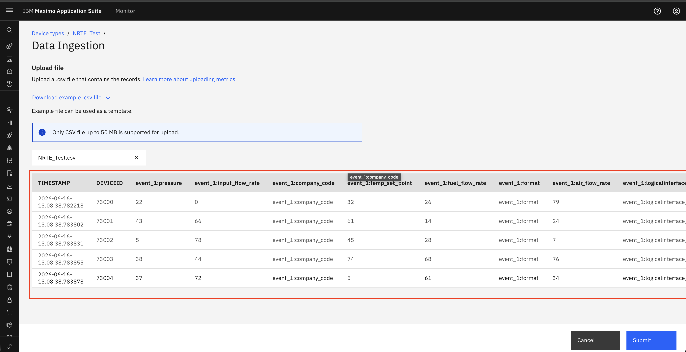
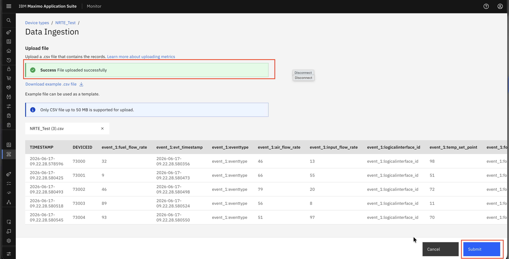

# Download Template

## Objective

In this exercise, you will learn how to download the CSV template and prepare CSV files for upload. You will access the template from the **Data Ingestion** workflow, understand the required CSV structure, review validation rules, and submit the file for processing in Monitor.

---

## Navigate to Data Ingestion

Access the template download flow from either of the following paths:

- **Setup → Data Ingestion**
- **Setup → Device Types → Edit → Data Ingestion**

---

## Download and Prepare the Template

#### Step 1: Download the Template

Navigate to **Data Ingestion**, click on **Download example.csv file**.

&nbsp;&nbsp;

#### Step 2: Prepare the CSV File

Once the sample CSV template is downloaded, fill in the data according to the defined format. Data is validated based on the expected data type. If the data type does not match the configured metrics, the record fails validation.

**Mandatory Fields in CSV**

The CSV file must include the following mandatory fields:

1. **Timestamp** – Represents the date and time when the data was generated
2. **Device ID** – Unique identifier of the device
3. **Data Field (Metric/Event)** – At least one metric or event column

#### Step 3: Review Validation Results

Once the file is uploaded, the system performs multiple validations before processing:

- **File Name Validation** – Checks whether the file already exists; duplicate file names are not accepted for the same device type
- **Header Validation** – Ensures the CSV headers match the required template
- **Data Type Validation** – Verifies that all values are in the correct format
- **Mandatory Field Check** – Ensures required fields are not null or missing
- **Maximum supported file size** → 50 MB
- **Other Basic Validations** – Ensures overall data consistency

Review the validation outcome after the file is uploaded.

If any validation fails, the system highlights the specific errors and prompts you to correct them.

&nbsp;&nbsp;

If the file passes all validations, the system processes the data and displays the raw data.

&nbsp;&nbsp;

#### Step 4: Submit the File

Submit the file after successful validation. After the success message is displayed, you are redirected to the data ingestion page.

&nbsp;&nbsp;

---

## Summary

You have learned how to:

- Access the CSV template download option from the data ingestion workflow
- Prepare CSV data by using the required template structure
- Understand mandatory fields and upload requirements
- Review validation results before submission
- Submit the CSV file for processing in Monitor

---

## Next Steps

Proceed to [Uploaded File - Progress Tracking & Status](file_status.md) to learn how to track uploaded files and review their processing status.

---

**Congratulations!** You have successfully downloaded the template and prepared the CSV file for upload.