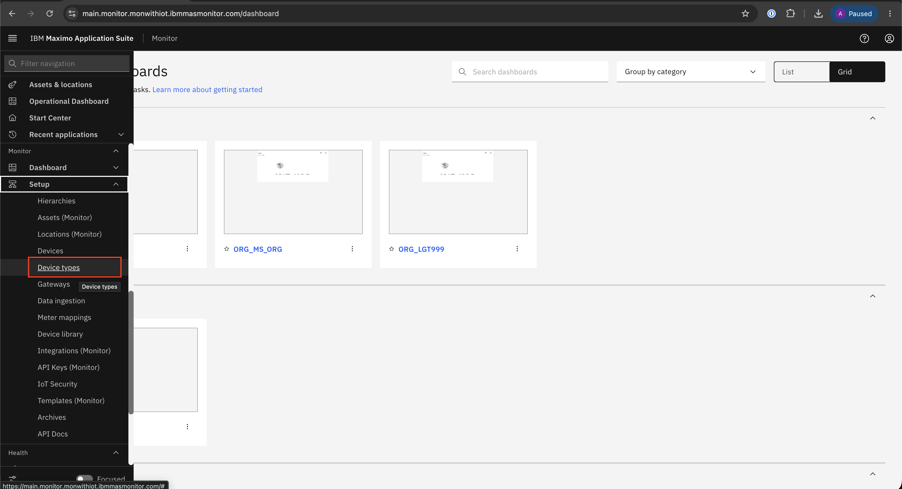
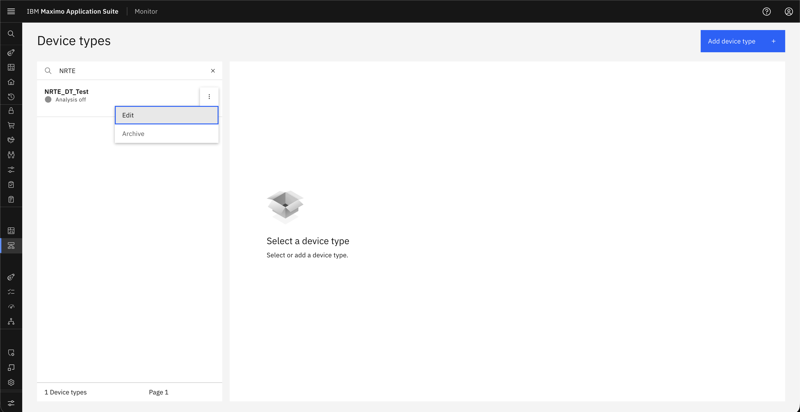

# File Retention Days

## Objective

In this exercise, you will learn how to change retention days for CSV files. You will navigate to the device type configuration, update the file retention setting, and save the changes according to your storage configuration.

---

## Configure File Retention

### Step 1: Open Device Types

Go to **Setup → Device types** to access all device configurations.

&nbsp;&nbsp;

### Step 2: Select the Device Type

Select the desired **Device Type** and click **Edit** to update its settings.

&nbsp;&nbsp;

### Step 3: Edit the Overview Settings

Open the **Overview** tab and click **Edit** to modify general details.

&nbsp;&nbsp;

### Step 4: Update File Retention Days

Configure **File Retention days** as needed according to the storage configuration and click **Save** to apply the changes.

&nbsp;&nbsp;

!!! warning
    **Once the retention period is over, the file is removed from the system.**

---

## Summary

You have learned how to:

- Navigate to the device type configuration
- Open the overview settings for a device type
- Update file retention days for CSV files
- Save the retention configuration changes

---

## Next Steps

Proceed to [Delete File](delete_file.md) to learn how to remove a CSV file from Monitor.

---