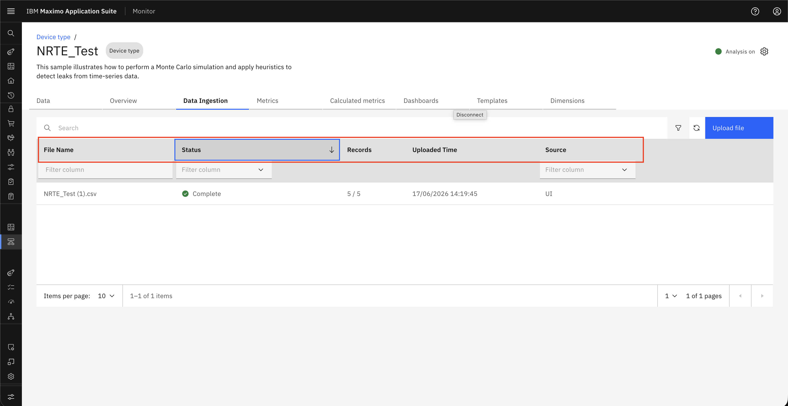
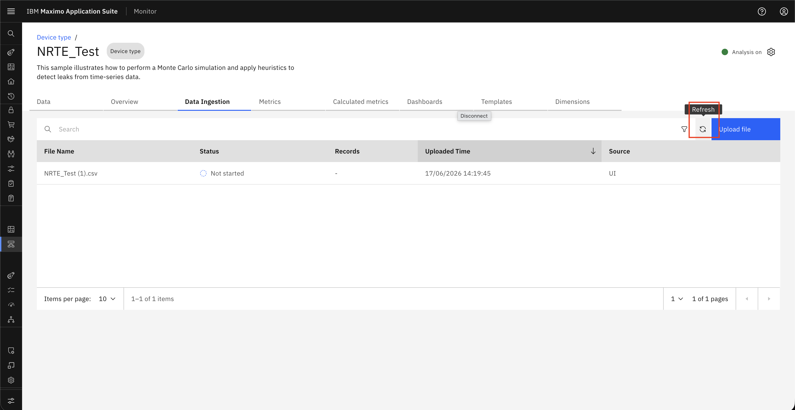

# Uploaded File - Progress Tracking & Status

## Objective

In this exercise, you will learn how to track uploaded CSV files and review their processing status in Monitor. You will navigate to the data ingestion view and use filtering, sorting, and refresh options to monitor file processing records.

---

## Navigate to Data Ingestion

Access the file status view from either of the following paths:

- **Setup → Data Ingestion**
- **Setup → Device Types → Edit → Data Ingestion**

---

## Review File Processing Records

### Step 1: Filter File Records

Use **Filter** to view and organize file records based on:

1. **File Name** – Filter records by file name
2. **Status** – Not Started, In Progress, Incomplete, Failed, Complete
3. **Source of Upload** – UI, API, EDC, SCADA

&nbsp;&nbsp;

### Step 2: Sort File Records

Use **Sorting** to organize file records based on:

1. **File Name** – Sort files by file name
2. **Status** – Sort files by processing status
3. **Upload Timestamp** – Sort files by upload date and time

&nbsp;&nbsp;

### Step 3: Refresh the Records

A **Refresh** button is available in the UI to reload and fetch the latest file processing records.

&nbsp;&nbsp;

---

## Summary

You have learned how to:

- Access the uploaded file status view in Monitor
- Filter file records by file name, status, and upload source
- Sort file records by key attributes
- Refresh the view to check the latest processing updates

---

## Next Steps

Proceed to [Download Processed and Error Files](download_file.md) to learn how to download processed files and error files from Monitor.

---

**Congratulations!** You have successfully explored CSV file progress tracking and status options.