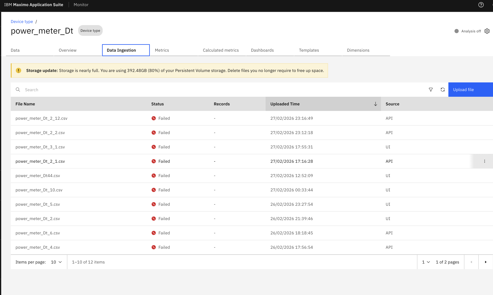

# Storage Usage & Storage Mode

## Objective

In this exercise, you will learn how storage works for CSV files in Data Ingestion. You will review where storage details are displayed in the UI and understand the supported storage configurations for file staging and ingestion.

---

## Navigate to Data Ingestion

Access the storage details view from either of the following paths:

- **Setup → Data Ingestion**
- **Setup → Device Types → Edit → Data Ingestion**

Storage details are visible at the top section in the yellow box.

---

## Storage Configurations

### Step 1: Review Persistent Volume (PV) Storage

By default, the Operator provisions a **Persistent Volume (PV)** for file staging and ingestion. It is typically used for low-volume or smaller file ingestion, as user uploads occur through APIs and UI.

&nbsp;&nbsp;

### Step 2: Review Cloud Object Storage (COS/S3)

If the customer enables **Cloud Object Storage (COS/S3)** during installation through MAS Core configuration, the Operator automatically performs the following actions:

1. Creates the COS service binding, including credentials, endpoint, and bucket name
2. Exposes the connection details, such as S3 bucket path, credentials, and region, to File Ingest and external connectors like EDC, SCADA, and Data Logger
3. Updates ingestion configuration to treat S3 as the primary file storage backend instead of PV

&nbsp;&nbsp;

---

## Summary

You have learned how to:

- Access storage details from the data ingestion workflow
- Identify where storage information is displayed in the UI
- Understand the default PV-based storage configuration
- Understand how COS/S3 can be used as the primary storage backend

---

## Next Steps

Proceed to [File Retention Days](file_retention.md) to learn how to configure retention days for CSV files.

---