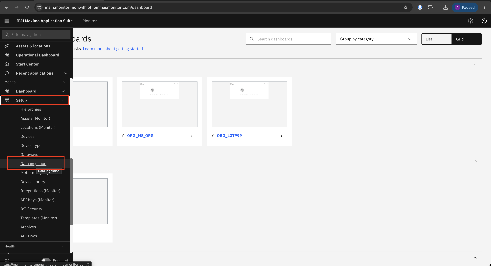
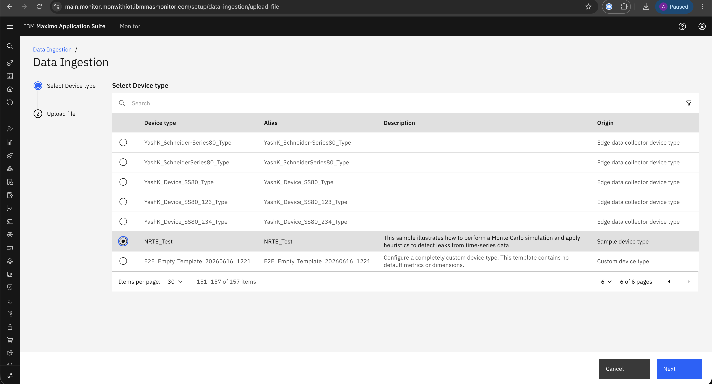

# Upload CSV Files via Monitor

## Objective

In this exercise, you will learn how to upload CSV files into Monitor for device data ingestion. You will use either the **Data Ingestion** page or the **Device Type** configuration flow, choose the target device type, and upload CSV files so the data can be processed by Monitor.

---

!!! info
    To upload CSV files, you can use one of the following options.

## Upload Options

### Option 1: Data Ingestion from Setup

#### Step 1: Select Data Ingestion from the Menu

Navigate to **Setup → Data Ingestion** to access the upload interface.

&nbsp;&nbsp;

#### Step 2: Choose Upload File

Click **Upload** to start the file upload process.

&nbsp;&nbsp;

#### Step 3: Select Device Type

Select the required **Device Type** and click **Next** to proceed.

&nbsp;&nbsp;

#### Step 4: Data Ingestion Page

Upload the CSV files to complete the ingestion process.

&nbsp;&nbsp;

### Option 2: Data Ingestion from Device Type

#### Step 1: Select Device Type from the Menu

Navigate to **Setup → Device types** to locate the device configuration.

&nbsp;&nbsp;

#### Step 2: Select Device Type

Select the **Device Type** and click **Edit** to modify settings.

&nbsp;&nbsp;

#### Step 3: Choose Upload File

Go to the **Data Ingestion** tab and click **Upload**.

&nbsp;&nbsp;

#### Step 4: Data Ingestion Page

Upload the CSV files to complete the ingestion process.

&nbsp;&nbsp;

---

## Summary

You have learned how to:

- Access the CSV upload interface from **Setup → Data Ingestion**
- Access the CSV upload workflow from **Setup → Device types**
- Select the appropriate **Device Type** for ingestion
- Upload CSV files into Monitor for processing

---

## Next Steps

Proceed to [Download Template](download_template.md) to learn how to download the template and prepare the CSV file for upload.

---