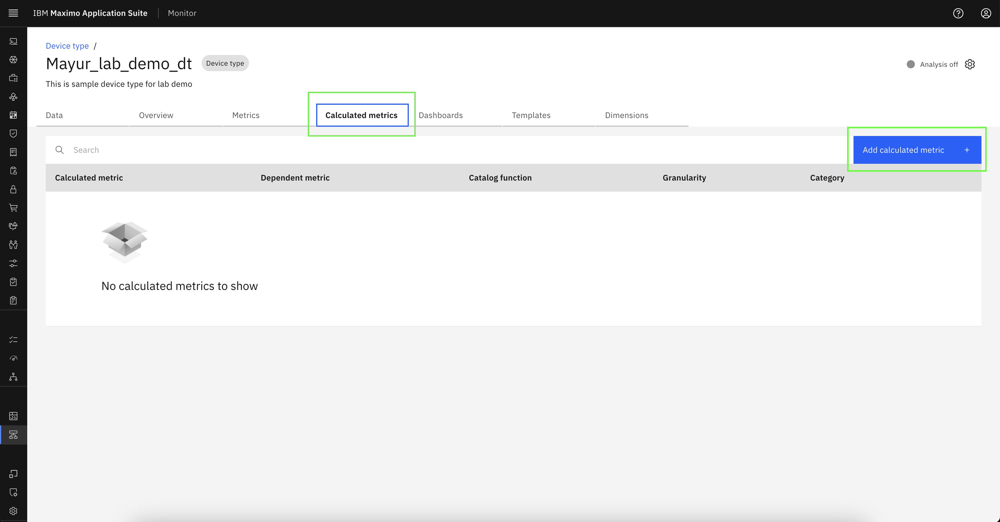
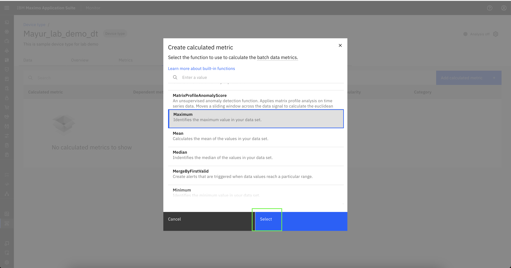
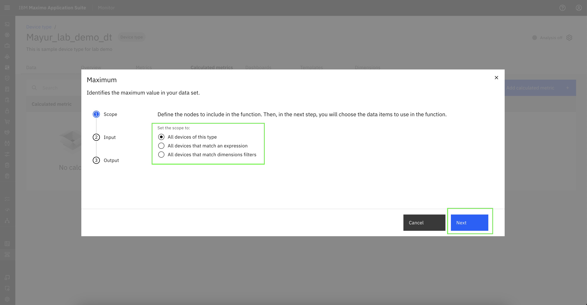
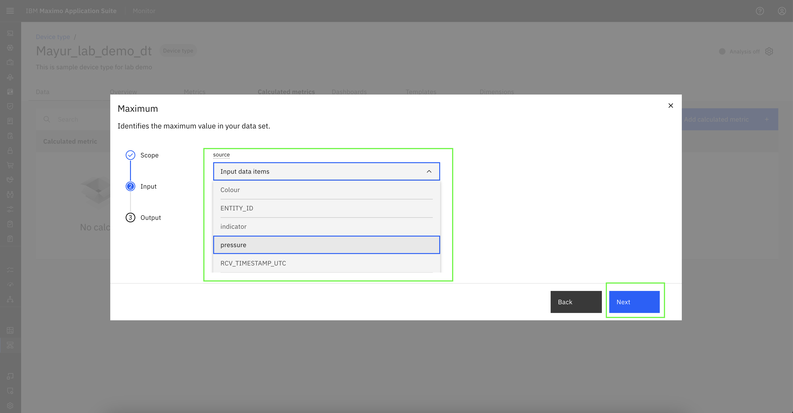
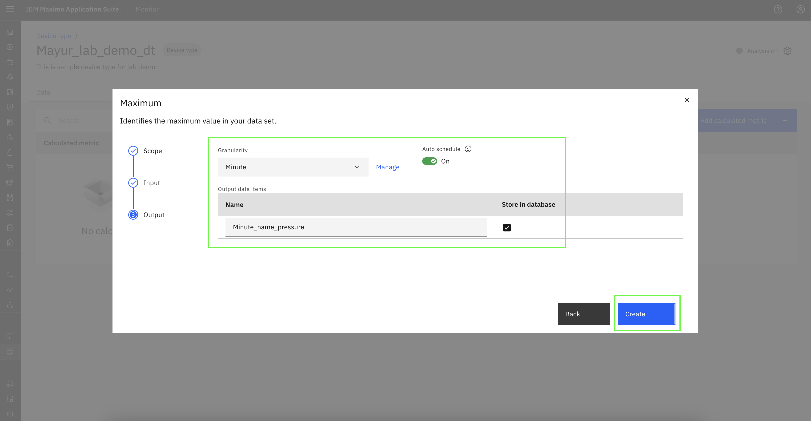
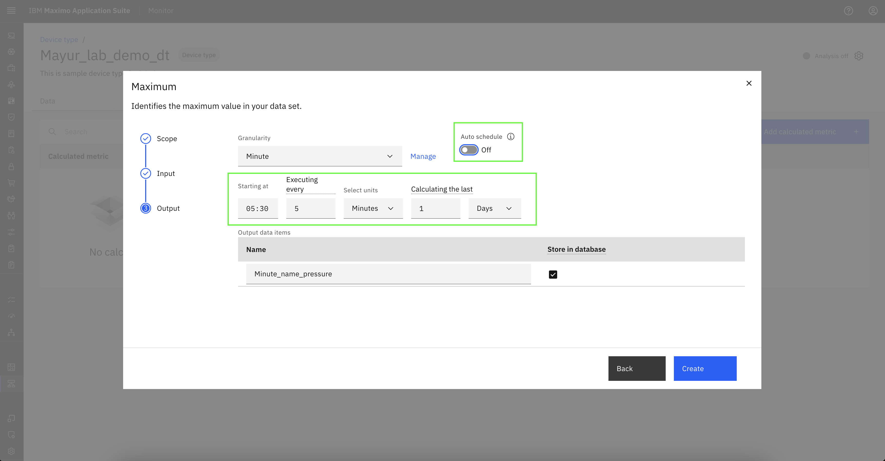
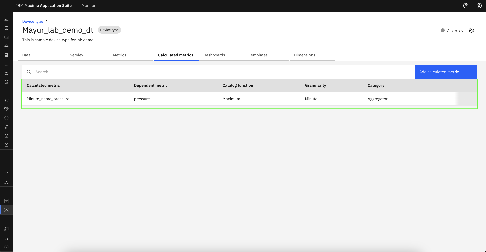
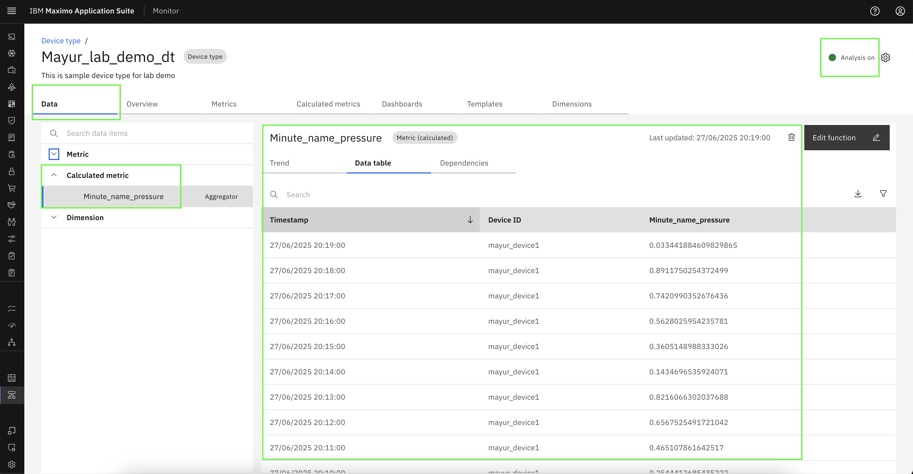

# Objectives
In this Exercise you will learn how to add calculated metrics in device type.

---
*Before you begin:*  
This Exercise requires that you have:

1. completed the pre-requisites required for [all labs](prereqs.md)
2. completed the previous exercises
 
---

## Add Calculated Metrics

Navigate to the Calculated metrics tab within the desired device type and click on `Add calculated metric`.
  

Select the desired calculation function from the list of available options, then click `Select` to apply it.
  

Define the nodes to include in the function from listed options.
  

Select the input data item to be used in the calculation from the dropdown.
  

Select the desired granularity level, then enter a name for the output calculated metric. 
Finally, click `Create` to generate the calculated metrics data.
  

(Optional) Toggle the ‘Auto Schedule’ option to configure the start time and execution interval for the calculated metric.
  

Calculated metric successfully added in device type.
  

## View Calculated Data

Navigate to the Data page of the device. Click the arrow next to Calculated Metric to expand the list. 
Select the Calculated metric name for which you want to view data. Click on the Data Table to display the Calculated metric data. 
If multiple calculated metrics have been created, data will be available for each of them and can be reviewed individually. 
The `Analysis on` option, located at the top-right corner of the Device Type page, indicates that the pipeline execution has started.
  
---
Congratulations you have successfully added calculated metrics in device type. 
