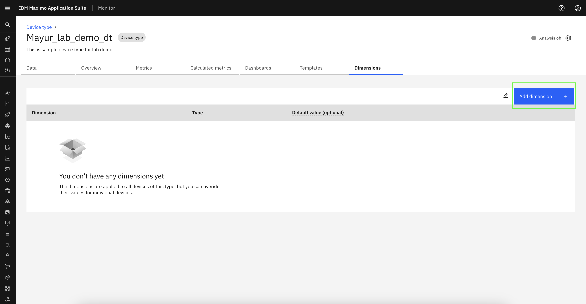
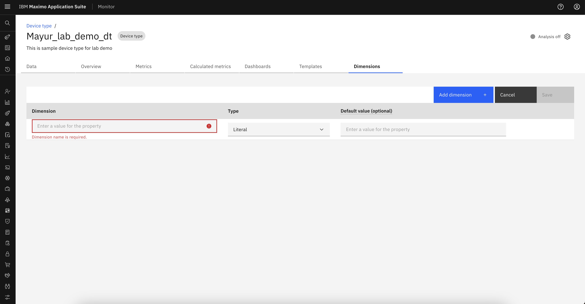
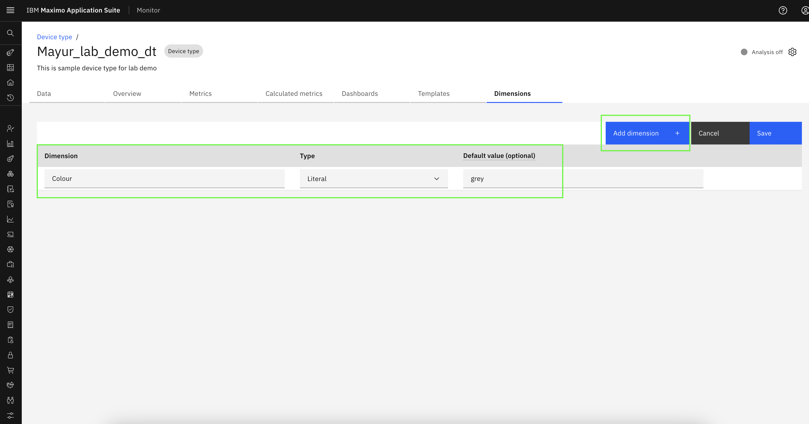
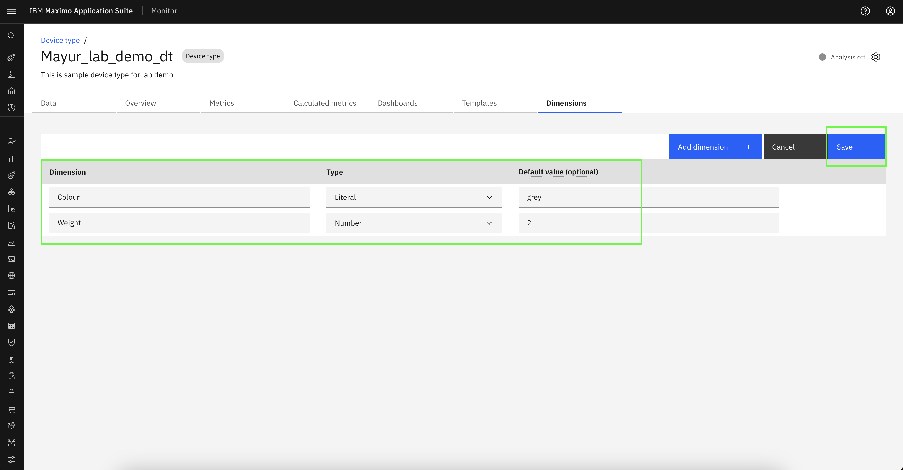
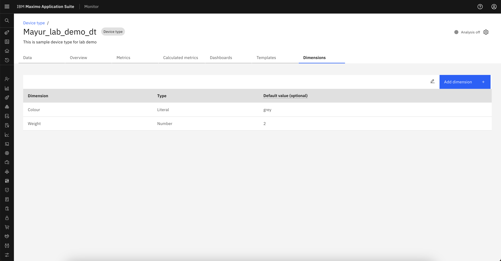
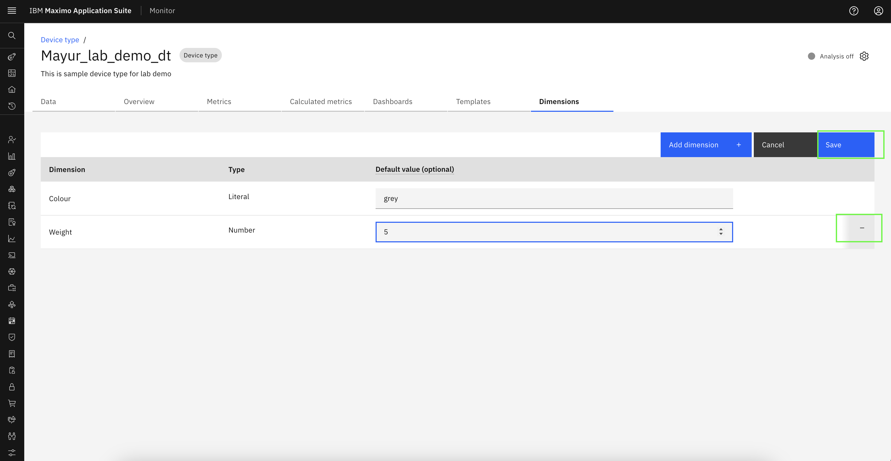
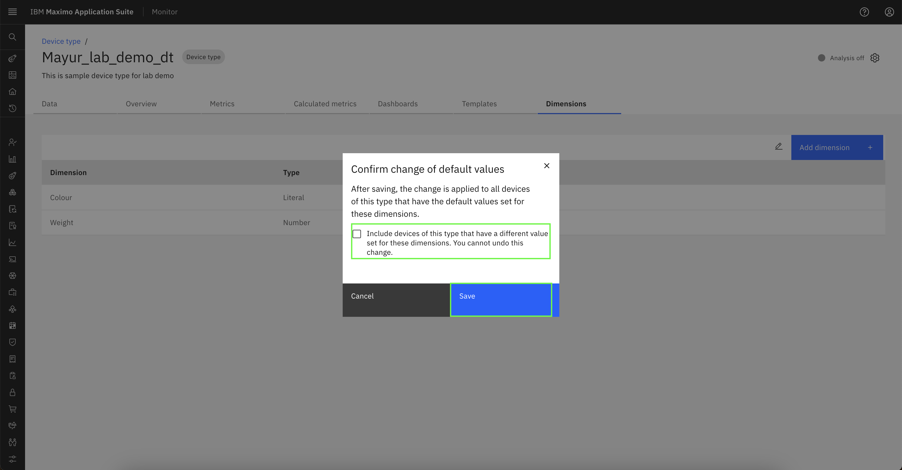

# Objectives
In this Exercise you will learn how to add/edit dimensions in device type.

---
*Before you begin:*  
This Exercise requires that you have:

1. completed the pre-requisites required for [all labs](prereqs.md)
2. completed the previous exercises
 
---

## Add Dimensions

Navigate to the Dimensions tab within the desired device type.
  

Click on `Add dimension` to initiate the dimension creation process.
  

Enter Dimension Name, Type, and default value. To add another dimension, click on `Add dimension` again and repeat the input process.
  

Enter Dimension Name, Type, and default value of second dimension.Finally, click `Save` to store the dimensions data for the selected device type.
  

Dimensions data saved successfully.
  

## Edit Dimensions

Click the edit icon to modify existing dimensions data.
  

Click on `-` to remove entire event row or modify the existing value.
  

Click `Save` to apply and update the dimensions data for the device type.
!!! note "Note"
     Select the checkbox labeled `Include devices of this type that have a different value set for these dimensions. You cannot undo this change` if you wish to override the dimension values for all devices of this device type.
  

---
Congratulations you have successfully added and modified dimensions in device type. 
