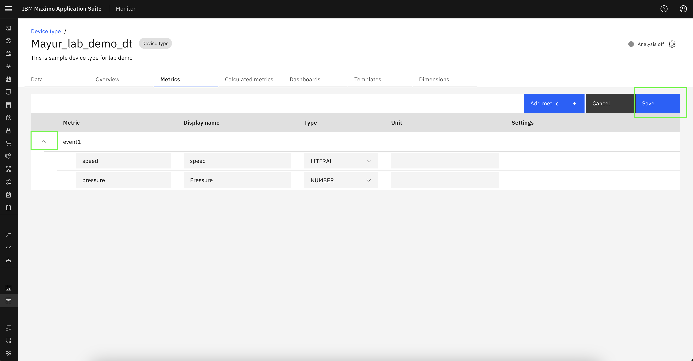

# Objectives
In this Exercise you will learn how to add/edit metrics in device type.

---
*Before you begin:*  
This Exercise requires that you have:

1. completed the pre-requisites required for [all labs](prereqs.md)
2. completed the previous exercises
 
---

## Add Metrics

Navigate to the Metrics tab within the desired device type and click on `Add metric`.
  

Click on `Add metric` in popup to initiate the metric creation process.
  

In the pop-up window, enter the Metric Name, Display Name, Event Name, Type, and Unit.
  

To add another metric, click on `Add Metric` again and repeat the input process.
  

Enter Metric Name, Display Name, Event Name, Type, and Unit data of second metric. Click `Add` to include all metrics in the table.
  

Once added, the metric data will be visible in the table.
  

Click the arrow icon to preview the data. Finally, click `Save` to store the metrics data for the selected device type.
  

## Add second event

Click on `Add metric` again to include an additional event.
  

In the pop-up window, previously saved metric data for the device type will be displayed. Click on `Add metric` within the pop-up to insert a new blank row in the table.
  

Enter the Metric Name, Display Name, Event Name, Type, and Unit for the new metric. After entering all required metrics, click `Add` to include them in the table.
  

Finally, click `Save` to store the updated metrics data for the device type.
!!! note "Note"
     To designate a metric as the default timestamp for incoming events, select the `Use this as the default timestamp` checkbox.This option is applicable only for metrics with the TIMESTAMP type.
  

## Edit Metrics

Click the edit icon to modify existing metric data.
  

Click on `-` to remove entire event row.
  

To delete a specific metric within an event, click the `-` icon next to that metric. Click `Advanced Options` to open a pop-up window for configuring the JSON path and key.
  

Enter the JSON path and key as needed. Refer to the provided sample for guidance (this step is optional).
  

Click `Save` to apply and update the metrics data for the device type.
  

---
Congratulations you have successfully added and modified metrics in device type. 
