# Objectives
In this Exercise you will learn how to Archive and Restore/Delete the device type.

---
*Before you begin:*  
This Exercise requires that you have:

1. completed the pre-requisites required for [all labs](prereqs.md)
2. completed the previous exercises
 
---
## Unassign Device
!!! note "Note"
     We can archive device type only when devices of this device type are not assigned to any asset or location.

To unassign a device from an Asset or Location, search for the relevant device type and select the device that was previously assigned to the Asset or Location. 
Navigate to the Device Overview page. Under the 'Relationships' section, if the device is assigned to an Asset, click the delete icon corresponding to each row to remove the assignment.
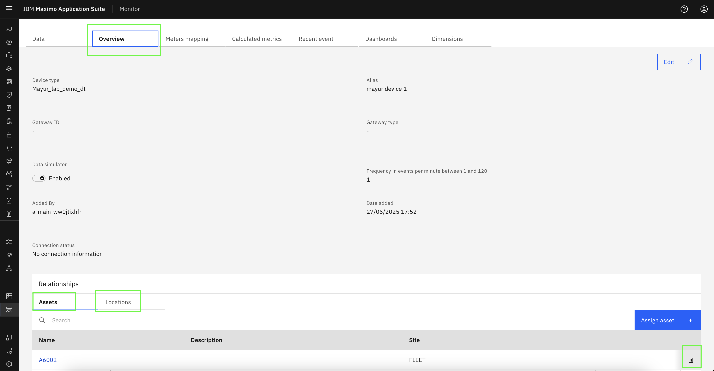  

Click `Confirm` to complete the unassignment of the device from an Asset.
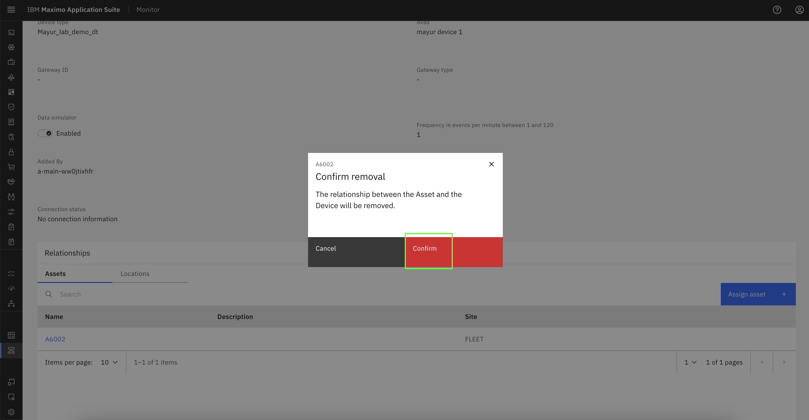  

Repeat the same steps in the 'Relationships → Locations' section under the 'Overview' tab to unassign the device from a Location.

## Archive Device type

To archive a device type, navigate to Setup → Device Type from the left-hand panel and search for the relevant device type. 
Click the three-dot menu next to the device type name and select `Archive` to proceed with archiving the device type.
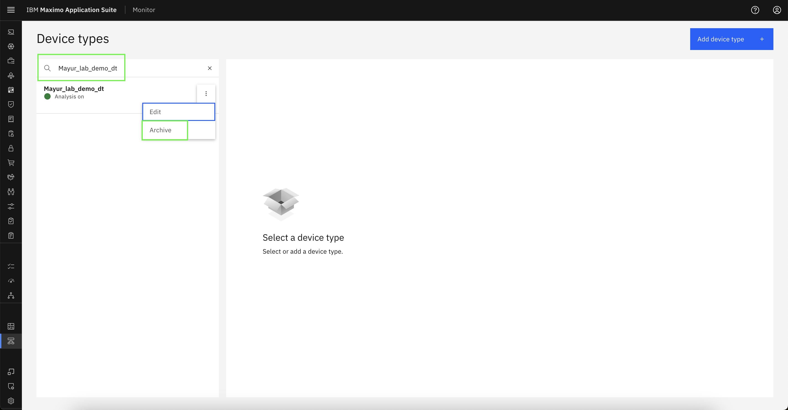  

In the confirmation popup, click 'Archive' to archive the device type.
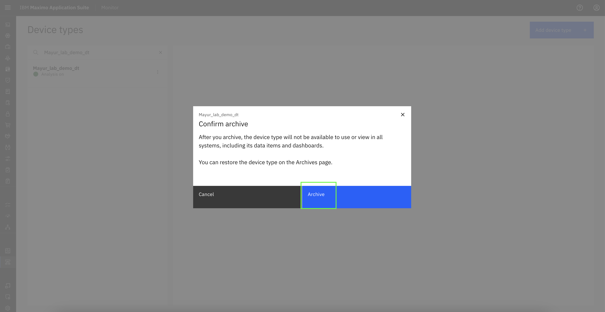  

## View Archived Device type

To view archived device type, navigate to Setup → Archives from the left-hand panel.
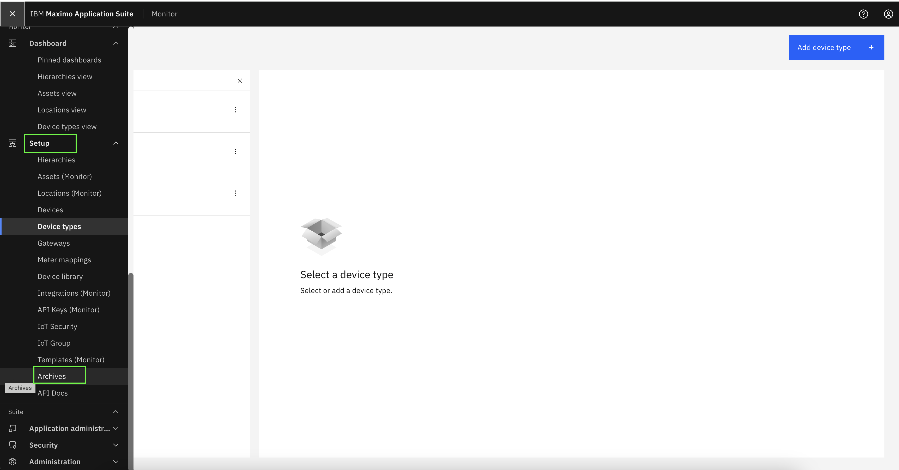  

You should now be able to view the archived device type. If it does not appear, try searching for it by name using the search bar.
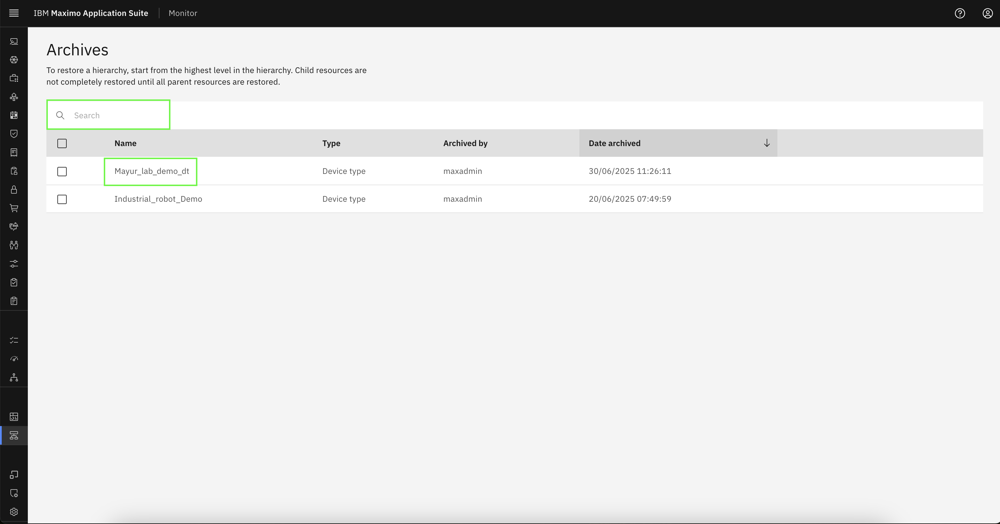  

For each table row, you will see `Restore` and `Delete` options. You can choose either action by following one of the steps outlined below.
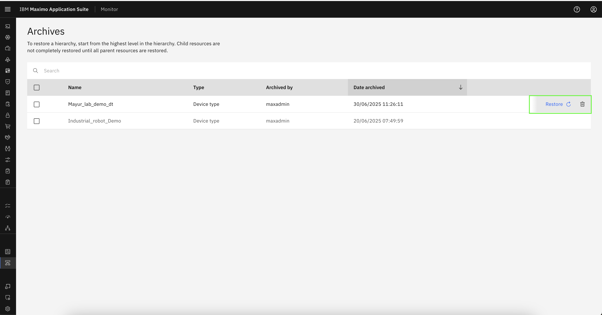  

## Restore Device type (Optional)

Click `Restore` next to the archived device type to reinstate it.
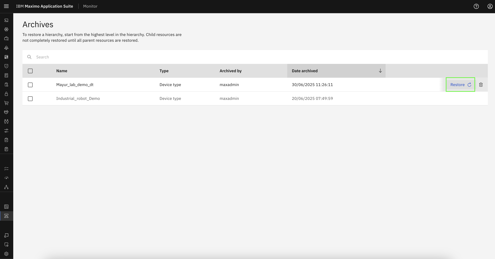  

In the confirmation popup, click `Restore` to complete the device type restoration process.
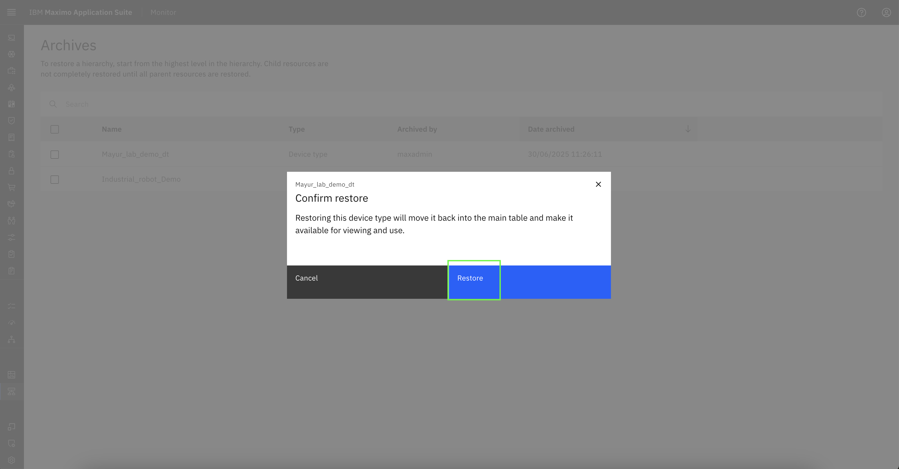  

## Delete Device type (Optional)

!!! note "Note"
     Please note that a device type must be archived prior to deletion.

Click Delete icon next to the archived device type to delete it.
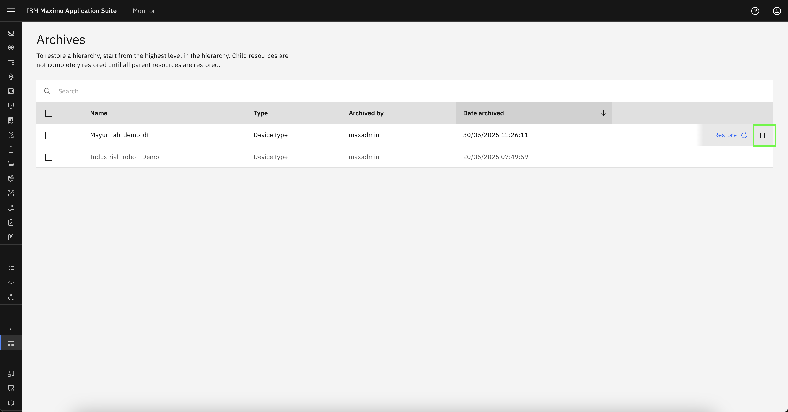  

In the confirmation popup, enter the device type name and click `Confirm` to remove this device type from the Monitor.
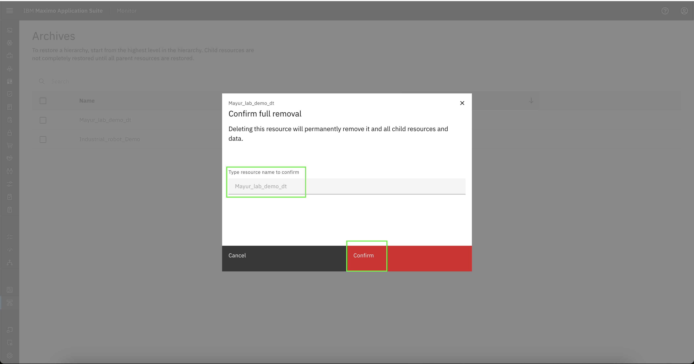  

---
Congratulations you have successfully Archived and Restored/Deleted the device type. 
