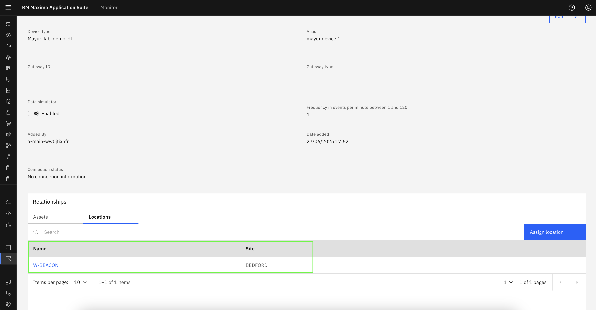

# Objectives
In this Exercise you will learn how to assign device to asset/location.

---
*Before you begin:*  
This Exercise requires that you have:

1. completed the pre-requisites required for [all labs](prereqs.md)
2. completed the previous exercises
 
---

## Assign device to Asset

Navigate to the Overview tab of the desired device. In the Asset Relationship section, click on the `Assign Asset` button to link the device to an asset.
  

Select the asset to which you want to assign the device, then click the `Save` button to confirm the assignment.
  

The device has been successfully assigned to the selected asset.
  

## Assign device to Location

Navigate to the Overview tab of the desired device. In the Location Relationship section, click on the `Assign location` button to link the device to the location.
  

Select the location to which you want to assign the device, then click the `Save` button to confirm the assignment.
  

The device has been successfully assigned to the selected location.
  

## Unassign device from Asset

To remove an assigned device from an asset, navigate to the Asset Relationship section and click the delete icon next to the corresponding row.
  

## Unassign device from Location

To remove an assigned device from location, navigate to the Location Relationship section and click the delete icon next to the corresponding row.
  

---
Congratulations you have successfully assigned device to asset/location and removed device from asset/location. 
