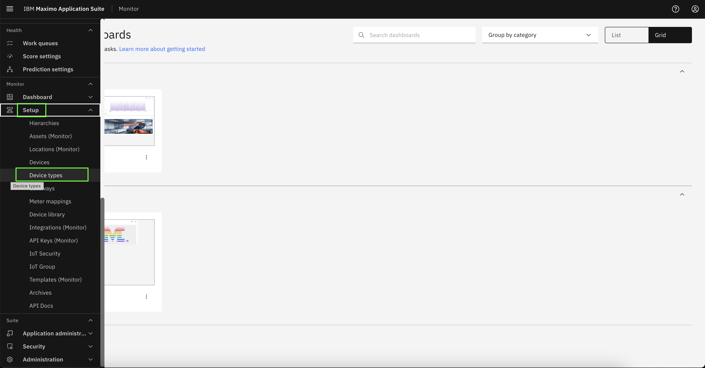
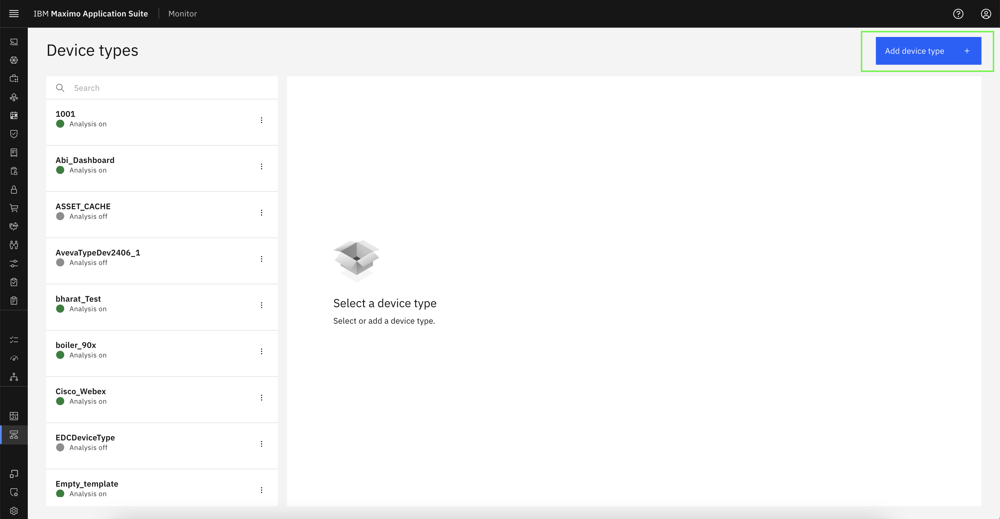
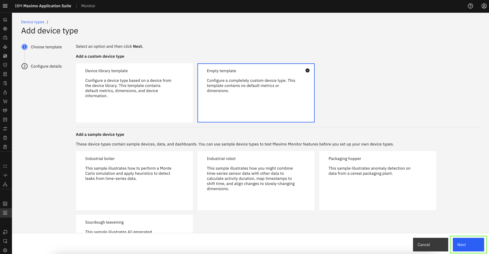
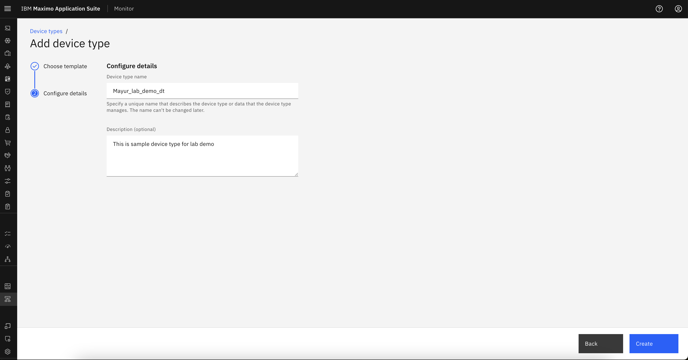
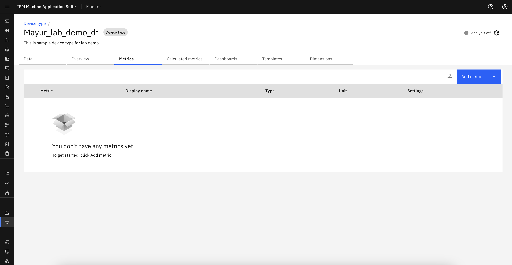
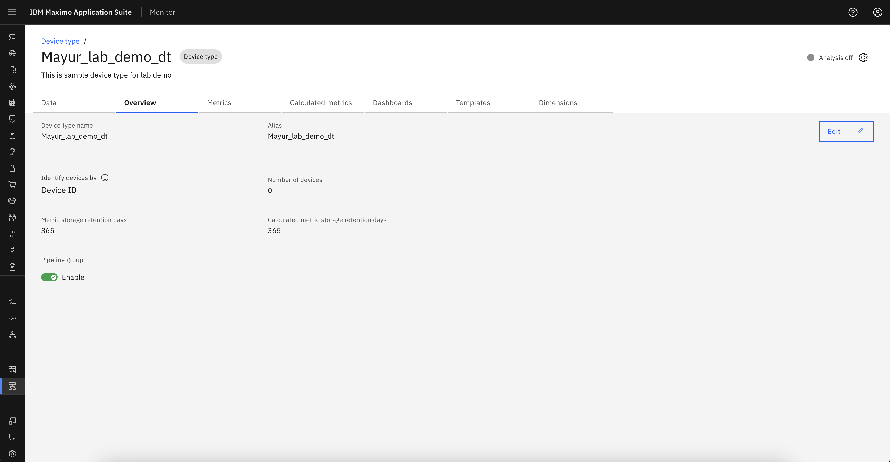
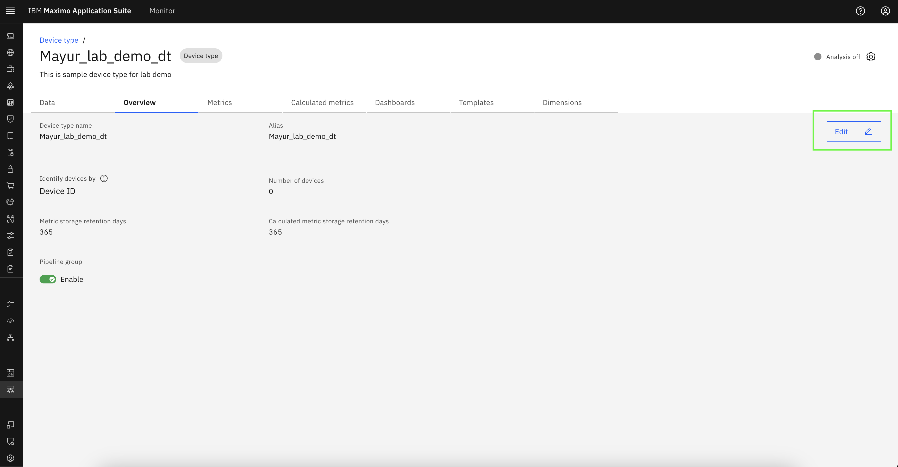
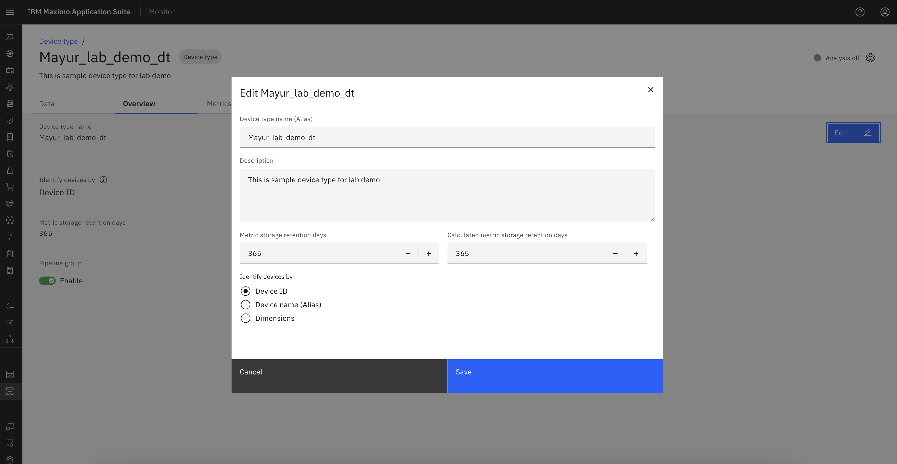

# Objectives
In this Exercise you will learn how to:

* Create a Device Type in MAS Monitor.

---
*Before you begin:*  
This Exercise requires that you have:

1. completed the pre-requisites required for [all labs](prereqs.md)

---

## Create Device Type

To create a Device Type, log in to IBM MAS Monitor and navigate to Setup -> Device Type.

  

Click the `Add Device Type` button located at the top-right corner of the screen.

  

There are different templates available under custom device type and sample device type. Then, select an option and click `Next`.  

  

Provide the basic configuration details, including Device Type Name, Device Type Description.Then, click on `Create`. 
!!! attention "Note"
     Specify a unique name that describes the device type or data that the device type manages. The name can't be changed later.

  

This will create the Device Type and redirect to the metric page.

  

 

## View Overview tab

This tab provide detail description of Device Type.We can see Pipeline group status which is default enable for newly created device type.

  

## Edit Device type data

Through edit option we can edit alias, Identify device with different category and retention days of Metric and Calculated Metric available in Device Type. But we can't edit Device Type name once we create it.

Click on `Edit` button.
  

Update the necessary fields in the Edit popup, then click `Save` to apply the changes.
  

---

Congratulations you have successfully setup the device type,viewed and modified device type data from overview tab. 

