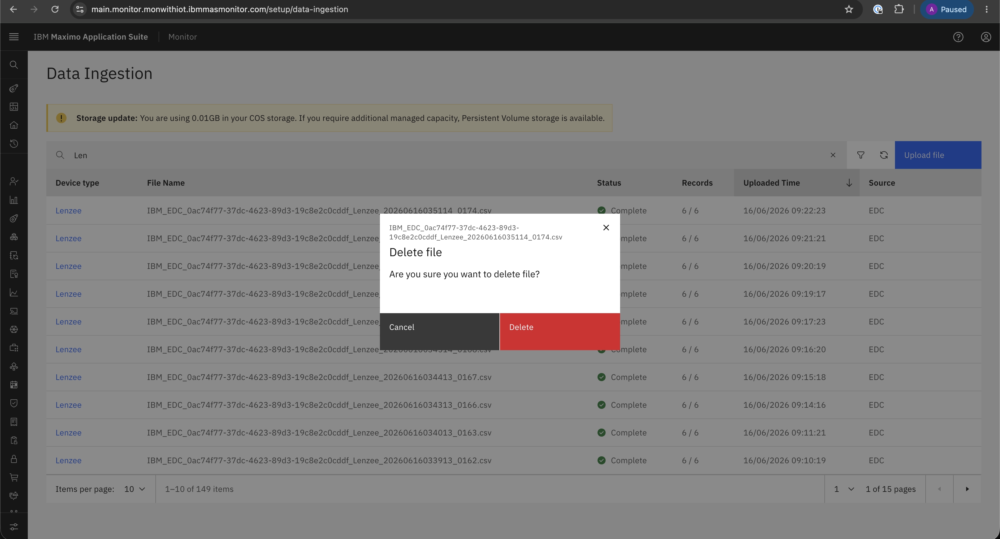

# Objectives
In this Exercise you will learn how to:

* How to Delete the CSV file.

---
*Before you begin:*  
This Exercise requires that you have:

1. completed the pre-requisites required for [all labs](prereqs.md)
2. completed the previous exercises

---

### Navigate Data Ingestion
        Setup → Data Ingestion OR Setup → Device Types → Edit → Data Ingestion

### Navigate Delete File
Select the CSV file you want to delete and click on Delete File to initiate removal.
&nbsp;&nbsp;

### Confirm Delete File
!!! warning
    **Once the CSV file is deleted, it cannot be retrieved, Please ensure you have a backup before proceeding.**
    
Confirm the deletion by clicking on the Delete button.
&nbsp;&nbsp;

---

Congratulations you have successfully deleted CSV file. 