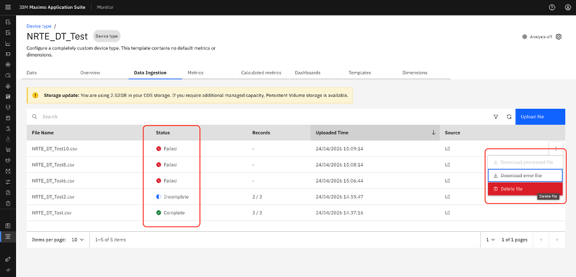

# Objectives
In this Exercise you will learn how to:

* How to Delete the CSV files.

---
*Before you begin:*  
This Exercise requires that you have:

1. completed the pre-requisites required for [all labs](prereqs.md)
2. completed the previous exercises

---

!!! info
    To Delete CSV Files, we have to naviagete towards Data Ingestion.

1. Select File which we want to delete -> Delete File
&nbsp;&nbsp;

!!! warning
    CSV Files Cannot Be Retrieved
        Once the CSV file is deleted, it cannot be retrieved. Please ensure you have a backup before proceeding.

---

Congratulations you have successfully downaloaded CSV file template. 