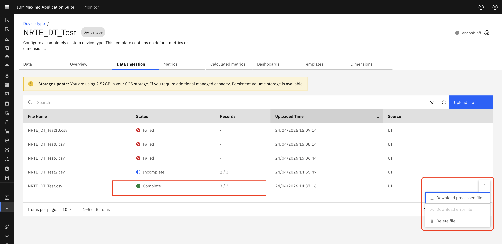

# Objectives
In this Exercise you will learn how to:

* How to Download CSV files with errors.

---
*Before you begin:*  
This Exercise requires that you have:

1. completed the pre-requisites required for [all labs](prereqs.md)
2. completed the previous exercises

---

### Successful File Download
If a file is uploaded and all records are valid (no missing or invalid data), the status is marked as Completed.
The processed file can be downloaded from the UI. (Download processed file)
&nbsp;&nbsp;

### Partial File Download
If the data is partially processed (some records ingested, some failed), the status is marked as Incomplete 
Both files are available for download from the UI: 
Processed (successful) records file (Download processed file)
Failed (unprocessed) records file (Download error file)
&nbsp;&nbsp;

### Failed File Download
If the file fails due to invalid data, incorrect headers, or record-level errors, no data is processed 
The file status is marked as Failed 
An error file is available for download from the UI for troubleshooting (Download error file)
&nbsp;&nbsp;

---

Congratulations you have successfully downloaded CSV file. 