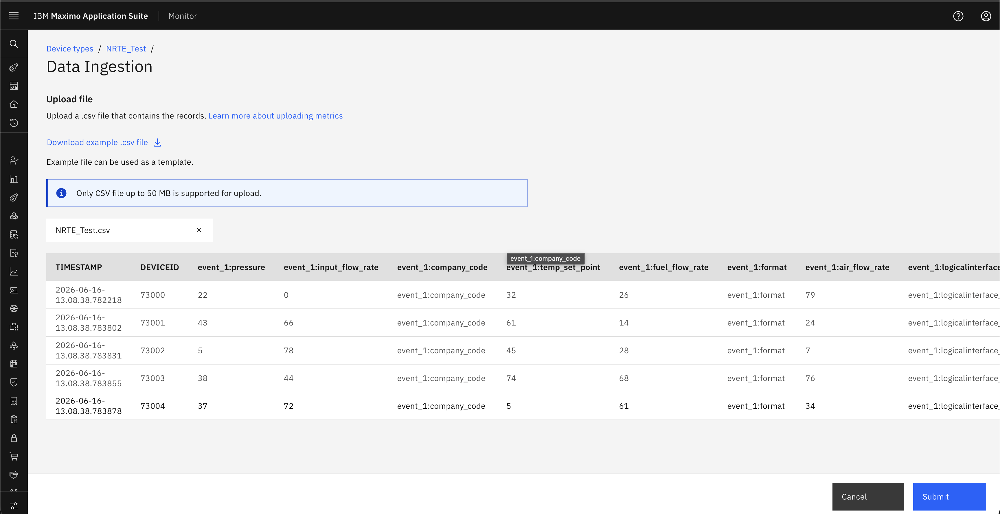
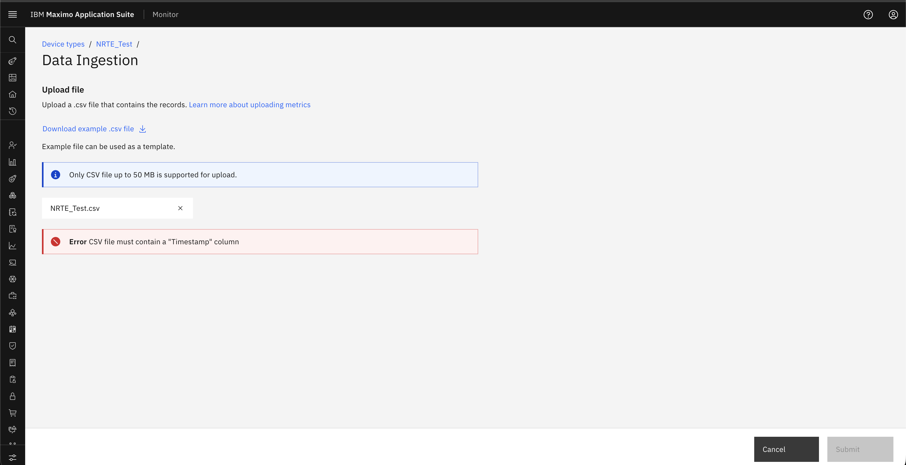
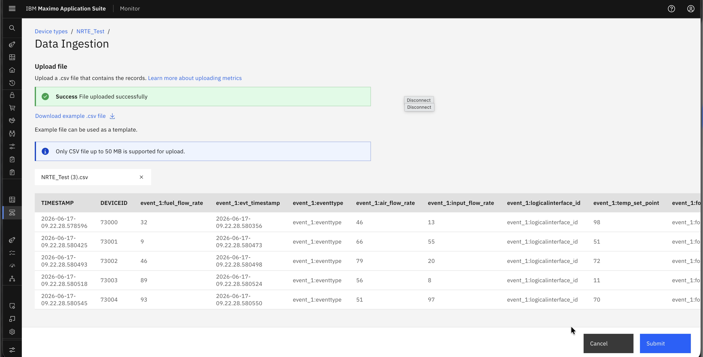

# Objectives
In this Exercise you will learn how to:

* How to Prepare the CSV files for uploading using template.

---
*Before you begin:*  
This Exercise requires that you have:

1. completed the pre-requisites required for [all labs](prereqs.md)
2. completed the previous exercises

---

### Navigate Data Ingestion
        Setup → Data Ingestion OR Setup → Device Types → Edit → Data Ingestion

1. Navigate to Upload File -> Download Template
&nbsp;&nbsp;

2.  Once the sample CSV template is downloaded, data must be filled as per the defined format.
    Data is validated based on the expected data type.
    If the data type does not match the configured metrics, the record will fail validation.

#### Mandatory Fields in CSV
    1. Timestamp – Represents date and time when data got generated.
    2. Device ID – Unique identifier of the device 
    3. Data Field (Metric/Event) – At least one column of the metric

#### File Validation
    Once you click on the Upload File button, the File Upload screen appears with the following details:
    Device Type -> Select the required device type (Global Navigation)
    Upload CSV File -> Upload a .csv file containing the records (Ensure the file type is a .csv format)
    Maximum supported file size: 50 MB 
    File Upload Options 
        Drag and drop the file, or Click to browse and upload from your system

#### Data Validation
    Once the file is uploaded, the system performs multiple validations before processing:
    1. File Name Validation – Checks if the file already exists and duplicate file name not acceptable for the same device type.
    2. Header Validation – Ensures the CSV headers match the required template 
    3. Data Type Validation – Verifies that all values are in the correct format 
    4. Mandatory Field Check – Ensures required fields are not null or missing 
    5. Other Basic Validations – Ensures overall data consistency

3. If the file passes all validations, the system processes the data and displays a raw data.
&nbsp;&nbsp;

    If any validation fails, the system highlights the specific errors and prompts to correct them.
&nbsp;&nbsp;

4. Submit the file in case for success, it will redirect to fileIngestion page after success message.
&nbsp;&nbsp;

---

Congratulations you have successfully uploaded CSV file. 