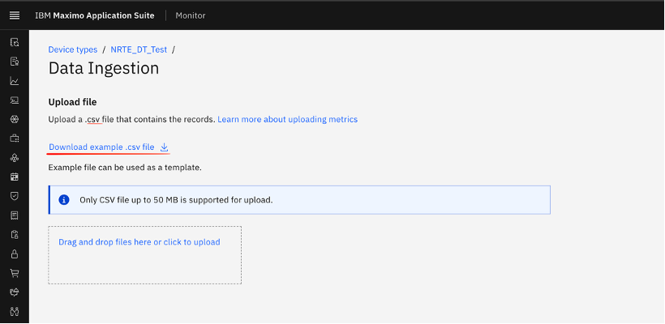

# Objectives
In this Exercise you will learn how to:

* How to Prepare the CSV files for uploading using template.

---
*Before you begin:*  
This Exercise requires that you have:

1. completed the pre-requisites required for [all labs](prereqs.md)
2. completed the previous exercises

---

!!! info
    To Download CSV Files Template, we have to naviagete towards selected device type.

1. Select Device Type -> Download Template
&nbsp;&nbsp;

!!! info
    Once the sample CSV template is downloaded, data must be filled as per the defined format.
    Data is validated based on the expected data type.
    If the data type does not match the configured metrics, the record will fail validation.

!!! warning
    Mandatory Fields in CSV
        Timestamp – Represents date and time when data got generated.
        Device ID – Unique identifier of the device 
        Data Field (Metric/Event) – At least one column of the metric 

!!! info
    File Validation
        Once you click on the Upload File button, the File Upload screen appears with the following details:
        Device Type  -> Select the required device type (Global Navigation)Upload CSV File
        Upload a .csv file containing the records (Ensure the file type is a .csv format)
        Maximum supported file size: 50 MB 
        File Upload Options 
        Drag and drop the file, or 
        Click to browse and upload from your system

!!! info
    Data Validation
        Once the file is uploaded, the system performs multiple validations before processing:
        File Name Validation – Checks if the file already exists and duplicate file name not acceptable for the same device type.
        Header Validation – Ensures the CSV headers match the required template 
        Data Type Validation – Verifies that all values are in the correct format 
        Mandatory Field Check – Ensures required fields are not null or missing 
        Other Basic Validations – Ensures overall data consistency
    

---

Congratulations you have successfully downaloaded CSV file template. 