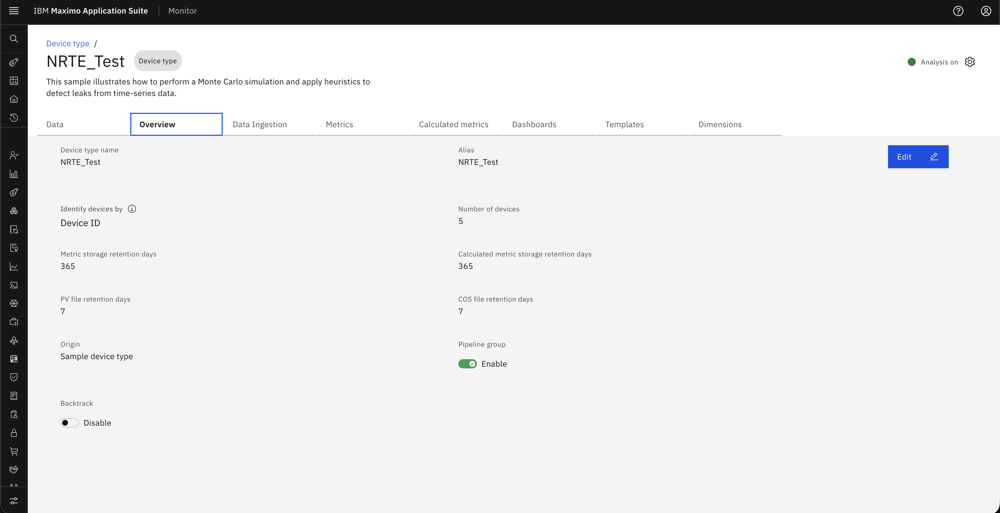
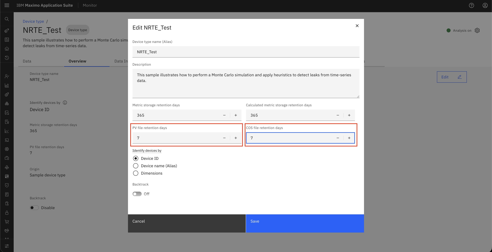

# Objectives
In this Exercise you will learn how to:

* Change retention days for CSV file.

---

*Before you begin:*  
This Exercise requires that you have:

1. completed the pre-requisites required for [all labs](prereqs.md)
2. completed the previous exercises

---

1. Go to Setup → Device types to access all device configurations.
&nbsp;&nbsp;

2. Select the desired Device Type and click Edit to update its settings.
&nbsp;&nbsp;

3. Open the Overview tab and click Edit to modify general details.
&nbsp;&nbsp;

4. Configure File Retention days as needed according to storage configuration and click Save to apply changes.
&nbsp;&nbsp;

!!! warning
    **Once retention period is over, file will be removed from the system.**

---