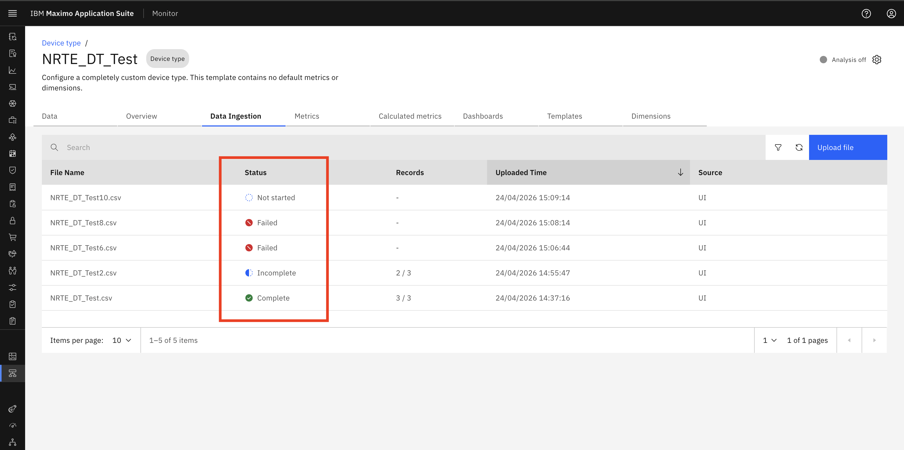

# Objectives
In this Exercise you will learn how to:

* How to Delete the CSV file.

---
*Before you begin:*  
This Exercise requires that you have:

1. completed the pre-requisites required for [all labs](prereqs.md)
2. completed the previous exercises

---

### Navigate Data Ingestion
        Setup → Data Ingestion OR Setup → Device Types → Edit → Data Ingestion

### Filtering File Records
    Using Filter, you can easily view and organize file records based on:
        1. File Name - Filter Based on File Name
        2. Status – Not Started, In Progress, Incomplete, Failed, Complete
        3. Source of Upload – UI, API, EDC, SCADA 
&nbsp;&nbsp;

### Sorting File Records
    Using Sorting, you can easily view and organize file records based on:
        1. File name – Sort files based on file name
        2. Status - Sort files based on their status
        3. Upload Timestamp – Sort files based on upload date and time
&nbsp;&nbsp;

### Refresh Option
    A Refresh button is available in the UI which helps to reload and fetch the latest file processing records.
&nbsp;&nbsp;

---

Congratulations you have successfully explored CSV file view options. 