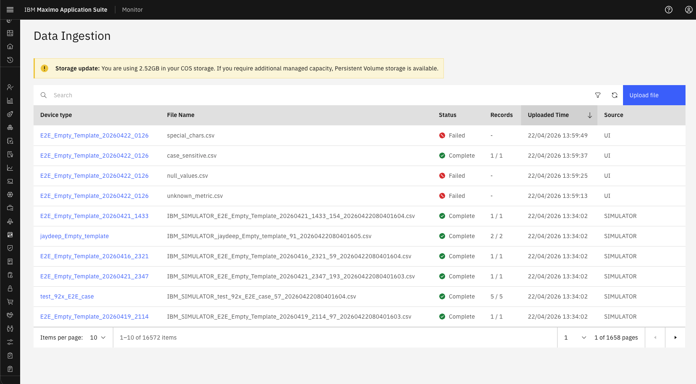

# Objectives
In this Exercise you will learn:

* how storage works for CSV files in Data Ingestion.

---
*Before you begin:*  
This Exercise requires that you have:

1. completed the pre-requisites required for [all labs](prereqs.md)
2. completed the previous exercises

---
### Navigate Data Ingestion
        Setup → Data Ingestion OR Setup → Device Types → Edit → Data Ingestion

           Storage details are visible at the top section in yellow box.

### Storage Configuration - PV
    By default, the Operator provisions a Persistent Volume (PV) for file staging and ingestion.
    It is typically used for low-volume or smaller file ingestion, as user uploads occur through APIs and UI.
&nbsp;&nbsp;

### Storage Configuration - (COS/S3)
    If the customer enables Cloud Object Storage (COS/S3) during installation via MAS Core configuration, the Operator automatically perform following actions
        1. Creates the COS service binding (credentials, endpoint, bucket name).
        2. Exposes the connection details (S3 bucket path, credentials, region) to File Ingest and external connectors (EDC, SCADA, Data Logger).
        3. Updates ingestion configuration to treat S3 as the primary file storage backend instead of PV.
&nbsp;&nbsp;

---