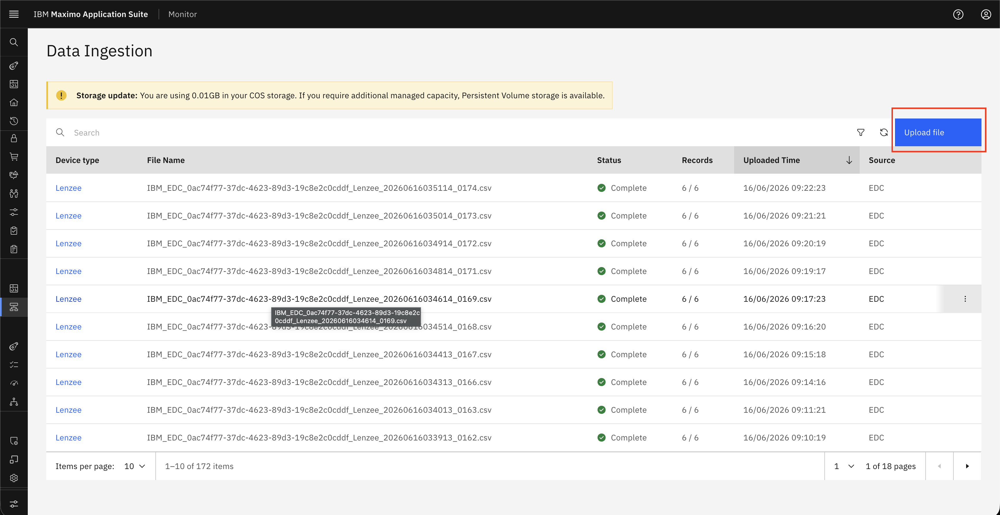
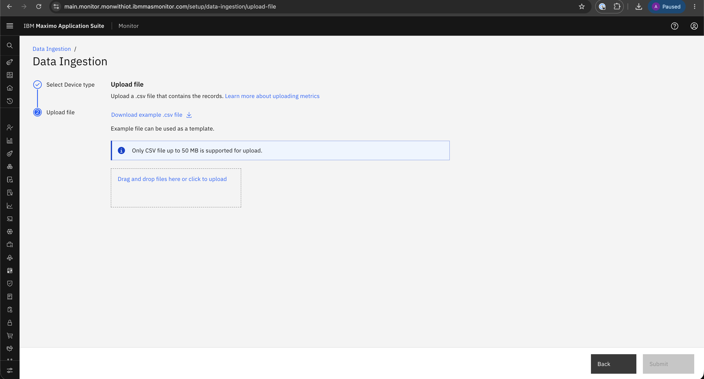
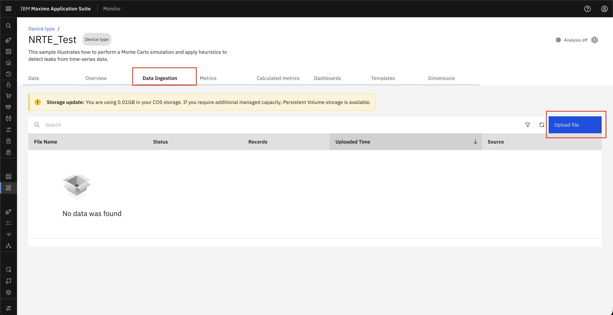

# Objectives
In this Exercise you will learn how to:

* How to Upload CSV Files via Monitor

---
*Before you begin:*  
This Exercise requires that you have:

1. completed the pre-requisites required for [all labs](prereqs.md)
2. completed the previous exercises

---

!!! info
    To upload CSV files, you can use one of the following options.

### Option-1. Data Ingestion from Setup

1. Navigate to Setup → Data Ingestion to access the upload interface.
&nbsp;&nbsp;

2. Click on the Upload button to start the file upload process.
&nbsp;&nbsp;

3. Select the required Device Type and click Next to proceed.
&nbsp;&nbsp;

4. Upload the CSV files to complete the ingestion process.
&nbsp;&nbsp;

### Option-2. Data Ingestion from Device type

1. Navigate to Setup → Device types to locate the device configuration.
&nbsp;&nbsp;

2. Select the Device Type and click on Edit to modify settings.
&nbsp;&nbsp;

3. Go to the Data Ingestion tab and click on the Upload button.
&nbsp;&nbsp;

4. Upload the CSV files to complete the ingestion process.
&nbsp;&nbsp;

---

Next step we will see how we can download template and prepare CSV for upload. 