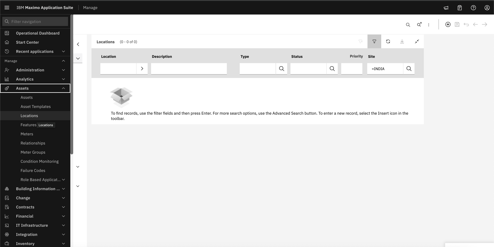
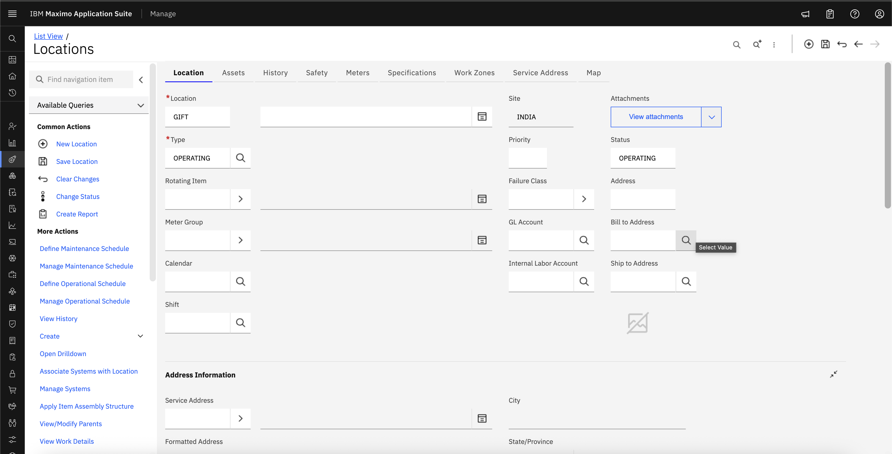
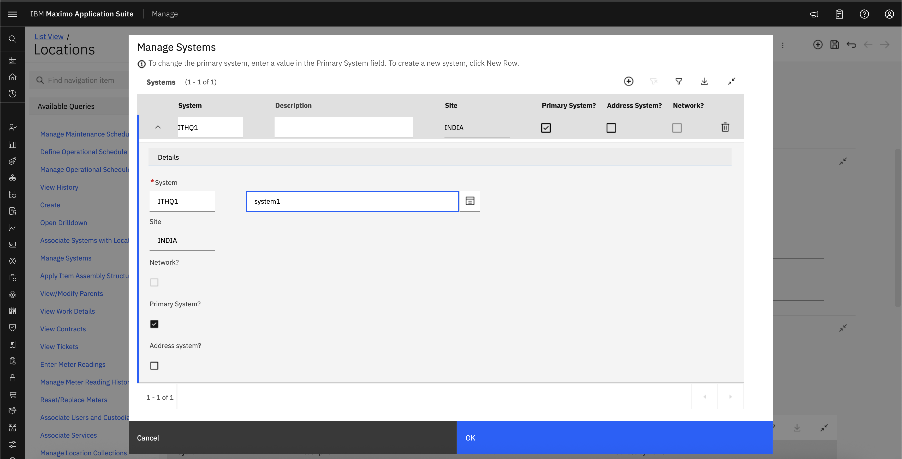

# Objectives
In this Exercise you will learn how to:

* Create Location, System

---
*Before you begin:*  
This Exercise requires that you have:

1. completed the pre-requisites required for [all labs](prereqs.md)
2. completed the previous exercises

---

!!! info
    Assign the location to system to ensure it is properly integrated and accessible across our maximo application suite.

1. Navigate to Locations under Assets section.
&nbsp;&nbsp;

2. Set Location Name and Type
&nbsp;&nbsp;

3. Navigate to Manage Systems, click on plus icon and create new System
&nbsp;&nbsp;
&nbsp;&nbsp;

4. Click on Associate Systems with location, you can also define parent location as per requirement.
&nbsp;&nbsp;

---