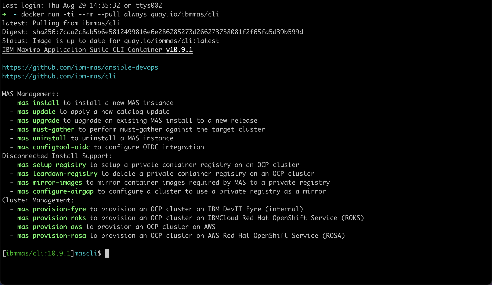
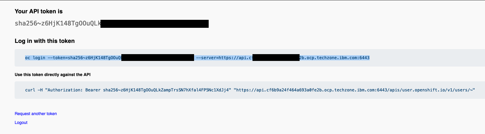
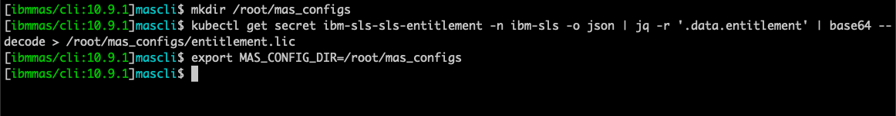
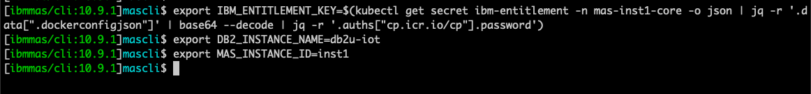
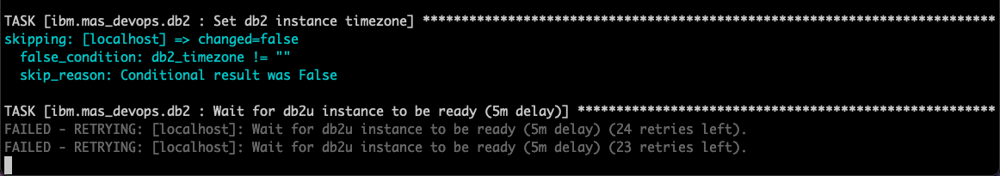
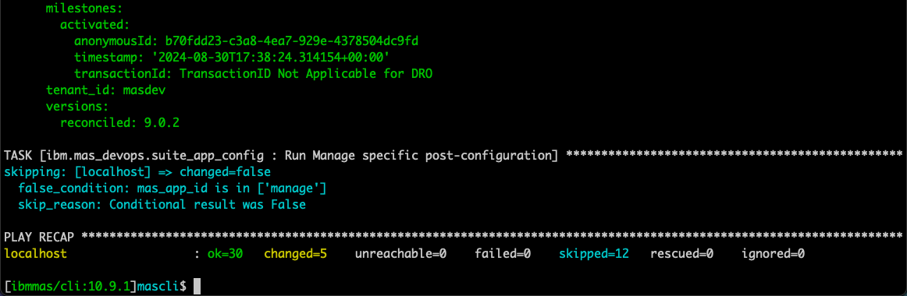
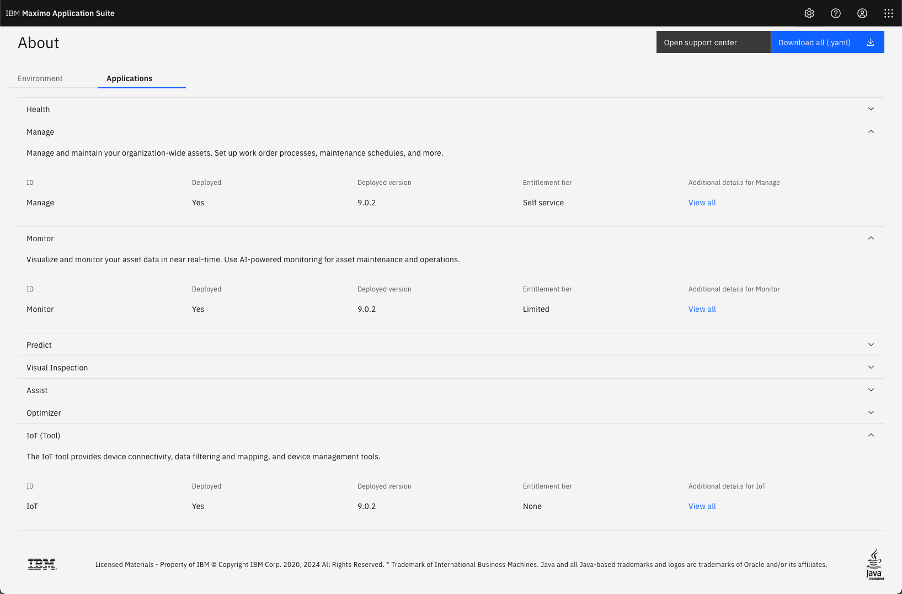

# Objectives
In this Exercise you will learn how to install Maximo Monitor on an existing MAS cluster.

---
*Before you begin:*  
This Exercise requires that you have completed the pre-requisites required for [all exercises](prereqs.md)
---

### Start MAS CLI

!!! note
    This lab relies on the [MAS Devops Ansible Collection](https://ibm-mas.github.io/ansible-devops/){target=_blank} and the [IBM Maximo Application Suite CLI Utility](https://ibm-mas.github.io/cli/){target=_blank}.</br>

First open a terminal and run the docker command to start the MAS CLI docker container:
````
docker run -ti --rm --pull always quay.io/ibmmas/cli
````
</br>
</br></br>

Login to the OpenShift cluster using your kubeadmin account and click on `Copy login command`:</br>
</br></br>

Click on `Display Token` and copy the `oc login` command in its entirety:</br>
</br></br>

Run the command in the MAS CLI docker container:</br>
</br></br>

### Prepare for Installation

Define the required environment variables according to [MAS DevOps Ansible Playbook for adding IoT](https://ibm-mas.github.io/ansible-devops/playbooks/oneclick-iot/){target=_blank} using the MAS CLI docker container.

First extract the existing MAS License File from your MAS environement and define MAS_CONFIG_DIR:
````
mkdir /root/mas_configs
kubectl get secret ibm-sls-sls-entitlement -n ibm-sls -o json | jq -r '.data.entitlement' | base64 --decode > /root/mas_configs/entitlement.lic
export MAS_CONFIG_DIR=/root/mas_configs
````
</br></br>

Then define the other environment variables:
````
export IBM_ENTITLEMENT_KEY=$(kubectl get secret ibm-entitlement -n mas-inst1-core -o json | jq -r '.data[".dockerconfigjson"]' | base64 --decode | jq -r '.auths["cp.icr.io/cp"].password')
export DB2_INSTANCE_NAME=db2u-iot
export MAS_INSTANCE_ID=inst1
````
</br></br>

### Install IoT Tool

The first component that needs to be installed is the IoT Tool - this also includes:</br>
* Set up Db2 instance as the system-level JDBC datasource</br>
* Set up Kafka cluster as the system-level Kafka

Run the following command in the MAS CLI docker container:
````
ansible-playbook ibm.mas_devops.oneclick_add_iot
````
Now grab a cup of coffee and be patient. Installing the IoT Tool and the dependencies takes 1,5 - 2 hours.</br>
Don't be worried when you see the `FAILED - RETRYING:...` messages:</br>
</br></br>

You can continue this exercise, when you see the following:</br>
</br></br>

### Install Monitor

Run the following command in the MAS CLI docker container:
````
ansible-playbook ibm.mas_devops.oneclick_add_monitor
````
Another cup of coffee and patience is needed. Installing the Monitor application takes 1 - 1,5 hours.</br>
You are done when you see this:</br>
</br></br>

Logging into MAS and viewing in About, this MAS environment now have MAS Core, Manage, IoT, and Monitor installed:</br>
</br></br>


!!! tip
    You can now install the additional Maximo Application Suite applications by following the [MAS Devops Ansible Collection](https://ibm-mas.github.io/ansible-devops/){target=_blank}</br> 
    or begin to test, build your demo, or build your pilot with the installed applications - have fun !!</br>

---
Congratulations you have successfully installed Maximo Monitor on an existing MAS environment.</br>
