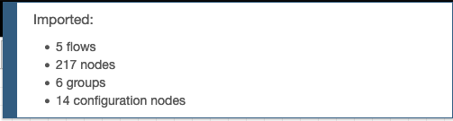

# Objectives
In this Exercise you will learn how to convert the Raspbery Pi to an instance of the asset called 
Raspberry Pi Engine controller (RPE).

In this task, you will import and modify the Node-RED flows that makes out the RPE.

## 1. Install the needed Node-RED libraries (nodes).
**a.** Power on the Pi and wait for the green LED to calm down.

**b.** Open your browser and enter the IP address or hostname from before using port 1880, 
e.g. `192.168.1.59:1880` OR `rpe042.local:1880`

**c.** Select the Manage palette from the burger menu: 

**d.** Find the `node-red-dashboard` under the Install tab: 

**e.** Install it: 
 
wait until you get a message about the nodes been installed. 

**f.** Install these two additional libraries: 

## 2. Import the RPE Node-RED flows.
**a.** Download the Node-RED [RPE Flows.json](config/RPE Flows.json). 

**b.** Select Import from the burger menu: 

**c.** Click on `select a file to import` and select the file you just downloaded. It will create some new flows in Node-RED.

**d.** Wait for something like this: 

 
**e.** Delete Flow 1 and click on Deploy

## 3. Modify the MQTT connections to your need.
**a.** Go to the `Collect And Send Data` tab.

**b.** Locate the MQTT nodes, which are trying to connect: 

**c.** In the Debug sidebar pane a couple of warnings tells you that the mqtt nodes failed to connect, which is only natural since the credentials are not transferred when you export and then import the flows. Further you also need to add your own credentials: 

 
**d.** Follow the comment nodes if you want to change the number of mqtt connections. [Not Default] 

**e.** Modify the mqtt nodes with your credentials. Open the mqtt node for the CPU device: 

**f.** Optionally change the name to your RPE CPU Device Id. Click on the pencil to modify the Server: 

**g.** Change the messaging server of the connection and the port number to `443` (red boxes): 

 The Client ID (purple box) is defined as `d:<org>:<device type>:<device id>` 
– e.g. `d:wwgeo:CPU:RPE042-CPU-01` 
The corresponding Server could be: `wwgeo.messaging.iot.wwgeomas.gtm-pat.com` for 
the WW MAS Geo cluster. Use the one from your environment. 

The TLS configuration must be the same messaging server and the `Verify server certificate` must be un-checked: 

**h.** Select the Security tab

The Username is `use-token-auth` 
The Password is the Authentication Token from when you created the device in Exercise 1.

**i.** Press Update and Done

**j.** Clear the debug sidebar pane and click Deploy.

**k.** You’ll see the `mqtt out` node reporting to be connected if the credentials are correct: 
 

**l.** After a short while the disconnected state changes to connecting and the following appears in the debug sidebar pane:

**m.** Do the same with the other `mqtt out` nodes.

**n.** You should now see the following if all credentials are correct: 

 
**o.** You can add additional mqtt nodes by following the instructions in the comments notes below. 

 
**p.** This concludes this exercise.

!!! tip
    The interpretation of the SenseHAT LED’s and the usage of the joystick is explained in 
    Exercise 5 – RPE User Guide.

!!! tip
    The flows work in two different time intervals with different behavior: 
    1) Monday – Friday 8am-6pm CET:  
       In this mode, a 5 minutes load is put on the RPE every 15 minutes (00, 15, 30, 45) after which a
       10 minutes idle and cooling down period is allocated.  
       The RPE gathers and submit data to Maximo Monitor every 10 second. 
     
    2) All other times no load is being is being performed. 
       The RPE gathers and submit data to Maximo Monitor every 20 minutes.

