# Objectives
In this Exercise you will learn how to create the RPE device credentials in MAS Monitor.

Your RPE asset will have three devices that measures different things:

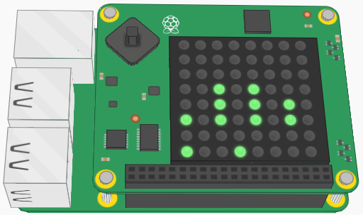

| Device Type | Measurements                            |
|-------------|-----------------------------------------|
| CPU         | CPU related metrics from the Pi         |
| OSC         | Oscillator related metrics from the Pi  |
| ENV         | Environmental metrics from the SenseHAT |

You need to create three device types (CPU, OSC and ENV) with the related metrics (as we already know what they are) and then later a device of each device type. 
The credentials for the three devices will be used when configuring the RPE Node-RED script to work in your environment (in exercise [3. Convert Pi to RPE](convert_pi.md)).

## 1. Login

**a.** Login to your instance of MAS and navigate to Monitor: 
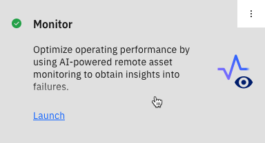

## 2. Create the device types
!!! note
    Jump to [Create the devices](#3-create-the-devices) if the CPU, OSC and ENV device types have already been created.

**a.** Go to the Setup tab: 
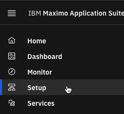

**b.** We will setup three device types: CPU, OSC and ENV. 

**c.** Select the Devices tab and press the blue + button to add a new device type: 
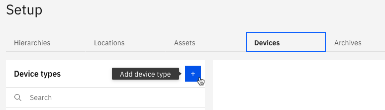

**d.** Select the Basic template and click Next: 
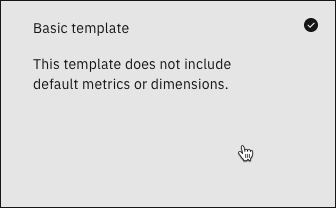

**e.** Define the Device type name as “CPU” and either clear or replace the Description 

**f.** Click Create and click on Add metric and Add metric 
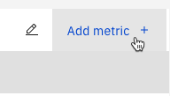

**g.** Create the following metrics while pressing “Add metric +” to add another metric row:

| Metric        | Display name    | Event | Type      | Unit       |
|---------------|-----------------|-------|-----------|------------|
| cl            | CPU_Load        | event | NUMBER    | Percentage |
| ct            | CPU_Temperature | event | NUMBER    | C          |
| du            | Disk_Usage      | event | NUMBER    | Percentage |
| mu            | Memory_Usage    | event | NUMBER    | Percentage |
| evt_timestamp	|                 | event | TIMESTAMP |            |  

!!! tip
    All the values above are case sensitive.

**h.**	Click the Add button and then the Save button to save the metrics 

**i.** Expand the event and it should look somewhat like this (the order might be different): 
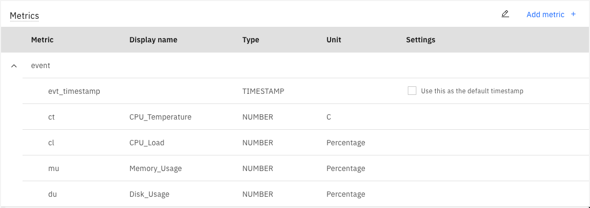

**j.** For the OSC Device type: repeat step 2c – 2f and create the following metrics:

| Metric        | Display name    | Event | Type      | Unit       |
|---------------|-----------------|-------|-----------|------------|
| ov            | OSC_Voltage     | event | NUMBER    | V          |
| ot            | OSC_Temperature | event | NUMBER    | C          |
| of            | OSC_Frequency   | event | NUMBER    | Hz         |
| evt_timestamp |                 | event | TIMESTAMP |            |

**k.** Click the Add button and then the Save button to save the metrics 

**l.** Expand the event and it should look somewhat like this (the order might change): 
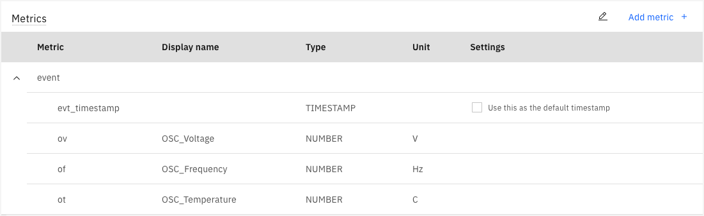

**m.** For the ENV Device type: repeat step 2c – 2f and create the following metrics:

| Metric        | Display name    | Event | Type      | Unit       |
|---------------|-----------------|-------|-----------|------------|
| eh            | ENV_Humidity    | event | NUMBER    | Percentage |
| ep            | ENV_Pressure    | event | NUMBER    | millibar   |
| et            | ENV_Temperature | event | NUMBER    | C          |
| evt_timestamp |                 | event | TIMESTAMP |            |

**n.** Click the Add button and then the Save button to save the metrics

**o.** Expand the event and it should look somewhat like this (the order might change): 
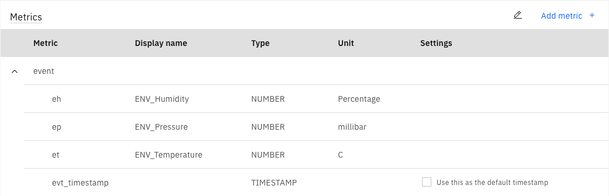

## 3. Create the devices

**a.** It is now time to create the three devices for the first asset. 
The example shows how to do that for the asset called RPE042.

**b.** Go to the Setup tab: 

 
**c.** Select the `Devices`tab. Select the CPU device type and click the blue “Add a device   +” link (There might already be existing devices in your environment, just make sure you create your own set): 
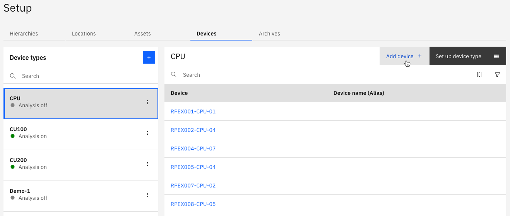
 
**d.** Define your own Device ID, leave the Token type to be Auto-generated, and click Add: 
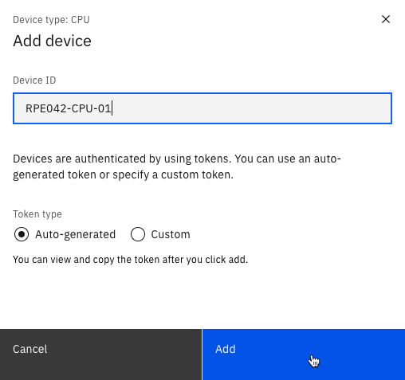
 
!!! attention
    Make sure to write down the credentials  
    – at least the Authentication Token as it is non-recoverable.

**e.** Once you have saved the credentials a safe place, then press Close: 
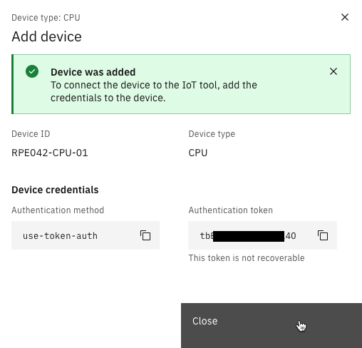

**f.** For the ENV device repeat step 3c – 3e, e.g. RPE042-ENV-17 

**g.** For the OSC device repeat step 3c – 3e, e.g. RPE042-OSC-03 

**h.** Navigate to the IoT Tool. 
This can either be done from the Monitor Home page: 
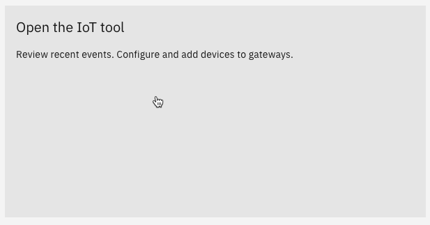

or from the Application Switcher in the upper right corner:  
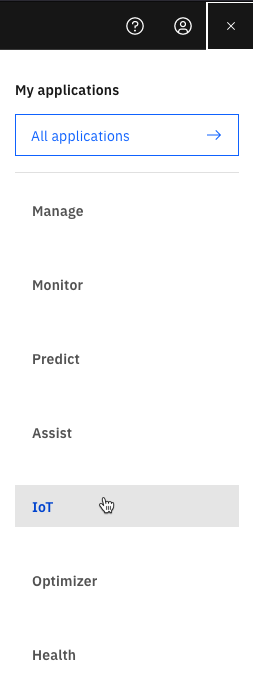

A new browser tab opens with the MAS Watson IoT Platform Service.

**i.** Here is how it could look like in the IoT Tool, once you have created all three devices and have used the `Search by Device ID`: 
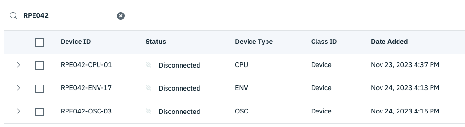

**j.** This concludes this exercise.

