# Objectives
In this Exercise you will learn how to prepare the Raspbery Pi with a SenseHAT.

In this task, you will download Raspberry Pi OS from raspberry.org and install it on an SD Card. 
Further install a load test package and configure Node-RED to automatically start on boot.

!!! note
    If you already have a Pi with a SenseHat running with the latest OS version then jump to step 4.


## 1. Download and install Raspberry Pi OS on an SD Card

**a.** Go to [https://www.raspberrypi.com/software/](https://www.raspberrypi.com/software/){target=_blank} and download the Raspberry Pi Imager:</br>
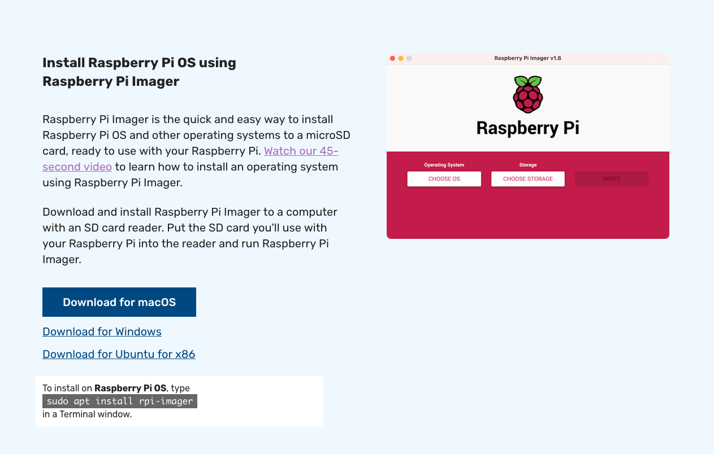

!!! tip
    For IBM’ers: Either you need to follow the Portable Storage Approval Process to get an exception so you can write to your IBM machine USB port</br>
    [https://ciso-approvals.w3bmix.ibm.com/portable-storage-home.html](https://ciso-approvals.w3bmix.ibm.com/portable-storage-home.html)</br>
    or you’ll need to find a non-IBM machine to perform this task.

**b.** Install and start the Rapberry Pi Imager:</br>
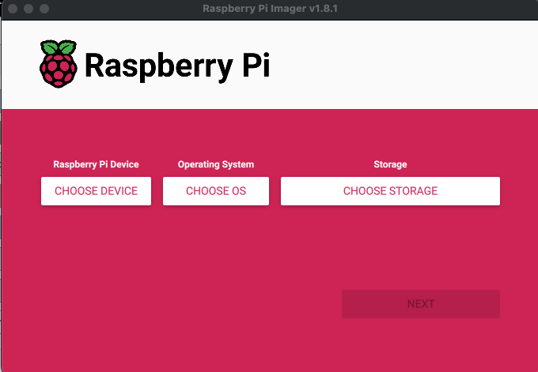

**c.** Chose the Raspberry Pi Device type:</br>
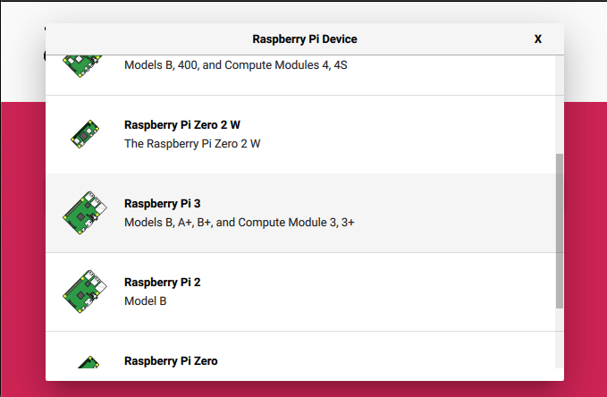

**d.** Choose the Recommended OS:</br>
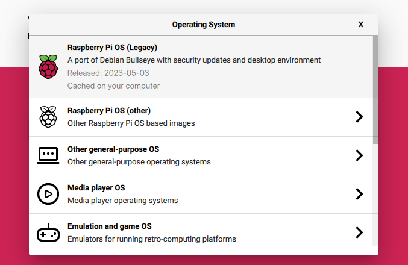

**e.** Choose Storage and select the SD Card in your laptop that you want to write to:</br>
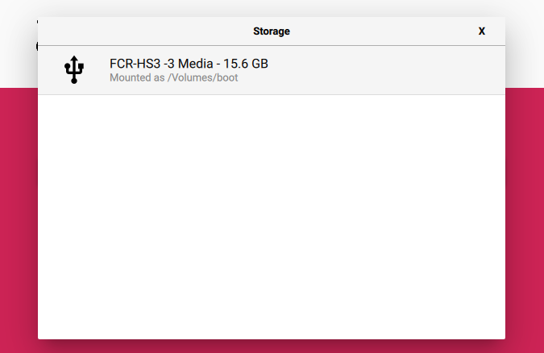

**f.** Click Next:</br>
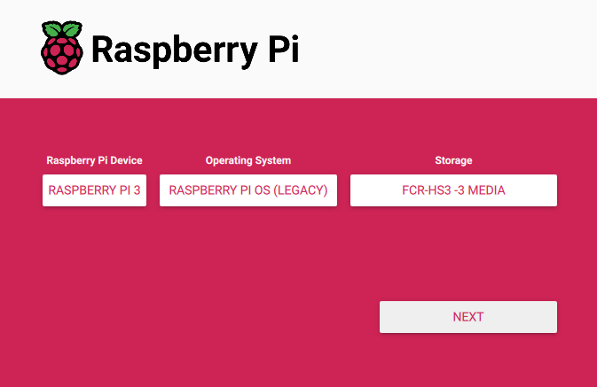

**g.** You might want to select Edit Settings, which will be easier and will skip step 2/3 later in this exercise – at least the username and password:</br>
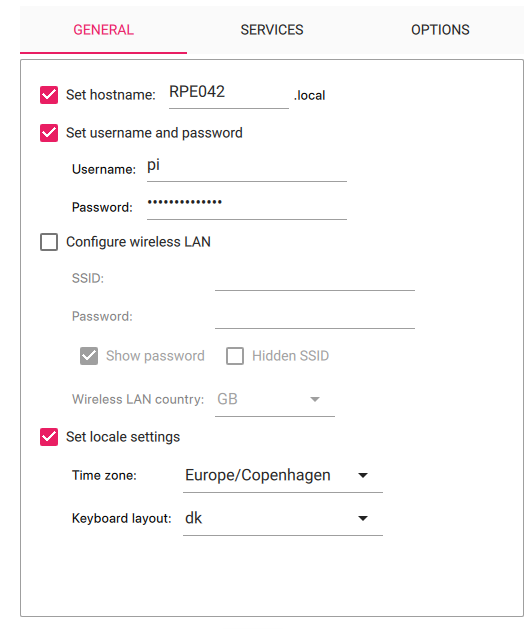

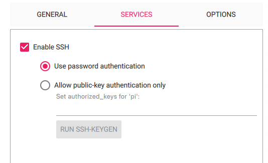

**h.** Click on Save and Yes.</br>
Click on Yes to overwrite the SD card and wait until the verification has finished.:</br>
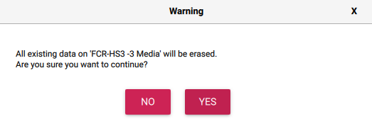

**i.** Once the SD card is ready you need to do some additional steps before inserting it into the Raspberry Pi. First copy over the following files to a local place on your laptop: 
an empty SSH file, wpa_supplicant.conf and the config.txt:</br>
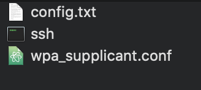

!!! tip
    You can prepare the wpa_supplicant.conf file with your WiFi credentials, by following the instructions here:</br>
    [https://www.raspberrypi.org/documentation/configuration/wireless/headless.md](https://www.raspberrypi.org/documentation/configuration/wireless/headless.md){target=_blank}
    
    The ssh file is empty.

**j.** Add your WiFi credentials to the wpa_supplicant.conf file.</br>
You might also want to change the country code if you do not live in the US.

**k.** Eject and re-insert the SD Card in the reader.</br>

**l.** Copy the 3 files to the bootfs location:</br>
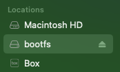
 
**m.** Eject the SD card from the reader.</br>

 
## 2. Get the Raspberry Pi up and running using the Raspberry Pi OS desktop
**a.** Insert the micro SD card into the Raspberry Pi. 

**b.** Connect it to a monitor and keyboard/mouse. 

**c.** Power on the Pi and verify:</br>
- the WiFi is working</br>
- you have defined the right hostname (Terminal: hostname)</br>
- use Raspberry Pi Configuration tool</br>
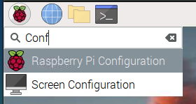
to verify Interfaces are enabled (SSH and optionally VNC), Localisation and WLAN Country

## – OR - 

## 3. Get the Raspberry Pi up and running headless using the terminal

**a.** Insert the micro SD card into the Raspberry Pi and power it up.</br>
You know it is up and running when the SenseHat have turned off the LEDs and the Raspberry Pi green LED is blinking slowly.

**b.** Open a terminal windows and ssh into the Pi:</br>
```
ssh pi@RPE042.local
```
answer yes</br>
enter the default password: raspberry (or the password you changed in step 1g)</br>
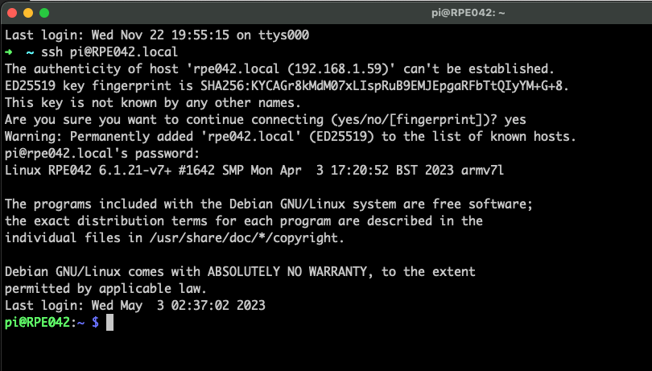
 
**c.** [If not done already] The first thing you need to do is changing the default password using:
```
passwd
```
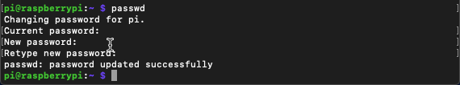

**d.** [If not done already] Then change the hostname (raspberry) to the instance of your RPE defined in task 1, e.g. RPE042. This needs to be changed in two files:
```
sudo nano /etc/hostname
sudo nano /etc/hosts
```
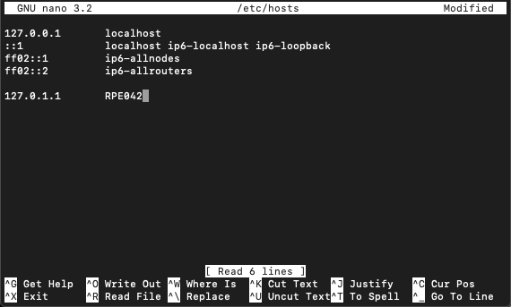


!!! tip
    Control-o to save the file, followed by Control-x to exit from the nano editor.

**e.** [If not done already] Change the localisation of your pi.
```
sudo raspi-config
```
select the following menu item: 5 Localisation Options</br>
and define your selections in all 4 submenus</br>
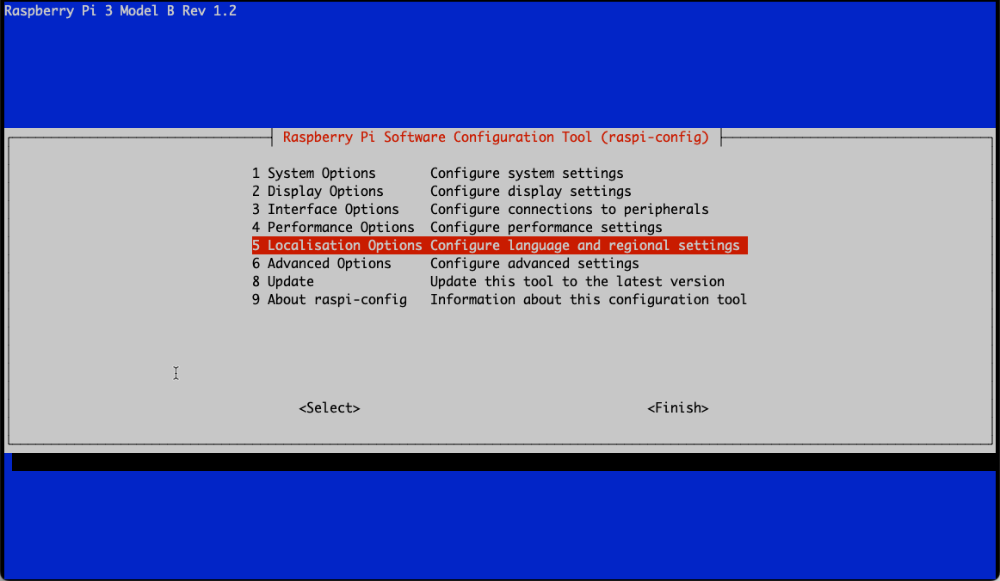


**f.** [Optional] You might want to enable VNC under 3 Interface Options 

**g.** Finish raspi-config

**h.** Reboot the Pi:</br>
```
sudo reboot now
```
wait a while until the Raspberry green LED have had some longer ON’s and then revert back to a few blinks once in a while.

**i.** SSH into the Pi again. Remember to use the new hostname and password:</br>
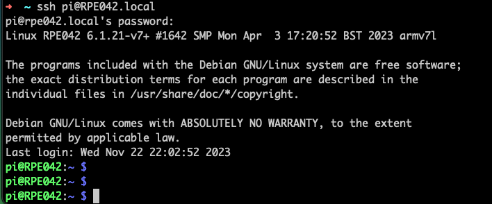

 
## 4. Update and upgrade the Pi
Update and upgrade the Pi by using the following commands:
```
sudo apt update
sudo apt full-upgrade
```
get a cup of coffee or tea, as this might take a while.</br>

## 5. A few additional steps
When the Pi is up and running you only need a few additional steps that are a pre-req for the RPE Node-RED flows to work.

**a.** SSH into the Pi if not already done so.

**b.** Install Node-RED following the steps described here:</br>
[https://nodered.org/docs/getting-started/raspberrypi](https://nodered.org/docs/getting-started/raspberrypi){target=_blank}</br>
However, it is advisable to add “--node20” to install Node-js V20 at the end of the install command:</br>

```
bash <(curl -sL https://raw.githubusercontent.com/node-red/linux-installers/master/deb/update-nodejs-and-nodered) --node20
```

Answer y to both questions and the installation will start.</br>
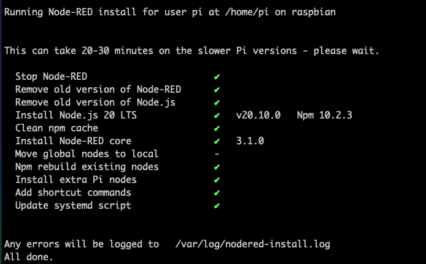

**c.** Set the Pi to autostart Node-RED at every boot:
```
sudo systemctl enable nodered.service
```

**d.** Install the sysbench package, which will be used to add load to the RPE at regular intervals:
```
sudo apt install sysbench
```

!!! tip
    Installing sysbench on the RPE is an **IMPORTANT** step to create load on the system regularly.


**e.** Fetch the IP address of the RPE as you will use that later when using Node-RED:</br>
```
hostname -I
```
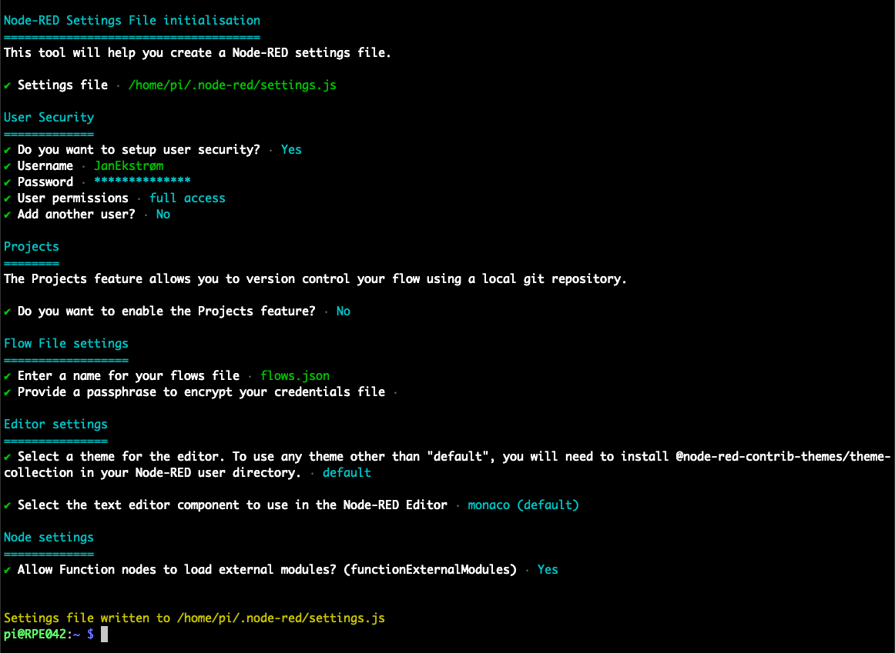</br>
(Showing both IP v4 and v6 addresses)

**f.** Shutdown the RPE: 
```
sudo shutdown -h now
```
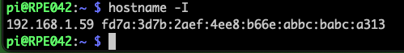


!!! tip
    Power off once the green LED stopped blinking.</br>
    NOW is a good time to backup you SD card to e.g. `<date>-Fresh Image.img`


**g.** This concludes this exercise.

