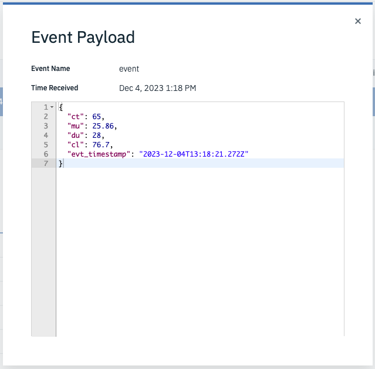

# RPE User Guide
This user guide will describe how to use and operate the RP Engine controller (RPE) once an RPE have been created following the exercises of this lab.

Hardware requirements are located here: [Hardware pre-requisites](prereqs.md#Hardware)

You can use this user guide to: 
►	Understand the RPE measurements 
►	Understand the RPE SenseHAT LED output 
►	Operate the RPE using the SenseHAT joystick 
►	Use the RPE local dashboard 

 

## 1. Understand the RPE measurements
The three devices (CPU, OSC, and ENV) in your RPE asset will submit its measured data on a regular basis to Maximo Monitor. 

The last exercise in this lab ended with a screen shot of the data being delivered for the CPU device into the IoT Tool: 

 
The properties are abbreviations of different measurements.

The Central Processing Unit (CPU) Device:

| Metric | Unit       | Description                        |
|--------|------------|-------------------------------------|
| cl     | Percentage | CPU Load                            |
| ct     | C          | CPU Temperature                     |
| du     | Percentage | Disk Usage of the SD card in the Pi |
| mu     | Percentage | Memory Usage of the Pi              |

The Oscillator (OSC) device:

| Metric  | Unit       | Description            |
|---------|------------|------------------------|
| ov      | Volt       | Oscillator Voltage     |
| ot      | Celcius    | Oscillator Temperature |
| of      | MHz        | Oscillator Frequency   |

The Environment (ENV) device:

| Metric | Unit       | Description ç                                              |
|--------|------------|-----------------------------------------------------------|
| eh     | Percentage | Environment relativ Humidity measured by the SenseHat     |
| ep     | millibar   | Environment atmospheric Pressure measured by the SenseHat |
| et     | Celcius    | Environment Temperature measured by the SenseHat          |

 

## 2. Understand the RPE SenseHAT LED output
### Overview
You should look at the RPE SenseHAT from this angle, which means the power chord and/or the HDMI cable is pointing away from you:

The display consists of three areas:

- Connection status of the mqtt connections
- Day of week including operation status: Running / Idle
- Four bars representing selected measurements

 

### Connection Status
This single LED at the left in the lower row is telling you the connection status to the Maximo Monitor instance.

##### All mqtt connections are connected

All devices are connected. It depends on knowing how many device connections it must look after as described in [exercise 3.3](convert_pi.md#3-modify-the-mqtt-connections-to-your-need).

##### All mqtt connections are trying to connect

 
All connections are either `disconnected` or `connecting` trying to establish a connection for all devices. This might be caused by lack of internet connectivity for the RPE.

##### At least one but not all connections are connected

This can be caused by faulty credentials in one or more `mqtt out` nodes, but not in all of them.

##### Waiting for connecting status

This may be caused by a mismatch between the number of connections defined and the number of `mqtt out` nodes the status node are listening to - as described in [exercise 3.3](convert_pi.md#3-modify-the-mqtt-connections-to-your-need).

### Day of week including operation status
The seven LED's to the right in the lower row each represents a day in the week, starting with Monday. 
**Green** means the RPE is running. The RPE will initiate a 5 minutes run under load every 0, 15, 30, 45 minutes past the top of the hour in the period: 8 am to 6 pm CET Monday to Friday. It will measure and submit data every 10 seconds while being in the running mode. 
**Red** means the RPE is idle, meaning outside of working hours or in the weekend. It will not run any loads and will only measure and send every 20 minutes.

##### RPE is in working hour on a Tuesday

It is Tuesday between 8am and 6pm CET and all connections are up and running.

##### RPE is in idle mode on a Saturday

It is Saturday at any time as it is weekend ;-)

### The four bars
The four bars represent the following four measurements:

1.	cl: CPU Load
2.	ct: CPU Temperature
3.	ot: Oscillator Temperature
4.	et: Environment Temperature (from the SenseHat)

| Color  | Meaning value in % or C is within |
|--------|-----------------------------------|
| RED    | X > 80                            |
| YELLOW | 60 >= X <80                       |
| GREEN  | 40 >= X <60                       |
| GREEN  | 20 >= X <40                       |
| GREEN  | X <20                             |

##### Example 1

It is Wednesday between 8am and 6pm CET and all connections are up and running.
The CPU Load is low, hence the temperatures are also relatively low.

##### Example 2

It is Wednesday between 8am and 6pm CET and all connections are up and running. 
The CPU Load is high between 60 and 80%. 
The CPU Temperature is between 60 and 80 C. 
The Oscillator Temperature is above 80 C. 
The Env, Temperature is between 20 and 40 C. 

 

## 3. Operate the RPE using the SenseHAT joystick
### Overview
This section will explain the options the SenseHAT joystick delivers to operate the RPE. You should look at it from this angle, which means the power chord and/or the HDMI cable is pointing away from you: 

The joystick currently has 4 actions available:

- Down click
- Up click
- Enter click
- Hold to the left

!!! attention
    Please be patient when using the joystick – it might take up to 20 seconds before you see the response on the SenseHAT LED Matrix.

##### Down Click
The down click shows scrolling text about network information changing between: 

- IP Address in blue
- WiFi SSID in yellow
- MAC Address in green

##### Up Click
The up click shows scrolling text about RPE information changing between: 

- The RPE ID in blue
- Software version of the Node-Red script in yellow
- Hardware version of the Raspberry Pi in green

##### Enter Click
Clicking on the enter button toggles the LED display off and on.

##### Hold Left
Holding the joystick left during some seconds will initiate an immediate SHUTDOWN of the RPE.
This is in fact the best way to close down a Raspberry Pi minimizing the risk of damaging the SD card.

 **Handle with care!!** 

 

## 4. Use the RPE local dashboard
### Overview
The RPE have a local dashboard where you can see the measurements and some additional information.
They are accessible on `http://<the RPE IP Address>:1880/ui`. 
The following three dashboards are available:

1.	RP Engine – Shows some Rasperry Pi measurements (CPU and OSC values)
2.	RP Environment – Shows some SenseHAT measurements
3.	RPE Control – shows some RPE information

##### RP Engine – Idle Example

All measurements are within normal Idle mode.

##### RP Engine – Load Example

All measurements are either high or very high when running under Load mode.

##### RP Environment

These measurements are done in the SenseHat and covers: 

1. Temperature (et)
2. Relative Humidity (eh)
3. Atmospheric Pressure (ep)

##### RPE Control

Information about the RPE software version and the Raspberry Pi hardware is available. 
Two buttons are available to either Reboot or shutdown the RPE.

**Handle with care!!**

 
 