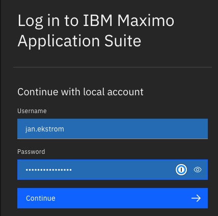
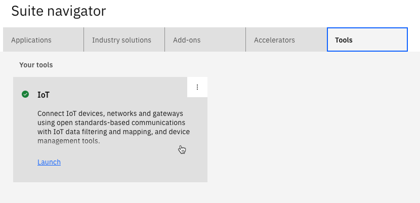
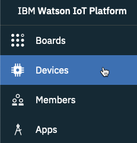
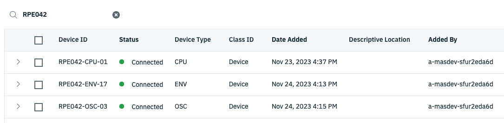
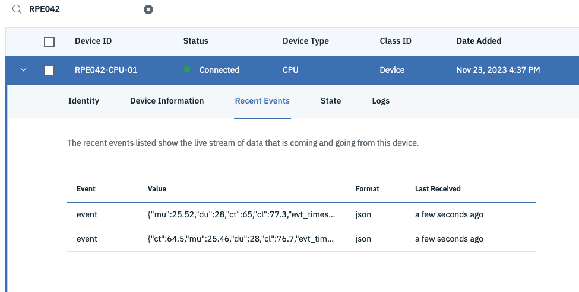
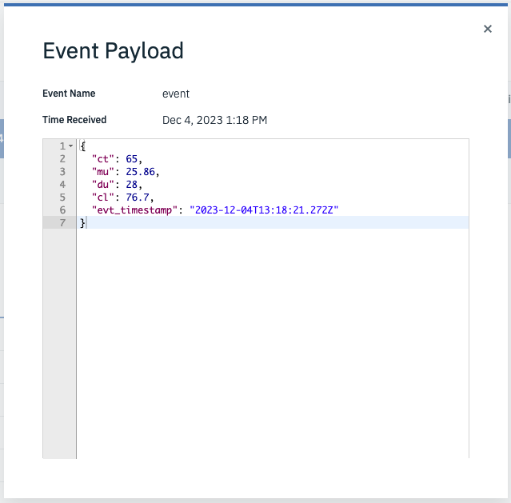

# Objectives
In this Exercise you will learn how to verify that the data is bing delivered from RPE to MAS Monitor.

Data is being send once all mqtt nodes are in state connected.

You will verify the setup by watching the data being send to MAS Maximo Montor instance you have access to.

## 1. Login
**a.** Login to your instance of Maximo Application Suite: 

**b.** Go to the Tools tab and click on IoT: 

**c.** A new browser tab opens with the MAS Watson IoT Platform Service. 
 
## 2. Verify data is being received.
**a.** Go to the Devices tab: 

**b.** Enter RPE042 in the Search field and you should see all three devices in a Connected status:

**c.** Expand one of the devices and select Recent Events. 
After a few seconds you should see data being received: 

**d.** Click on one of the event payloads: 

**e.** Repeat step c and d for the two other devices – just to verify data is being received.

!!! tip
    These properties are abbreviations for different measurements. 
    They are explained in the RPE User Guide as well as the meaning of the SenseHAT LEDs.

**f.** This concludes this exercise.

