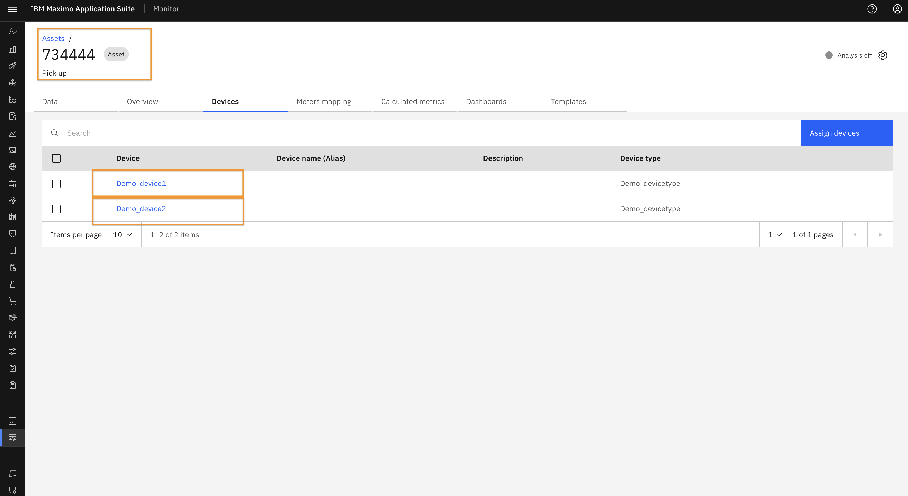
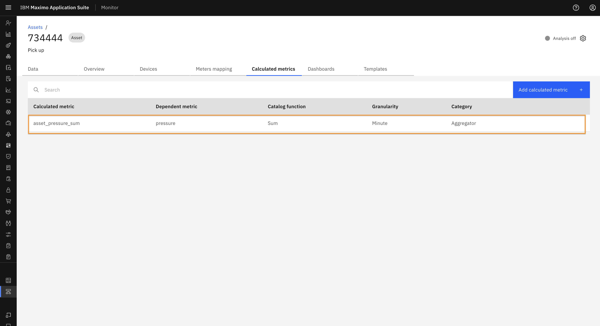
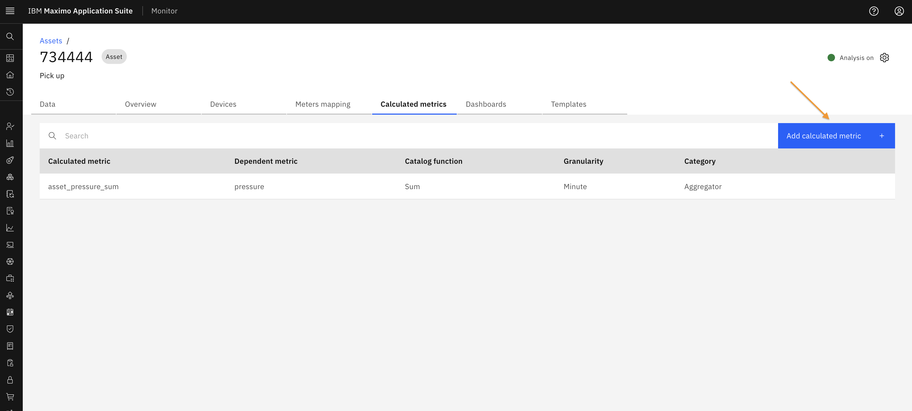
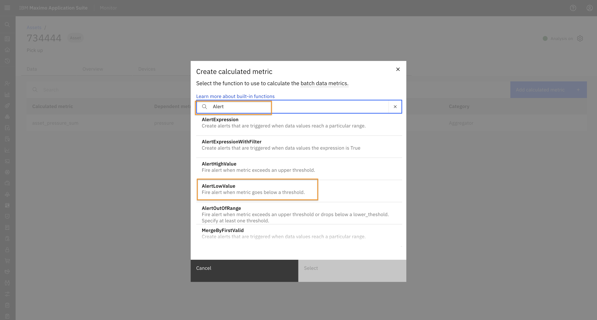
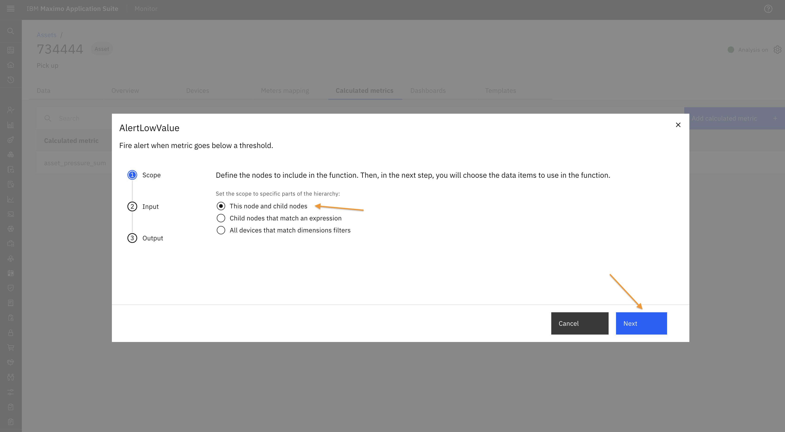
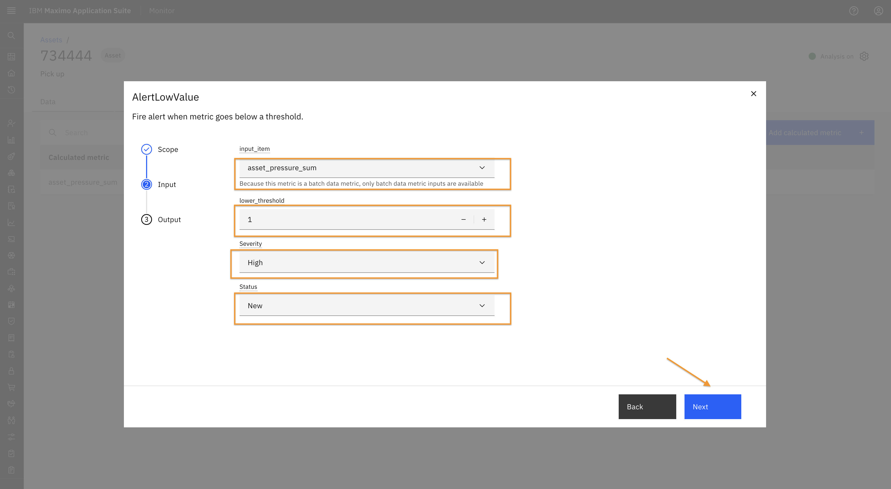
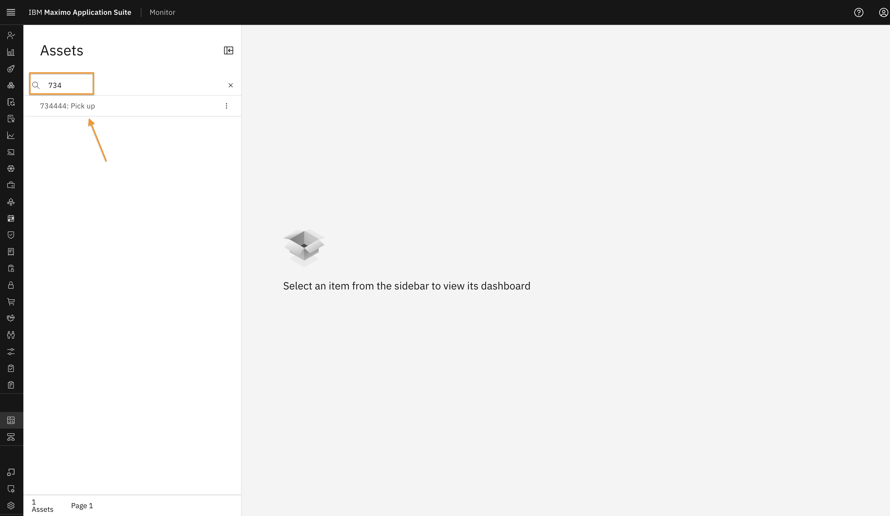
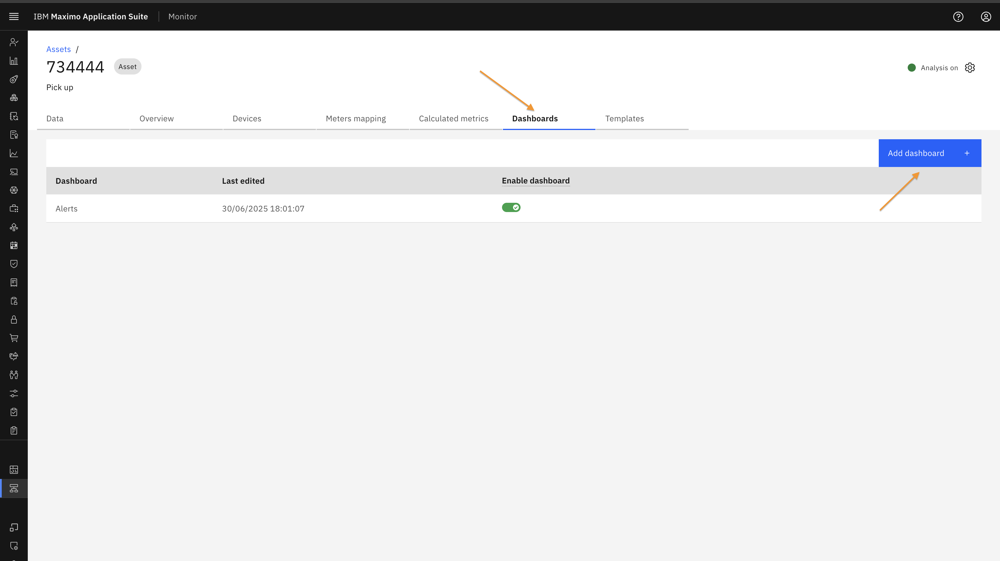

# Objectives
In this Exercise you will learn how to create and manage alerts in monitor hierarchy.

---
*Before you begin:*  

Make sure you have:

* Reviewed the Monitor Hierarchy lab to understand the concept of hierarchy in Monitor.
* Set up a sample hierarchy in Monitor.

In this lab, an asset is configured with two devices, both running simulations.
 
A calculated metric named asset_pressure_sum has been added at the asset level to compute the sum of pressure values from the devices every minute.
 

---

In this lab, you will configure an alert at the Asset level. Similarly, alerts can be configured at any hierarchy level such as Site, System, Location, or Organization.

#### Setup Alert

1. Navigate to the Asset Setup page and search for the asset.
 
2. click on the asset. It will open its detail page.
 
3. Go to the Calculated Metrics tab and click on "Add Calculated Metric" button.
 
5. In the popup window, search for "Alert".
 
6. Select AlertLowValue and click "Next".
 
7. Choose "This node and child nodes" and click "Next".
 
8. Select the calculated metric for which you want to generate the alert. Enter the lower threshold, severity, and status. Click "Next".
 
9. Provide a name for the alert and click "Create".
 
10. The alert will now appear in the Calculated Metrics table.
 

#### View Alert

The pipeline will run, and an alert will be triggered when the threshold condition is met.

You can view generated alerts in the "Alerts" dashboard, which is automatically created when an asset has any alert configured.

1. Navigate to the Asset Dashboard view from the left sidebar.
 
2. Search for the desired asset and click on it to open the details.
 
3. You will see the Alerts Dashboard, which displays an Alert Table. This table lists all alerts associated with the asset and its connected devices.
 
4. You can use Filter icon to filter alerts based on specific criteria.
 

You can also create a custom dashboard using Dashboard Tab in the Asset setup page. Follow the same steps outlined in [Exercise 2](./view_alert.md#custom-dashboard) of this lab series.
 

---

🎉 Congratulations! You have successfully completed the exercise to set up and view alerts at different hierarchy levels in Monitor. 