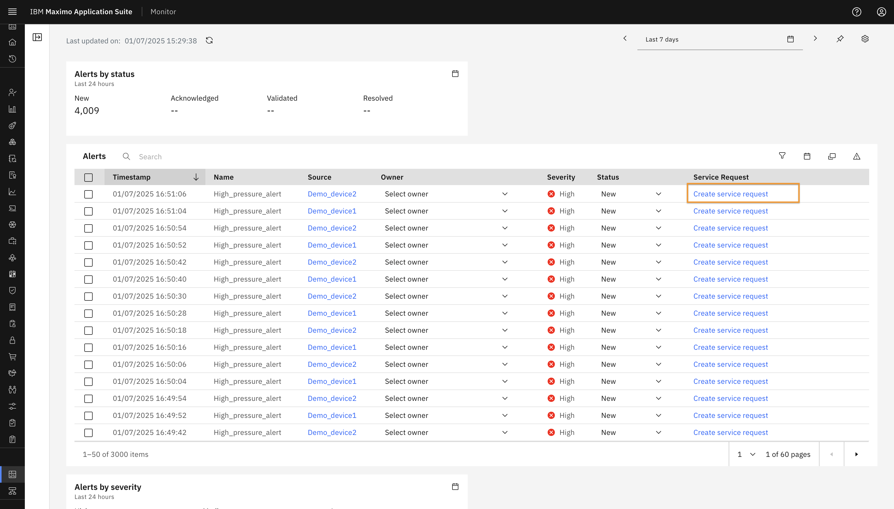
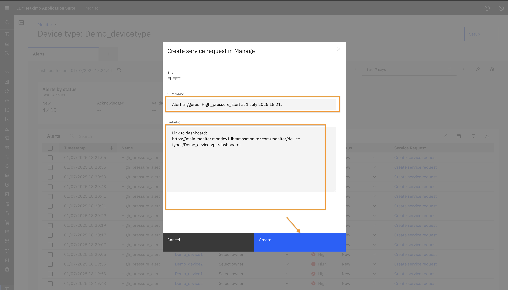

# Objectives
In this Exercise you will learn how to create service request for an Alert.

---
*Before you begin:*  
This Exercise requires that you have:

1. Completed the prerequisites listed in the [All Labs Prerequisites](prereqs.md).
2. Finished the previous exercises in this lab series.

---

As seen in the previous exercise, the Alerts Dashboard includes an Alert Table that provides detailed information about each alert. 

 
The table displays the following columns:

* Timestamp – The time when the alert was generated.
* Name – The name of the alert.
* Source – Indicates the source (device or asset or other hierarchy level i.e site, system, location) that triggered the alert. Clicking on the source will redirect you to the corresponding source detail page.
* Owner – Allows you to assign an owner to the alert.
* Severity – Indicates the severity level of the alert.
* Status – Defaults to New, but can be updated to Validated, Acknowledged, or Resolved.
* Service Request – Clicking "Create Service Request" opens a popup to initiate a request in Manage.
 

In the Create Service Request popup:

* Select Manage Integration.
* Fill in the Reported By field.
* The Asset and Site fields are auto-populated based on the hierarchy, if a link is found for the selected alert.
 
* You can also provide additional Location details.
* Default text is provided for the Summary and Details fields, which you can modify as needed.
* Click Create to submit the service request.
 

Once created, the service request number will appear in the Service Request column of the Alert Table. 
 
You can click on the request number to navigate directly to the corresponding service request in Manage.
 

---
Congratulations you have successfully completed exercise, and thereby completed this Maximo Lab.🤗 

