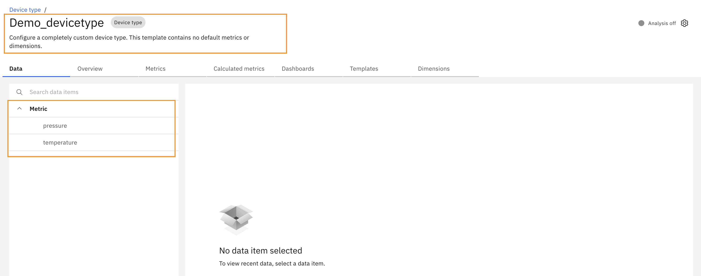
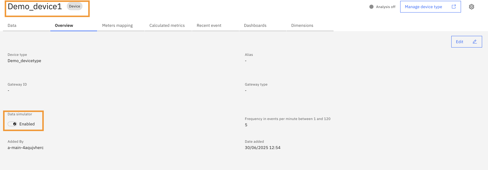
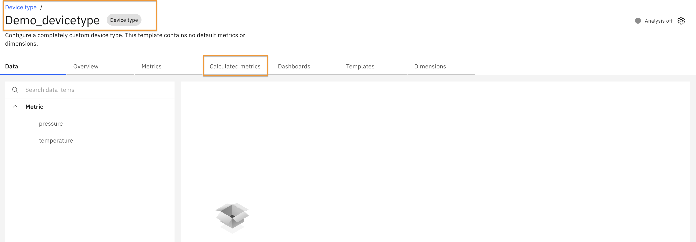
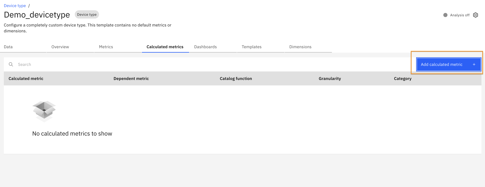
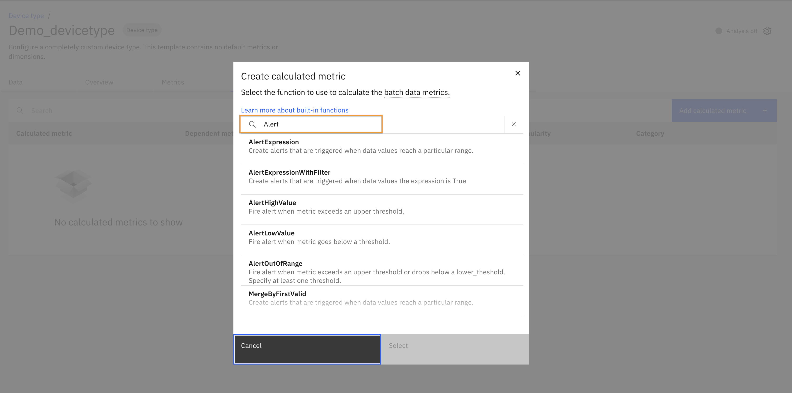
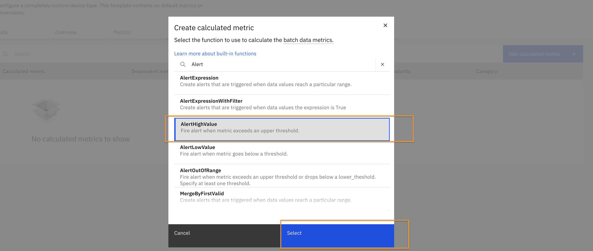
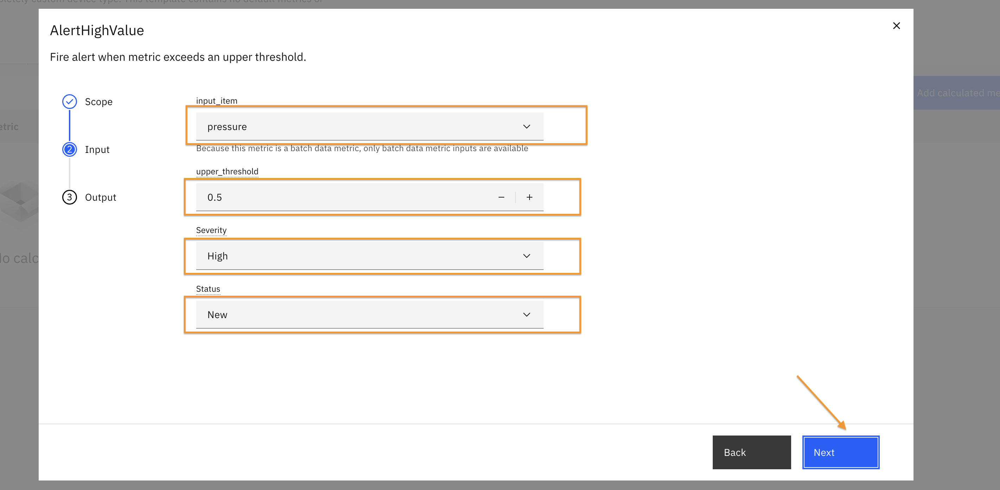
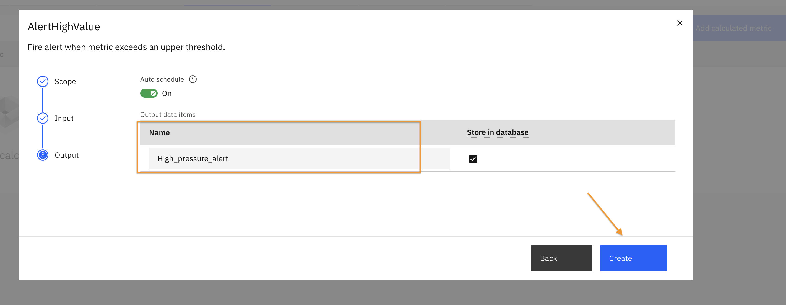
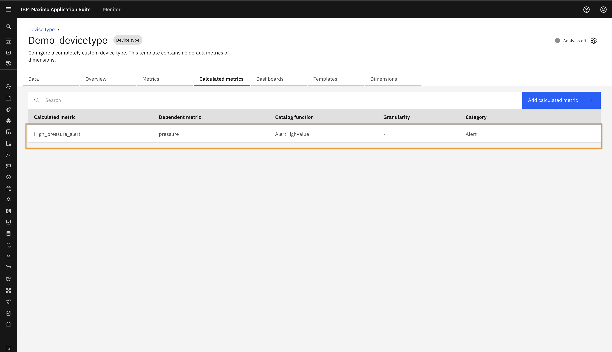
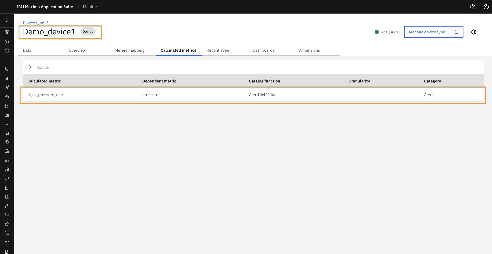

# Objectives
In this Exercise you will learn how to:

* Setup Alert KPI at device type

---
#### Before you begin  
This Exercise requires that you have:

* Review the Monitor Device Type and Devices lab to gain a foundational understanding of device types and devices.
* Set up a sample device type and a corresponding device.

In this lab, a device type has been configured with two metrics: temperature and pressure.
 

A sample device has also been added to this device type, and the simulator has been started.
 

---

In this exercise, you will configure an Alert KPI for the device type.

#### Alert Setup

Navigate to the device type you created. click on the calculated metrics tab.
 

Click on the "Add calculated metrics" button.
 

In the search box, type "Alert".
 

Select AlertHighValue from the list and click "Select".

Choose "All devices of this type" and click "Next".
     

Select the input item for which you want to configure the alert. Specify the threshold value, severity, and status. Click on "Next".
 

Provide a name for the alert and click "Create".
 

You should now see the newly created alert under the Calculated Metrics section as below.
 

Setting up an alert at the device type level automatically applies the same alert configuration to all devices associated with that type. You will also see the same calculated metric reflected at the individual device level.

You should able to see the same calculated metrics created for device as well.
 

Pipeline will run and produce an alert after sometime when the threshold value is exceeded.

!!! tip "Tips"
    In this exercise, we used the AlertHighValue KPI. Similarly, you can explore other alert types such as: 
    - AlertLowValue 
    - AlertExpression 
    - AlertOutOfRange.  
    You can read more about these alert types [here](https://www.ibm.com/docs/en/masv-and-l/maximo-monitor/cd?topic=data-alerts){target=_blank}.

---
Congratulations you have successfully setup Alerts at device type level 🤗. 
