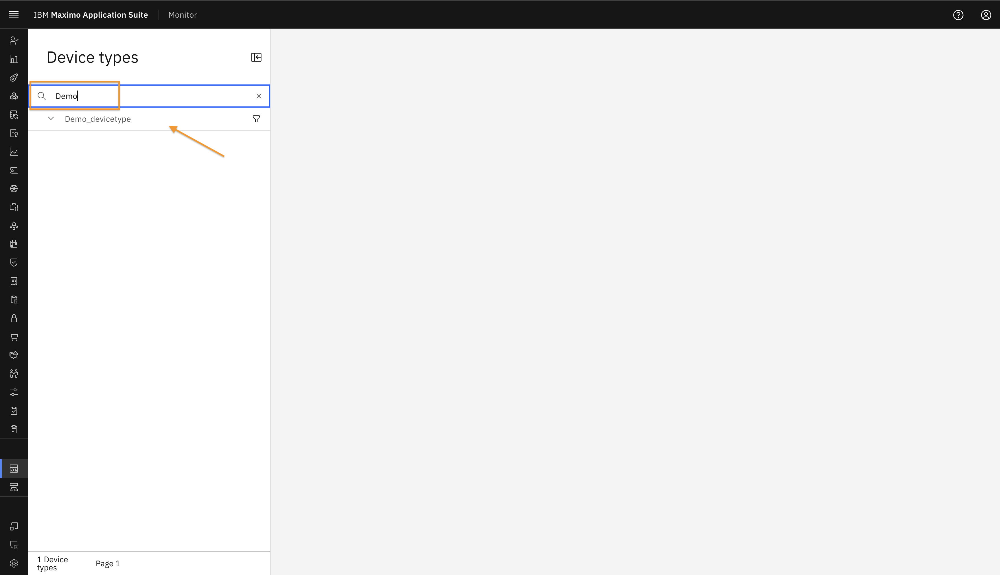

# Objectives
In this Exercise you will learn how to view alerts in monitor dashboard.

---
*Before you begin:*  
This Exercise requires that you have:

1. Completed the prerequisites listed in the [All Labs Prerequisites](prereqs.md).

2. Finished the previous exercises in this lab series.

---

### Default Dashboard

Once the Alert KPI is configured at the device type level, a dashboard named "Alerts" will automatically be added to the device type.

Navigate to the Device type Dashboard view from the left sidebar.
 
Search for the device type and click on it to open the details.
 
You will see the Alerts Dashboard, where the Alert Table displays all alerts related to the device type and its associated devices. You can click on the Source link to navigate directly to the device that triggered the alert.
 

### Custom Dashboard

You can create custom dashboards for both device types and individual devices. In this exercise, we will create a custom dashboard for a specific device.

Navigate to the device and open its Device Details page.
 
Click on the Dashboard tab, then click the "Add Dashboard" button.
 
Enter a title for your dashboard and click "Configure Dashboard".
 
The Dashboard Editor will open. From the right sidebar, select "Alert Table".
 
Provide a title and description for the alert. Choose a time range for the data and click "Add Card".
 
From the right sidebar, select "Time series line". Enter a title, Enable Overlay with Alerts, Select the alert name, Click "Add Card".
 
Click "Save and Close".
 
The newly created alert dashboard will now appear in the Dashboard tab.
 
To view it from the device type level, Navigate to the Device Type view from the left sidebar.
 
Search for your device type, click the dropdown arrow, and select the device.
 

You will now see a beautifully customized Alert Dashboard.

* You can rearrange the cards and resize them as needed.
* In the Timeseries card, alerts are shown as red markers. Hover over them to view the metric and alert values.

 

---
Congratulations you have successfully created Alert Dashboard🤗. 
